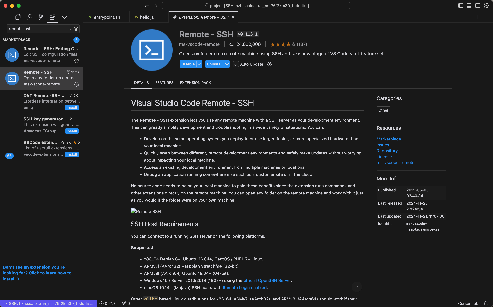

# FAQ

## 1. Cursor connection problem but VSCode can connect

Cursor Since the plugin version synchronization with VSCode is slow, outdated versions may cause connection problems.

Solution: Manually install the Devbox plugin. Install Remote-SSH in the Cursor extension market. Note that the current version should be v0.113.x. (Note that this version must be installed in Cursor. If you download Remote-SSH from the webpage and then import it into Cursor, there is a high probability that the versions do not correspond and lead to incompatibility.)

1. Download the vsix file of the [Devbox](https://marketplace.visualstudio.com/items?itemName=labring.devbox-aio) plugin from the VSCode plugin market.


2. Open the Cursor's extension window.

3. Drag the downloaded file into the extension window.


4. Install Remote-SSH v0.113.x in Cursor.



## 2. Cursor and VSCode cannot connect

First, understand the principle of the Devbox plugin: add remote environment information by modifying the ssh config file, and connect to the remote environment through the Remote-SSH plugin. The plugin first writes the following line of code in `~/.ssh/config` (some older versions may write other similar content):

```bash
Include ~/.ssh/sealos/devbox_config
```

This line of code imports the contents of the file `~/.ssh/sealos/devbox_config` into the current file. And `devbox_config` contains normal SSH configuration content, for example:

```config
Host usw.sailos.io_ns-rqtny6y6_devbox1234
  HostName usw.sailos.io
  User devbox
  Port 40911
  IdentityFile ~/.ssh/sealos/usw.sailos.io_ns-rqtny6y6_devbox1234
  IdentitiesOnly yes
  StrictHostKeyChecking no
```

So if there is a problem, it is most likely a plugin bug that causes errors in reading and writing files. You can feedback this to us or try to adjust the SSH file yourself.

## 3. Always stuck in downloading vscode-server or keep retrying

Cause: Due to some operation (such as restarting Devbox during this process), the download cursor is suspended, and re-downloading causes conflicts.

Solution:

1. Enter the web terminal and delete the `.cursor-server` folder.
    1. Click "Terminal" in the operation button on the right side of the Devbox webpage list item.
    2. Enter the terminal and go to the user directory first, `cd ..`, then use `ls -a ` to view all files and you can see `.cursor-server`.
    3. Remove `rm -rf .cursor-server`.
    4. Just retry the connection.
2. If there is no content in the newly created Devbox, you can directly delete it and rebuild it.

## 4. Report the following error

```bash
upstream connect error or disconnect/reset before headers. retried and the latest reset reason: remote connection failure, transport failure reason: delayed connect error: 111
```

First of all, you should understand that your current environment is a development environment. The URL you are connecting to is a test URL, which is only used in the development environment. This URL corresponds to the port of the development environment. In other words, you must run the development environment, such as `npm run dev` to run your program first, before you can see the content through the URL, otherwise this error will be reported.

Another possible situation is that you just need to wait for a while, maybe the network is slow.

## 5. Click the link Cursor and enter the cursor interface, and an error message "Failed to fetch" is reported

Try to open Cursor's extension market. If the extension market cannot be loaded normally and the error `Error while fetching extensions.Failed to fetch` is reported, it is a network problem that cannot load Cursor's plug-in market. Please refer to the manual installation tutorial above to manually install the Devbox plug-in or try to change your network environment.

## 6. The local localhost can open the project but the public network address cannot be opened

The exposed address in the code must be changed from `localhost` to `0.0.0.0` due to network reasons.

## 7. The Program Runs Normally in Devbox, but Fails to Run After Deployment

Before deploying, please ensure you can execute `entrypoint.sh` in the terminal (this is the recommended startup script
post-deployment). If public services are required, also check that the public address is accessible.

```bash
./entrypoint.sh
```

If you encounter the following issue:

```bash
bash: ./entrypoint.sh: Permission denied
```

You can run the following command in the terminal to modify the script's permissions, and then attempt to execute the
`entrypoint` script again, ensuring the outcome aligns with your expectations.

```bash
sudo chmod +x entrypoint.sh
```

Additionally, it is advisable to build and test the project code in Devbox before deployment. Once testing is
successful, you can proceed with the deployment. This can effectively prevent errors and out-of-memory (OOM) issues
during the startup phase after deployment.

## 8. Application Startup Fails When Listening on Port 80

When using Devbox, the default user for local editors (such as VSCode, Cursor, etc.) is devbox.
Ports in the range of 1-1023 are restricted to the administrator user.
If you need to use these ports normally, please run your program with administrator privileges. For example, in the Go
Devbox, you can use the following command:

```bash
sudo go run main.go
```

Alternatively, you could change your application's port.

## 9. How to Change the Default User to Root in Devbox

Run 'sudo su' in the terminal to switch to the root user.
