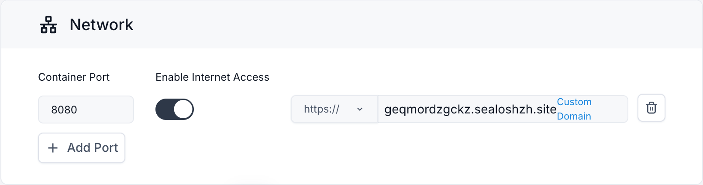
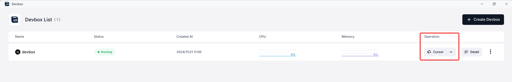
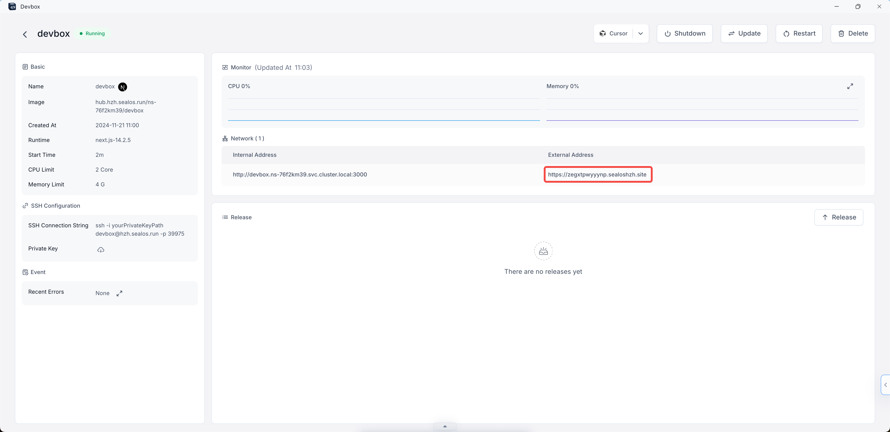
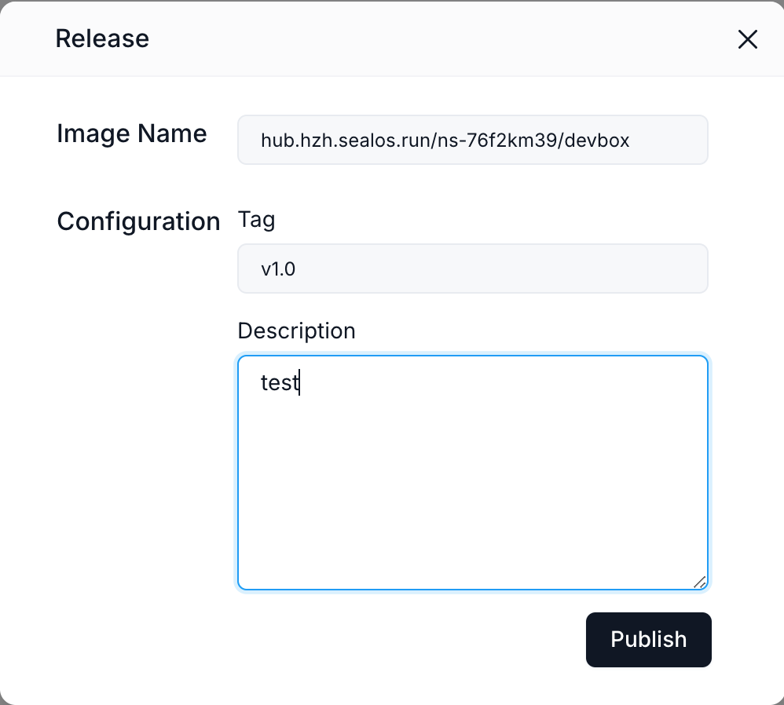
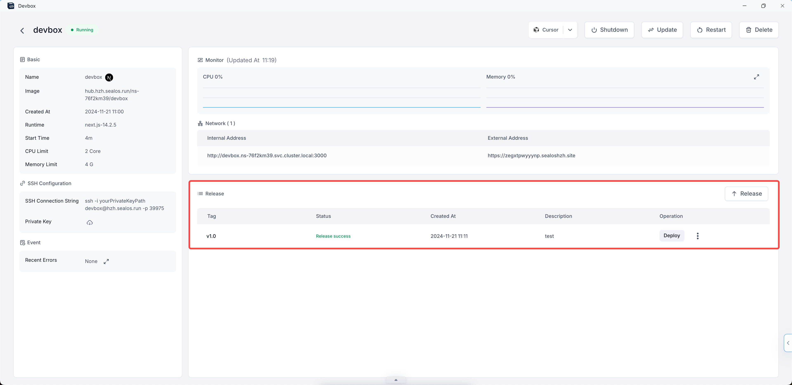
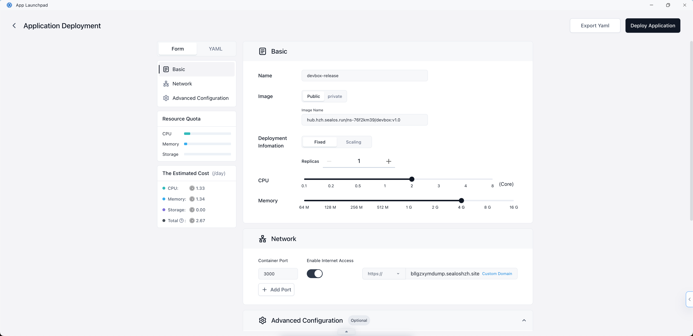
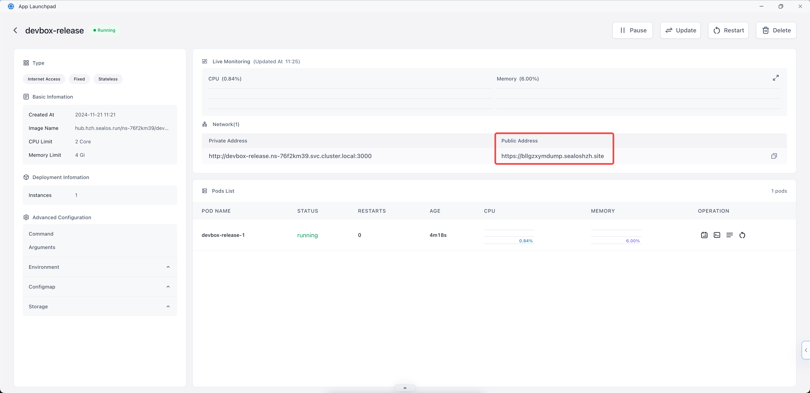

# Quick Start

> Learn how to create, develop, and deploy a Next.js app using Sealos DevBox. This guide covers project setup, remote development with Cursor IDE, and cloud deployment.

Sealos Devbox is an all-in-one platform designed for integrated online development, testing, and production. It offers a seamless solution for creating environments and database dependencies with just a single click, allows developers to work locally using their preferred IDEs while streamlining setup processes and enabling automatic application deployment.

In this guide We'll demonstrate how to create a minimal Next.js demo project with Sealos Devbox.

## Create a Devbox Project

1. Click on the "Devbox" icon on Sealos Desktop, then click on the "Create New Project" button to create a new project.

2. In the "Runtime" section, choose "Next.js" as the development framework. Use the sliders to set the CPU cores and memory for the project.


3. After setting up the basic environment, you'll need to configure the network settings for your project:

- Scroll down to the "Network" section of the configuration page.
- Container Port:
    - Enter "3000" in the Container Port field. This is the default port that Next.js uses for development.
    - If you need additional ports, click the "Add Port" button and specify them.
- Enable Internet Access:
    - Toggle the switch to enable internet access for your Devbox. This allows external users to access your Next.js
      application through the public internet using the provided domain.
- Domain:
    - By default, Sealos provides a subdomain for your application.
    - If you want to use a custom domain, click on "Custom Domain" and follow the instructions to set it up.

Remember that the container port (3000) should match the port your Next.js application is configured to run on. If you change the port in your Next.js configuration, make sure to update it here as well.



4. Click on the "Create" button to create your project.



## Connect with Cursor IDE

After creating your project, you'll see it listed in the Devbox List. Each project has an "Operation" column with various options.


1. To connect to your project's Devbox runtime using Cursor IDE:

- Locate your project in the Devbox List.
- In the "Operation" column, click on the dropdown arrow next to the VSCode icon.
- From the dropdown menu, select "Cursor".
- Click on the "Cursor" option that appears.

2. When you click on "Cursor", it will launch the Cursor IDE application on your local machine. Within Cursor, a popup window will appear, prompting you to install the Devbox plugin for Cursor. This plugin enables SSH remote connection to the Devbox runtime.

- Follow the instructions in the Cursor popup to install the Devbox plugin.
- Once installed, Cursor will establish a remote connection to your Devbox runtime.

> You can switch between different IDE options (VSCode, Cursor, or VSCode Insiders) at any time by using the dropdown menu in the "Operation" column.

## Develop

1. After the connection is established, you'll be able to access and edit your project files directly within the Cursor IDE environment.



This remote connection allows you to develop your Next.js application using Cursor IDE, with all the benefits of a cloud-based development environment:

- Your code runs in the Devbox runtime, ensuring consistency across development and production environments.
- You can access your project from anywhere, on any device with Cursor installed.
- Collaboration becomes easier as team members can connect to the same Devbox runtime.

2. You can start debugging your Next.js application:

- Open the terminal within Cursor IDE.
- Navigate to your project directory if you're not already there.
- Run the following command to start the Next.js development serve:

```bash
npm run dev
```

- This command will start your Next.js application in development mode.

3. To access your running application:

- Return to the Sealos Devbox List in your browser.
- Find the project you just created.
- Click on the "Detail" button on the right side of your project's row.

4. In the project details page:

- Look for the "Network" section.
- You'll see an "External Address" field.
- Click on this external address.


5. This will open your Next.js application in a new browser tab, allowing you to view and interact with your running service.



## Release

After you've developed and tested your Next.js application, you can release it as an OCI (Open Container Initiative) image. This allows you to version your application and prepare it for deployment.

1. In the Cursor IDE terminal, navigate to your project directory and run the build command:

```bash
npm run build
```

This command creates a production-ready build of your Next.js application in the '.next' directory.

2. Navigate to your project's details page:

- Go to the Sealos Devbox List in your browser.
- Find your project and click on the "Detail" button on the right side of your project's row.

3. On the project details page, look for the "Version" section.

4. Click on the "Release" button located in the top right corner of the "Version" section.

5. A "Release" dialog box will appear. Here, you need to provide the following information:

- Image Name: This field is pre-filled with your project's image name.
- Tag: Enter a version tag for your release (e.g., v1.0).
- Description: Provide a brief description of this release (e.g., "Initial release" or "Bug fixes for login feature").



6. After filling in the required information, click the "Release" button at the bottom of the dialog box.

7. The system will process your release. Once completed, you'll see a new entry in the "Version" section of your project
   details page, showing the tag, status, creation time, and description of your release.



By following these steps, you've successfully created an OCI image of your Next.js application. This image can now be used for deployment or shared with other team members. Each release creates a snapshot of your current code, allowing you to maintain different versions of your application and easily roll back if needed.

> Remember to create new releases whenever you make significant changes or reach important milestones in your project. This practice helps in maintaining a clear history of your application's development and facilitates easier deployment and collaboration.

## Deploy

After releasing your Next.js application as an OCI image, you can deploy it to Sealos Cloud for production use. Here's how to do it:

1. In your project's details page, locate the "Version" section.

2. Find the release you want to deploy and click the "Deploy" button in the "Operation" column.

3. This will redirect you to the App Launchpad application within Sealos.

4. In the App Launchpad application, follow the deployment wizard to configure your application settings. This may include:

- Selecting the appropriate environment
- Setting resource limits (CPU, memory)
- Configuring environment variables if needed
- Setting up any required volumes or persistent storage



5. Once you've configured all necessary settings, click the "Deploy Application" button in the top right corner to start the deployment process.

6. You'll be taken to the application details view within App Launchpad.

7. Once the status is "Running", Click on the address provided under "Public Address". This will open your deployed Next.js application in a new browser tab.

By following these steps, you've successfully deployed your Next.js application to Sealos Cloud using the App Launchpad application. Your application is now accessible via the public address, allowing users to interact with it from anywhere on the internet.

> You can always update your application by creating a new release in Devbox and repeating this deployment process with the new version using App Launchpad.

This workflow allows you to develop and debug your Next.js application in a cloud environment while still using your preferred local IDE. The external address makes it easy to share your work with team members or clients, as they can access your running application from anywhere with an internet connection.