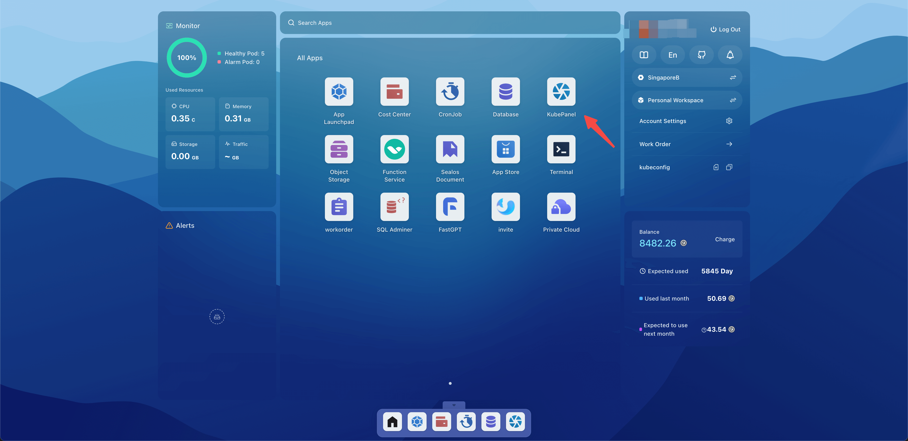
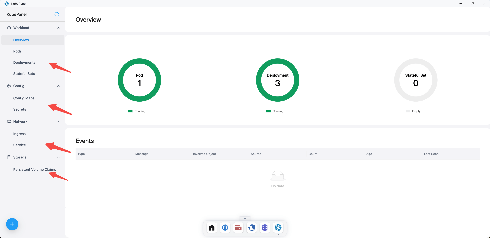
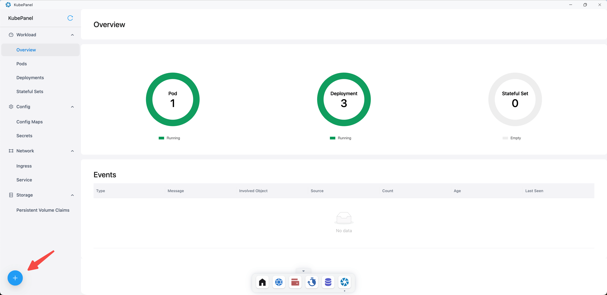
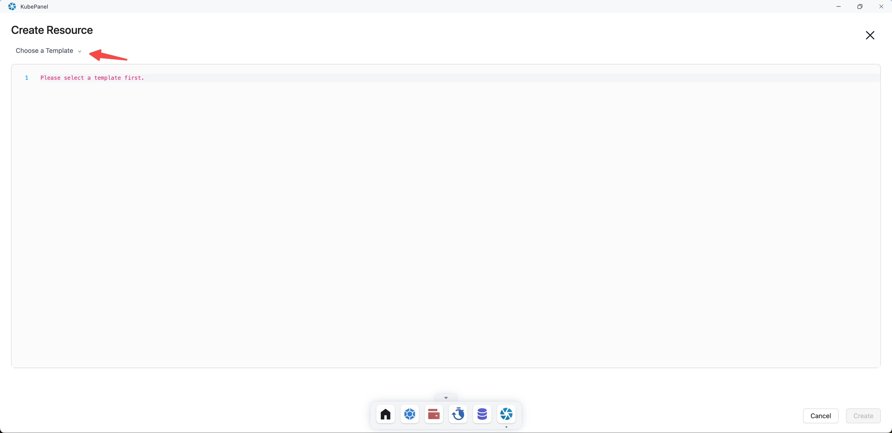
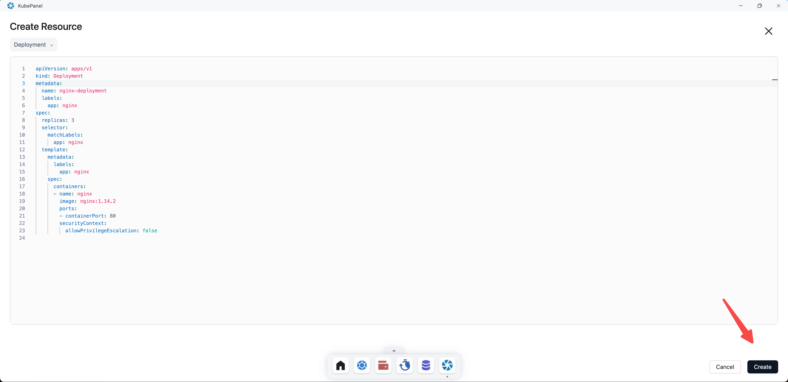
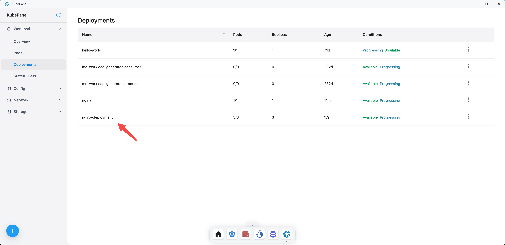
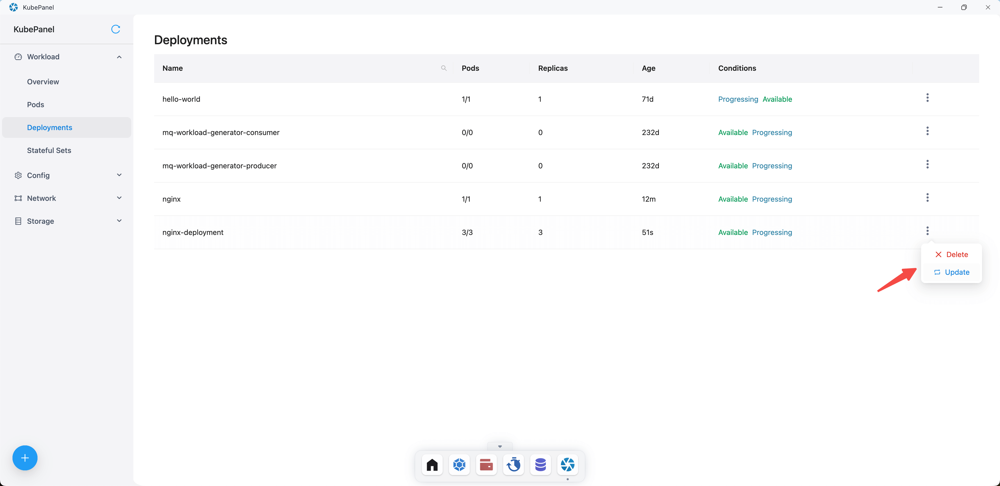

# Kubepanel

Kubepanel is a Kubernetes IDE (Integrated Development Environment). It provides a user-friendly graphical interface for
managing Kubernetes clusters, offering features such as real-time monitoring and resource visualization. It aims to make
Kubernetes more accessible and manageable, even for those who are not very familiar with Kubernetes command-line tools.

## Quick Start

Open the Sealos desktop and click on Kubepanel.

### Viewing Resources

In Kubepanel, you can view Workload, Config, Network, and Storage resources.

### Deploying Resources

Click on the plus sign.

You need to select a template before you can write the resource YAML.

Here, the Deployment template is selected. Click Create to create the Deployment resource.

After creation, you can see the Deployment resource under Workload/Deployments.

Kubepanel also supports deleting or updating resources.

