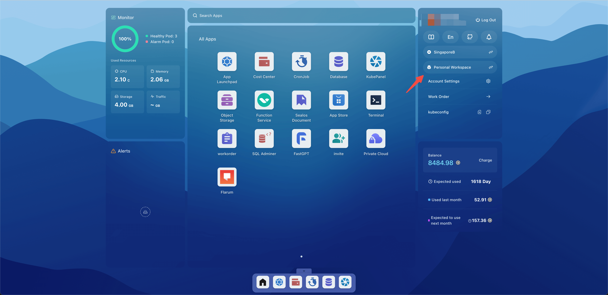
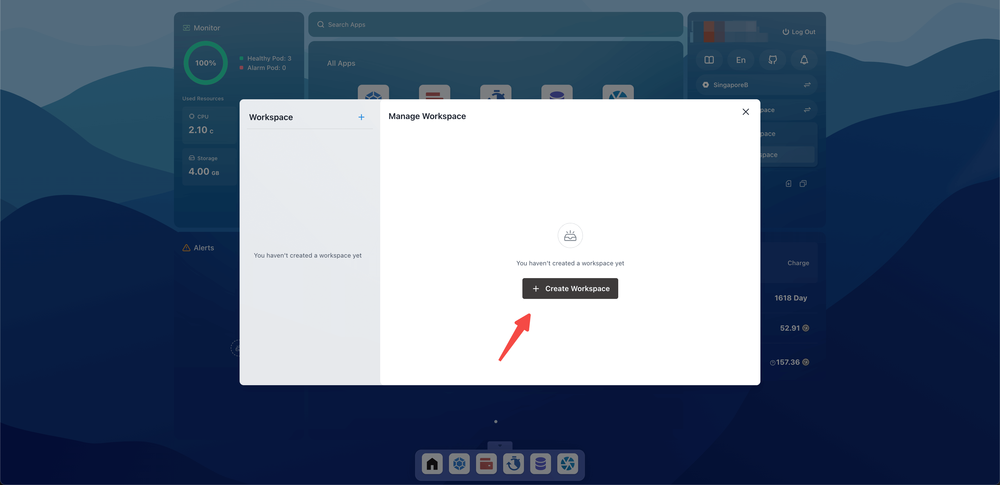
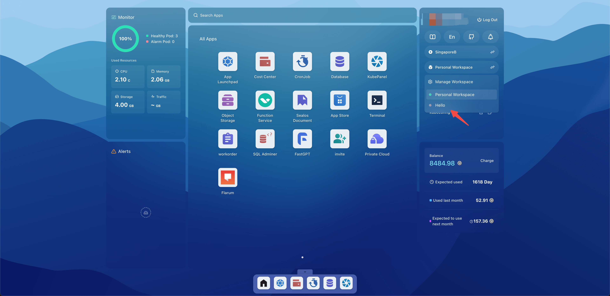
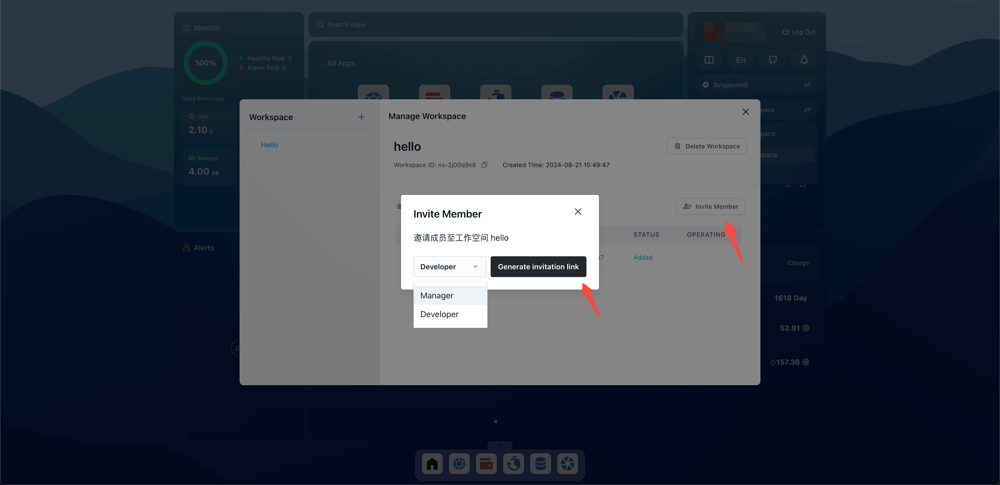
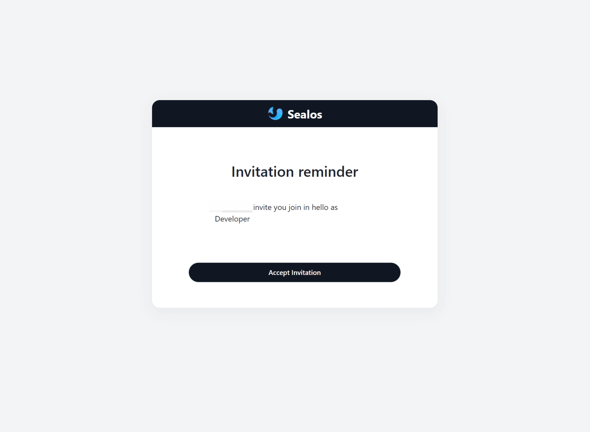

# Workspace

A workspace is a multi-tenant resource isolation mechanism that divides a cluster into multiple independent workspaces,
each with its own resource quotas and permissions. This mechanism supports team collaboration and resource allocation.

A personal workspace is a special form of a workspace where each user has a personal space with the same name as their
username. Although the resource quotas and permissions for a personal space are the same as those of a regular
workspace, it cannot be deleted or have other users added.

## Quick Start

### Creating a Workspace

Open the Sealos desktop, click on the Personal Workspace, and then click on Manage Workspace.

Click on Create Workspace.

### Switching Workspaces

Return to the Sealos desktop, click on the Personal Workspace, and select the hello workspace to switch to it.

### Inviting Users

In the Manage Workspaces section, click on Invite Member, select the members' roles and permissions, click on Generate
Invitation Link, and then send the link to other users.

There are three different roles for users within a workspace, with the following descriptions of roles and permissions:

- Owner: The owner has full permissions for the workspace, including deleting the workspace, viewing/creating/modifying
  all resources within the workspace, and inviting users to join the workspace as managers or developers.

- Manager: The manager has administrative permissions for the workspace, including viewing/creating/modifying all
  resources within the workspace and inviting users to join the workspace as developers.

- Developer: The developer has development permissions, including viewing the status of resources within the workspace.

### Accepting an Invitation

When a user receives an invitation link, they should visit the link and click on Accept Invitation to join the
workspace.

