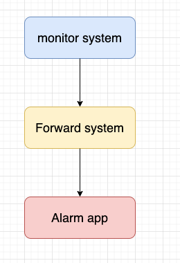

# 监控与告警系统

# 概述

监控与告警系统是公有云服务中非常重要的一部分，本身 Sealos 的设计已经可以将运维人员的心智负担大大降低，通过搭建良好的监控与告警系统可以进一步提升系统的稳定性与可用性。

根据收集的指标来区分，整个系统可以分为两部分，一部分是面向系统实时 Metrics 的监控和告警，而另一部分主要包括日志系统的收集，聚合，展示。

# 监控

## 设计

监控系统整体采用 [ VictoriaMetrics](https://github.com/VictoriaMetrics/VictoriaMetrics)，其相较于 Prometheus 的优势主要在于：

- 同时支持推模型和拉模型，采集数据量更高，消耗内存更小
- 原生支持高可用
- 兼容 PromQL

数据可视化工具使用 Grafana，在 Sealos 的每个可用区都分别部署一套 VictoriaMetrics+Grafana，分别监控。

# 告警

## 设计

告警系统设计思路主要是通过监控系统监控数据，当发现异常数据的时候，发送消息给消息处理中间层，这个中间层再把消息转发到相应的
app 群聊。：

## 实现

选择开源项目 [PrometheusAlert](https://github.com/feiyu563/PrometheusAlert) 作为转发系统，使用 Grafana 发出告警信息到
PrometheusAlert ，在由其转发到飞书，微信等平台。

与监控系统一样，告警系统同样是每个可用区部署一套，分别进行告警。

# 日志

### 设计

日志系统采用 [Loki](https://github.com/grafana/loki) 实现。Loki 是一个水平可扩展，高可用性的日志聚合系统，对比起 ELK ，Loki
并不会存储大量的索引文件以提供全文检索的功能，因此比较轻量。

使用 Grafana，从 Loki 获取数据，完成日志的查询和展示。每个可用区部署一套。