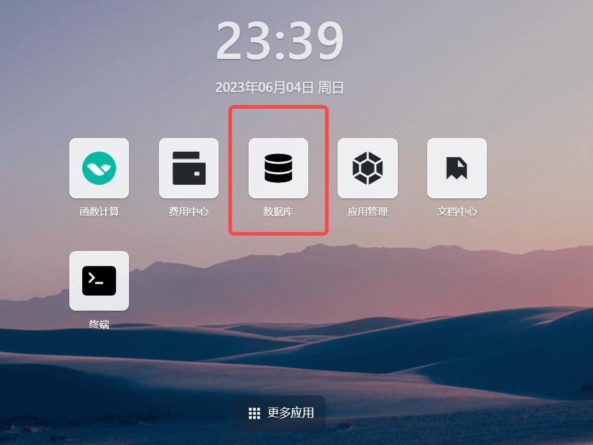
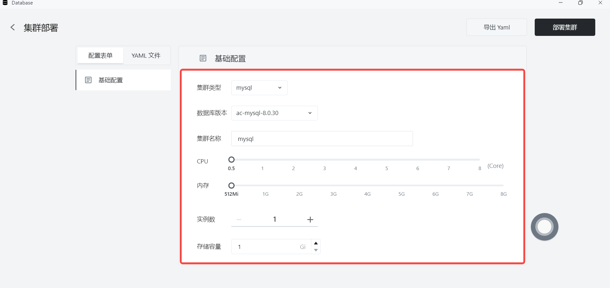
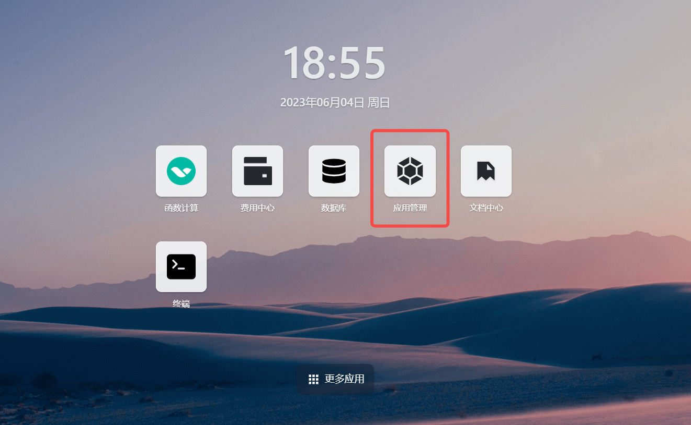
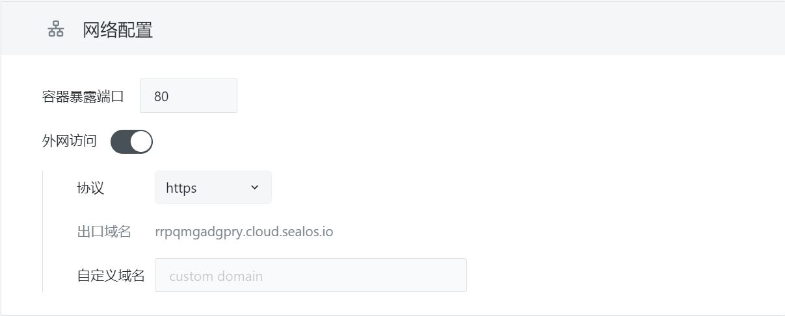
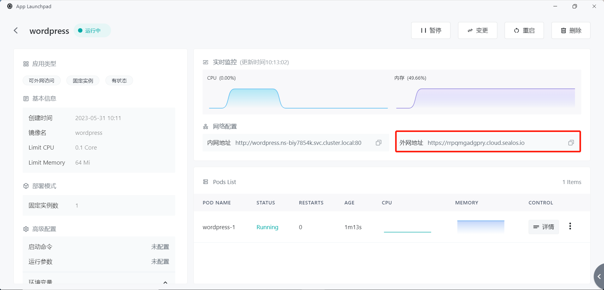
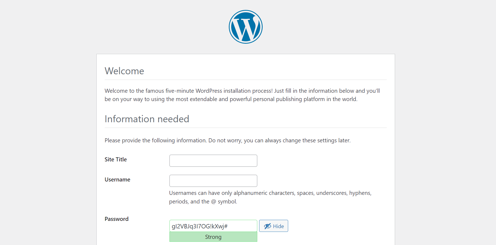

# 快速安装 WordPress

[WordPress](https://github.com/WordPress/WordPress) 是一款功能强大、易用、开源的内容管理系统 (CMS), 可以用于在互联网上发布网站、新闻、博客等内容。它提供了便捷的内容编辑、发布和更新方法 , 同时也可以通过主题和插件进行高度自定义。WordPress 已经成为非常成功和普及的 CMS 系统 , 在全球有超过 3 千万个网站使用 WordPress 搭建。

> 使用 Sealos 安装 WordPress，可以大幅度减少安装时间，极速开启用户的内容输出之旅。

WordPress 需要搭配 MySQL 数据库一同安装使用。作为使用 Sealos 的最佳实践，建议使用**数据库**应用独立安装 MySQL 数据库，依托独立数据库，快速安装 WordPress。

## 新建 MySQL 实例

进入 [Sealos](https://cloud.sealos.io) 桌面环境，在「数据库」中，快速配置需要的数据库实例，等待数据库部署完成。






**注：此时的 MySQL 实例中并不存在用户自定义数据库，需要在终端中手动创建**

## 新建数据库

通过**数据库**应用安装的 MySQL 实例时，并不会自动创建用户自定义数据库。在使用应用程序连接 MySQL 数据库时，您需要在 MySQL 实例中手动创建相应的数据库。

可以通过如下方式进入数据库的终端命令行


也可以在终端中自行输入命令

`mysql -u username -p -h yourhost`


数据库连接成功后，可以按照如下命令创建数据库

`CREATE DATABASE yourdb;`

至此，您已经在 MySQL 实例中手动创建了一个用户自定义数据库。

## 应用管理

点击应用管理，进入安装界面。



## 基础配置

首先设置自定义的应用名称，选择需要安装的镜像。Sealos 既支持公有镜像源，也支持私有镜像源。本示例选用的官方镜像源，不指定镜像版本时，默认拉取 latest 版本。

其次，为 WordPress 配置 CPU 与内存资源，WordPress 十分的轻量级，较少的资源就可以保证程序的正常运行。


## 网络配置

网络配置方面，打开外网访问，Sealos 会为用户自动分配出口域名用作外网访问，如果用户已经注册了自己的自定义域名，那么可以将自定义域名 cname 到该出口域名，这样就可以使用该自定义域名访问用户安装的应用。

注：后续演示，使用的是 Sealos 随机生成的出口域名。



## 高级配置

在高级配置中，需要根据数据库的实际情况配置 WordPress 的环境变量。

高级配置中，需要为 WordPress 配置环境变量与本地存储。

WordPress 常见环境变量如下所示：

```Plain
WORDPRESS_DB_HOST     数据库实例的ip地址
WORDPRESS_DB_USER     连接数据库的用户
WORDPRESS_DB_PASSWORD 连接库所需的用户密码
WORDPRESS_DB_NAME     连接的数据库名称
```

根据之前安装的 MySQL 示例，可以这样配置环境变量：

```Plain
WORDPRESS_DB_HOST=mysql-host:3306
WORDPRESS_DB_USER=root
WORDPRESS_DB_PASSWORD=root_passwd
WORDPRESS_DB_NAME=yourdb
```

WordPress 官方镜像的存储卷挂载地址为：`/var/www/html`，用户根据需求为应用分配存储空间。

这样，WordPress 也一并安装成功，点击详情，通过外网地址就可以成功访问。



点击该链接，如下页面，证明安装成功



**注：如部署失败 , 优先排查 WordPress 访问的用户自定义数据库是否存在于 MySQL 实例中**

