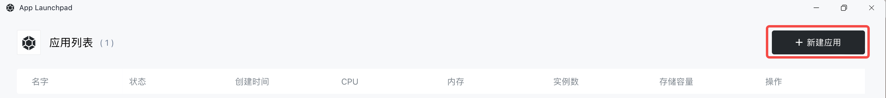
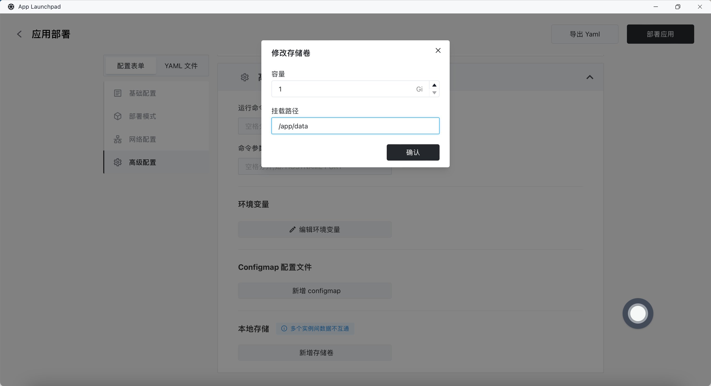

# 快速安装 Uptime Kuma

[Uptime Kuma](https://github.com/louislam/uptime-kuma) 是一款开源的、易于使用的服务器监控工具。它可以帮助你实时监控服务器的运行状态、响应时间以及其他关键指标，以确保你的服务器始终保持最佳状态。如果你想快速安装 Uptime Kuma，可以按照以下步骤进行操作：

### 步骤 1：首先进入 [Sealos](https://cloud.sealos.io) 桌面环境并打开「应用管理」

### 步骤 2: 新建应用

在 「应用管理」 中，点击「新建应用」来创建一个新的应用。

### 步骤 3: 设置启动参数

在启动参数中，按照以下方式进行设置：

- 容器暴露端口指定为 3001。
- 设置为外网访问即可通过给出的域名访问。

### 步骤 4: 设置存储卷

在高级配置中，添加存储卷挂载来持久化 Uptime Kuma 数据目录 `/app/data`。这样可以确保应用数据在容器重启后不会丢失。

### 步骤五：部署应用

点击「部署应用」后即可启动应用：

### 步骤 6: 访问应用

一旦应用启动成功，你就可以使用应用的外网地址进行访问了。在浏览器中输入应用的域名，即可访问应用的主界面。

### 步骤 7: 创建管理员账户

为了保护 Uptime Kuma 的安全性，首次进入你需要创建一个管理员账户，填写管理员账户的基本信息，包括用户名、密码。填写完毕后，点击创建按钮进行注册。

### 步骤 8: 添加自定义监控项

