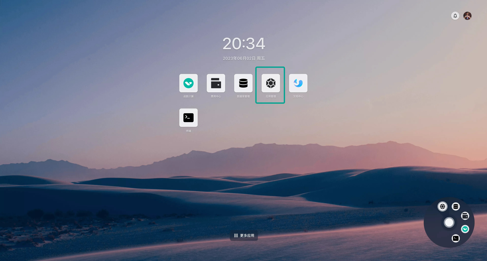
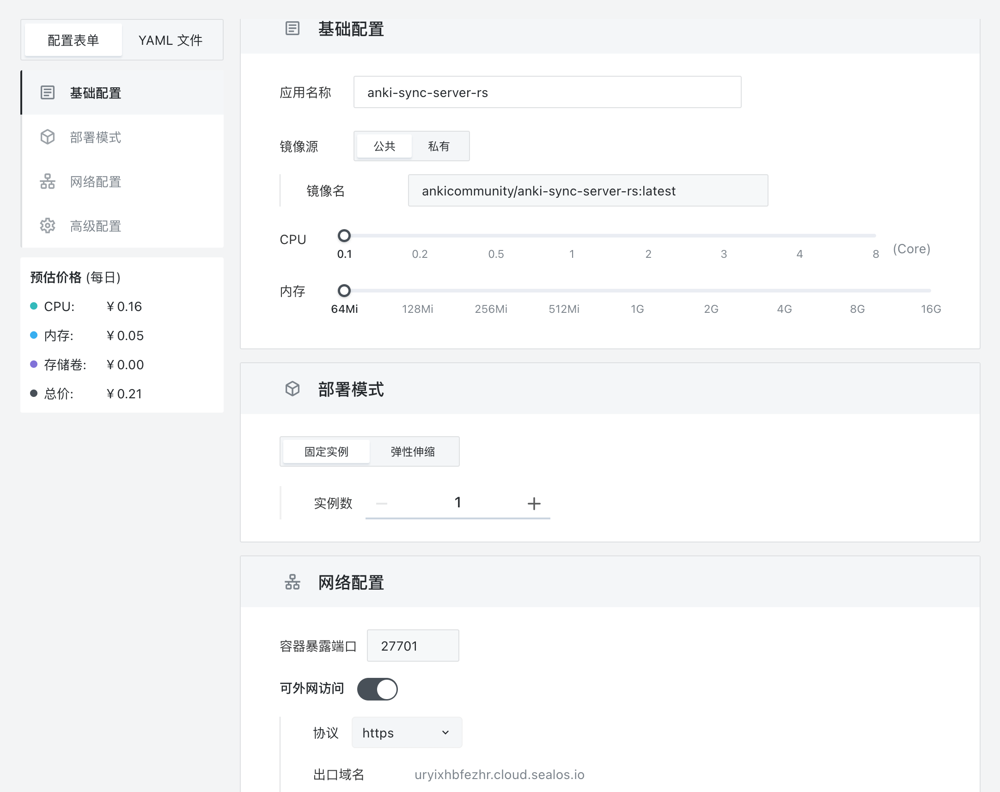
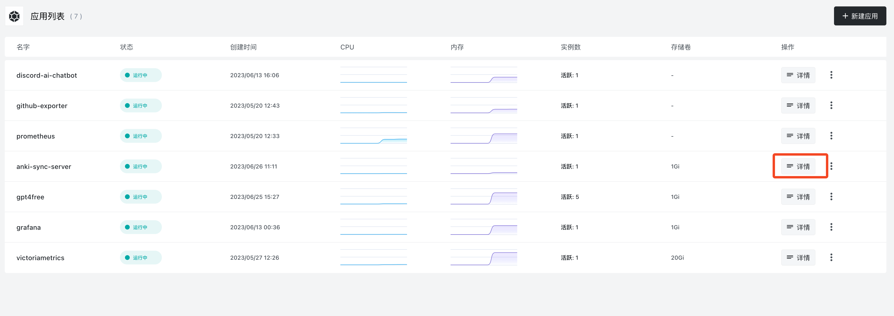
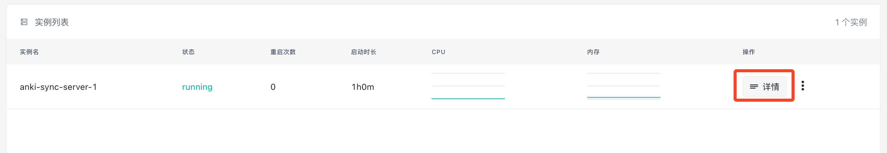
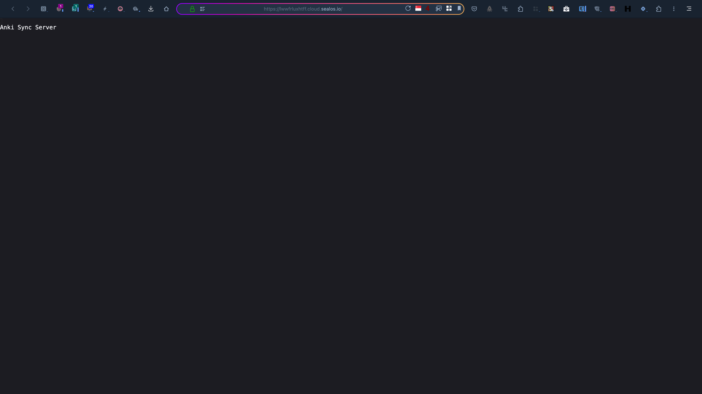
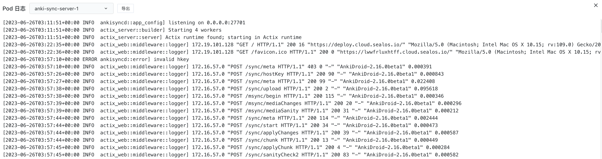
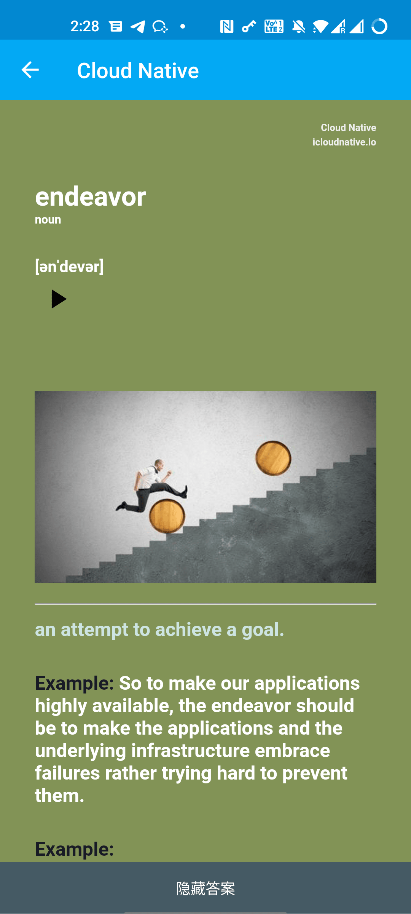
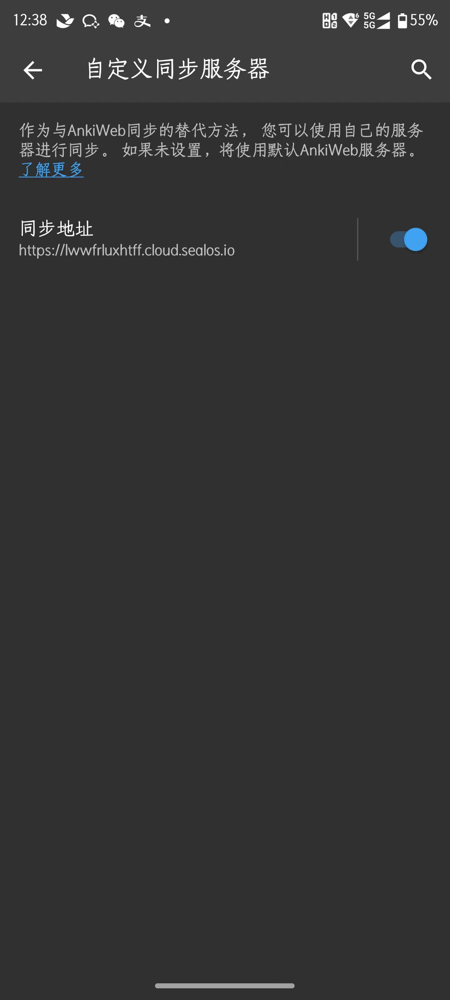

# 快速安装 Anki 自定义同步服务器

Anki 是一个辅助记忆软件，其本质是一个卡片排序工具--**即依据使用者对卡片上的自定义内容进行主动测试、自我评判后，其内部算法根据评判结果更改每张卡片下次测试时间的排序工具。**

所谓的卡片，专业说法叫 Flash Card（抽认卡或闪卡），是一小块纸片，分为正反两面，将问题和提示写在一面，将答案写在另一面。使用方法就是先看正面的问题与提示，在脑中回想答案，然后翻出反面进行对照验证。

闪卡的核心制作原则就是：**一个知识点一张卡**。因此非常适合用来学习英文，也可以用来记忆历史事件时间、公式等等。

Anki 的同步服务器在国外，还是一个个人项目，带宽很小，同步速度很慢，如果我们想在多个客户端之间同步学习进度和新增的知识点，那将非常痛苦。

为了解决这个问题，我们需要部署一个自定义的同步服务器，然后让客户端去使用这个同步服务器。

## Anki 同步服务器部署

自从 2023 年 2 月份，Anki 发布了 PC 端 2.1.57 版本以后，Anki 的 PC 端，安卓端，iOS 端用户都可以自定义同步服务器了，并且不再需要安装插件。从此 Anki 小伙伴再也不用担心 Anki 同步的问题了，困扰 Anki 用户多年的同步问题终于得到彻底解决。

社区目前只有 [anki-sync-server-rs](https://github.com/ankicommunity/anki-sync-server-rs) 这个项目支持最新的 Anki 版本，其他的同步服务器项目基本上都失效了。这个项目是用 Rust 写的，追踪 [Anki 官方](https://github.com/ankitects/anki) 同步服务端的进度，它们都是基于sqlite c 作为数据存储后端。

下面我们将在 Sealos 中部署并配置  anki-sync-server-rs。

首先在浏览器地址栏输入网址 [https://cloud.sealos.io/](https://cloud.sealos.io/) 进入 Sealos 桌面。然后打开「应用管理」：



点击「新建应用」：


依次输入应用名和镜像名，容器暴露端口是 `27701`，并开启外网访问：



继续向下，展开「高级配置」，点击「编辑环境变量」：


将以下内容粘贴到环境变量输入框中：

```bash
ANKISYNCD_USERNAME=<USERNAME>
ANKISYNCD_PASSWORD=<PASSWD>
```

请将 `<USERNAME>` 替换为你自己的用户名，将 `<PASSWD>` 替换为你自己的密码。


点击「新增存储卷」：


挂载路径填入 `/app`，然后点击确认：


最后点击右上角的部署应用即可。

部署完成后点击「详情」进入应用详情界面。



这里可以看到实例的运行状态，一定要等到状态是 running 才算是部署成功。如果一段时间以后状态还不是 running，可以点击「详情」查看故障原因：



部署成功后，可以看到应用的运行情况，包括 CPU 占用、内存占用等。点击外网地址即可通过外网域名直接打开同步服务器的 Web 界面。


如果出现以下的界面，则表示部署成功：



查看日志的方法也很简单，直接点击实例右侧的「三个点」，然后点击「日志」即可查看日志：




## 客户端设置

### 桌面端

桌面客户端（macOS/Windows/Linux）配置方法如下：

1. 先打开「首选项」

   

2. 点击「**网络**」，往下看，可以看到标有 `self-hosted sync server(自定义同步服务器)` 的方框，在里面填写您的服务端的地址：

   

3. 重启 Anki，然后点击「**同步**」：

   

4. 这时候会弹出一个输入框让你输入用户名和密码，你需要将你之前设置的用户名和密码输入进去：

   

5. 点击确认后，就会开始同步了。


### 安卓端

安卓端也是直接配置即可，我的 AnkiDroid 版本是 `2.15.6`。你可以通过「设置 -> 高级设置 -> 自定义同步服务器」找到配置页面。


再填写用户名和密码：

> 设置 -> 常用设置 -> AnkiWeb账户

这样就算配置完成了，所有的牌组都同步过来了。




官方的版本比较旧，如果你想使用更激进的社区版本，可以到这个页面下载最新的 Beta 版：

+ [https://github.com/ankidroid/Anki-Android/releases](https://github.com/ankidroid/Anki-Android/releases)

建议下载 **arm64-v8a** 版本。

安装完成后，可以通过「设置 -> 同步 -> 自定义同步服务器」找到配置页面：



再填写用户名和密码：

> 设置 -> 同步 -> AnkiWeb账户

### iOS 端

AnkiMobile 也已经支持和自建的同步服务器同步了。至少对于版本 Ankimobile 2.0.90(20090.2) 来说，似乎是可行的，这是一位 iOS 系统用户[在 Anki 论坛报告的](https://forums.ankiweb.net/t/ankimobile-self-sync-server-failure-the-one-bundled-in-version-2-1-60-qt6/27862)。

如果设置完成后发现不能同步可以参考下面的内容再试一次：

> If you're using AnkiMobile and are unable to connect to a  server on your local network, please go into the iOS settings, locate  Anki near the bottom, and toggle "Allow Anki to access local network"  off and then on again.

上面的内容摘自 [ANki tutorial](https://docs.ankiweb.net/sync-server.html#client-setup)