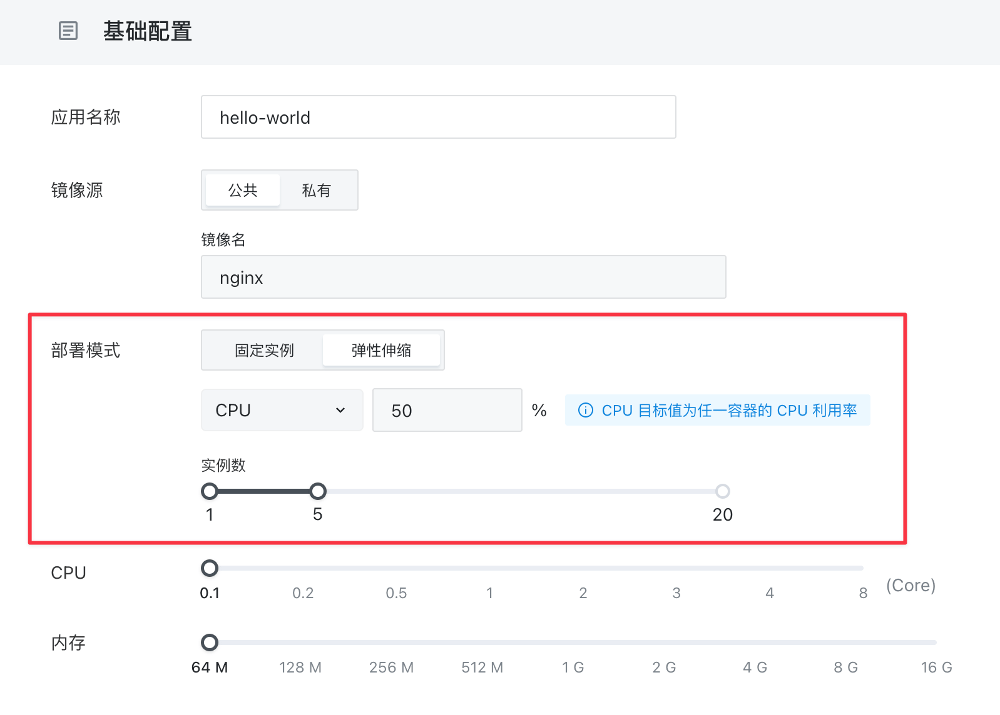

# 弹性伸缩

「[应用管理](/guides/applaunchpad/applaunchpad.md)」可以在 Sealos 集群中自动调整应用的实例数量，以适应不同的负载条件。这个功能叫「**弹性伸缩**（Horizontal Pod Autoscaler，简称 HPA）」。

「弹性伸缩」通过监测特定的度量指标（如 CPU 使用率或内存使用率）来动态增加或减少应用的实例数量，以确保应用程序运行效率和资源利用的最优化。

> 注意：在弹性伸缩的上下文中，提到的“使用率”通常是指应用实例的平均使用率。例如，如果一个应用有两个实例，那么其 CPU 平均使用率将是这两个实例的 CPU 使用率的平均值。

弹性伸缩的工作原理：

1. **监控**：持续监控应用的关键性能指标，如 CPU 使用率或内存使用量。
2. **决策**：根据设定的目标（例如 CPU 使用率不超过 50%），系统会计算出为了达到这一目标所需增加或减少的应用实例数量。
3. **调整**：基于计算结果，弹性伸缩会自动指示 Sealos 的控制器增加或减少应用实例的数量，以保持资源使用率在预定目标范围内。

假设我们为一个应用设置了如下规则：CPU 使用率不得超过 50%，实例数量可在 1 至 5 之间变动。在这种设定下，弹性伸缩将会：

- 当应用的平均 CPU 使用率超过 50% 时，系统会增加实例数量，最多增至 5 个。
- 当应用的平均 CPU 使用率低于 50% 时，系统会减少实例数量，但至少保持 1 个实例运行。

