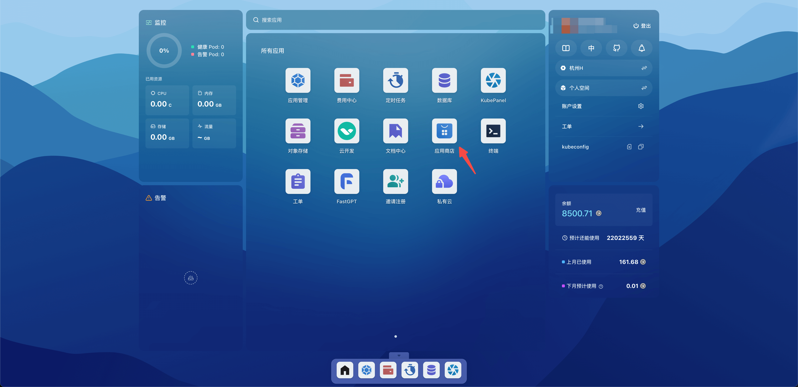
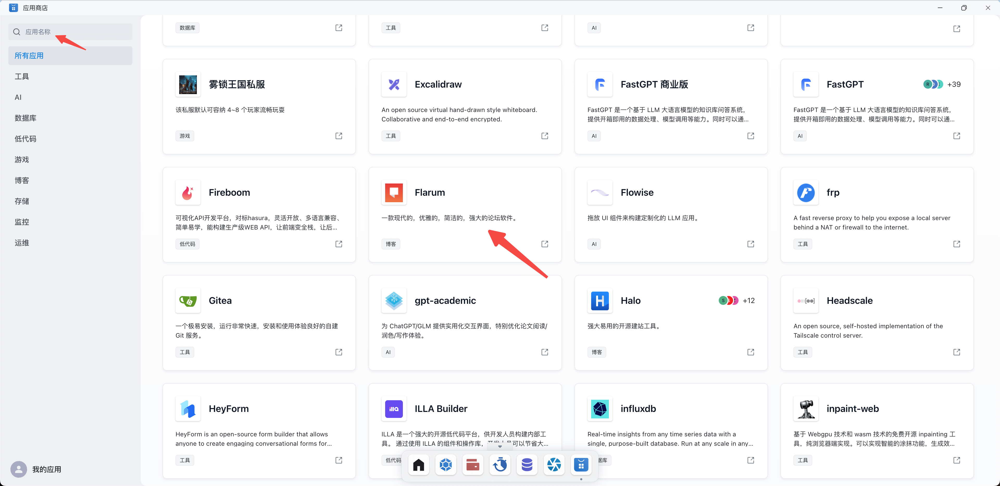
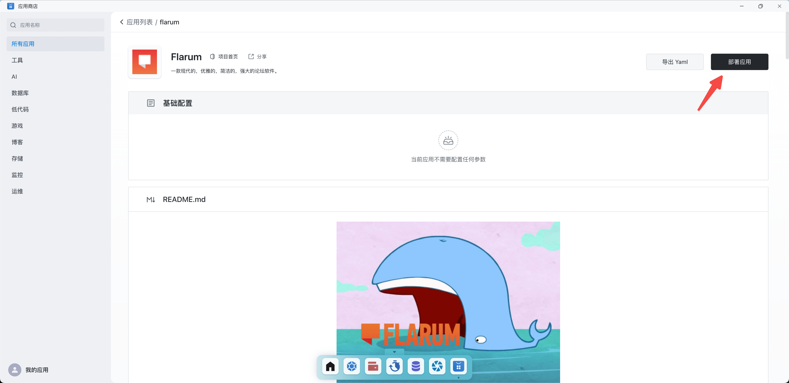
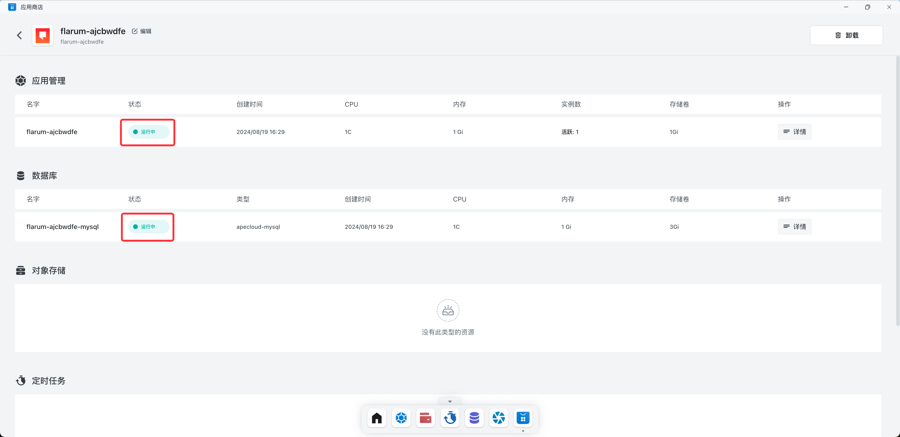
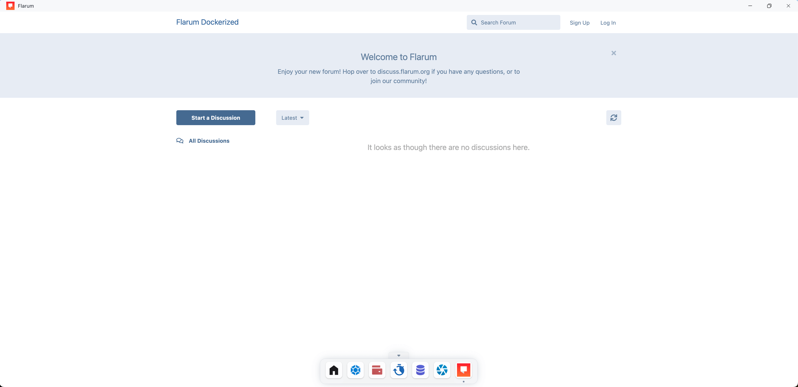

# 快速开始

使用 Sealos 快速部署 Flarum。

> Flarum 是一款非常简洁的开源论坛软件。它响应快速、简便易用，拥有打造一片成功的社区所需的所有功能。它也极其可扩展，允许达到终极的可定制性。

打开 Sealos 桌面，点击应用商店。

点击 Flarum 应用（左上角搜索栏可以快速查找应用）。

点击部署应用

等待所有组件的状态变为运行中，代表组件启动完毕（可以重新进入当前页面刷新状态）。

返回 Sealos 桌面，点击 Flarum 应用。

成功访问 Flarum。

