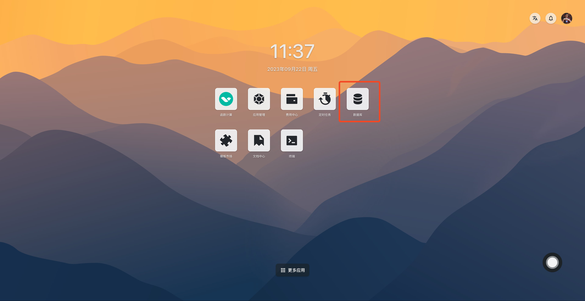
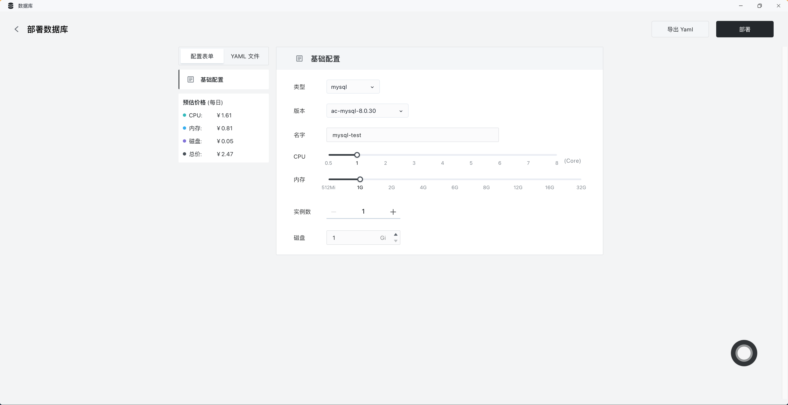
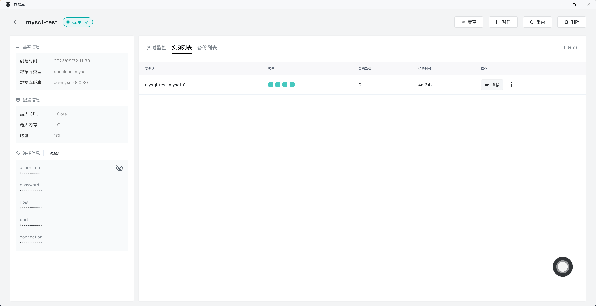
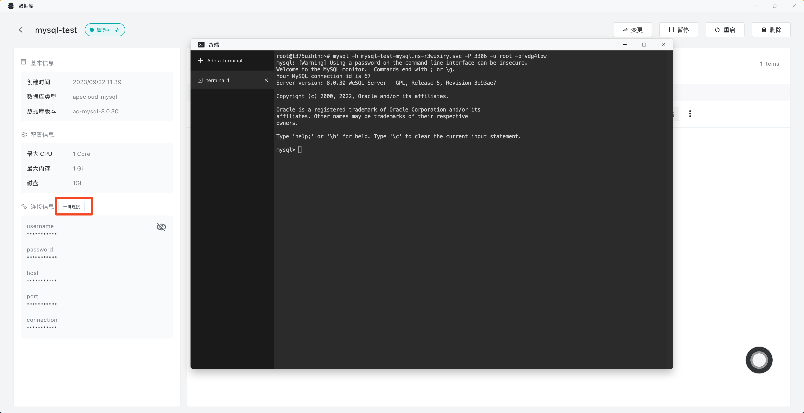

# 使用数据库

数据库是数据管理的重要手段 , 可用于高效地存储和访问数据。Sealos 提供了一个简单易用的数据库前端应用，屏蔽了繁琐的命令行操作，帮助你管理关系数据库、NoSQL、向量数据库和流数据库等各种类型的数据库。你只需通过「[数据库](/guides/dbprovider/dbprovider.md)」应用就能轻松创建各种数据库，包括 MySQL、PostgreSQL、MongoDB、Redis 等多种类型的数据库。

下面将通过示例来演示 Sealos 如何快速安装 MySQL。

## 快速安装 MySQL

1. 在 [Sealos](https://cloud.sealos.run) 桌面环境中打开数据库。

2. 点击新建数据库，完成基础配置设置。

3. 点击「部署」，然后点击「确认」等待数据库创建成功。

4. 点击一键连接，就可以直接打开「[终端](../../guides/terminal/terminal.md)」应用进入数据库的命令行终端。

## 快速安装 PostgreSQL 和 MongoDB

PostgreSQL 和 MongoDB 数据库的安装和 MySQL 类似，需要在基础配置界面选择相应的数据库类型。

