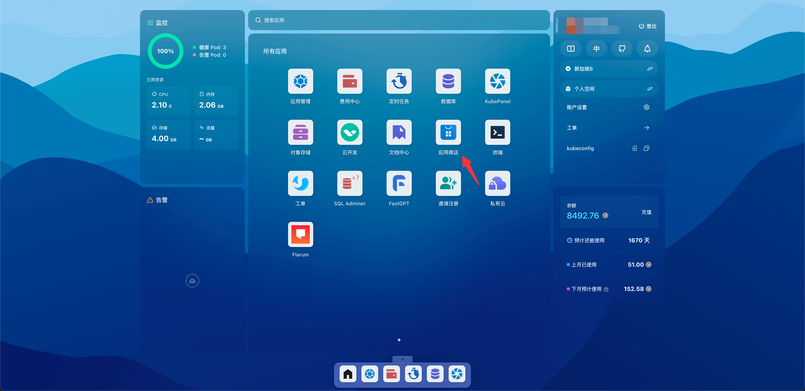
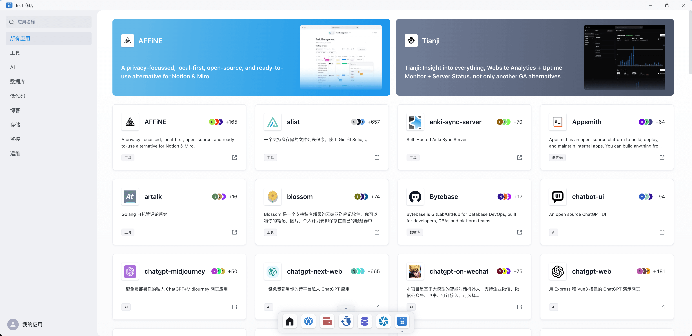
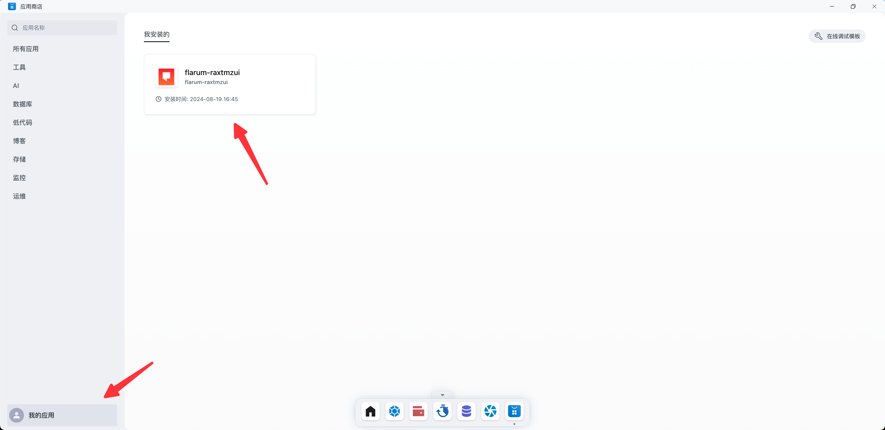
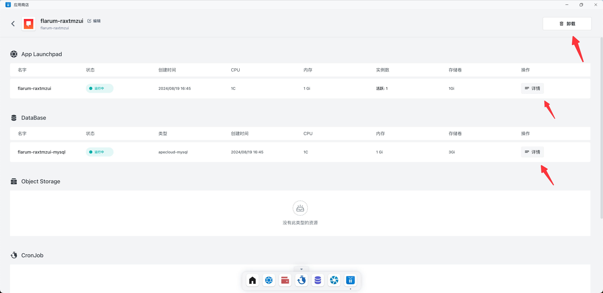

# 应用商店

应用商店提供了一系列预制的应用模板，支持快速创建和部署各种网站及应用程序。这些模板包括博客、AI
应用、低代码应用、网盘、即时通讯应用、中间件等，旨在简化开发过程，让开发者无需从零开始构建项目或处理应用之间的依赖关系。

## 快速开始

打开 Sealos 桌面，点击应用商店。

应用商店内展示了众多的应用，支持搜索框快速查找应用。

### 查看/卸载应用

展示了从应用商店部署的所有应用。

点击对应的应用，可以看到应用的详细信息，也支持卸载应用。（注意：从应用商店部署的应用需要从应用商店卸载应用才能完整卸载应用）

