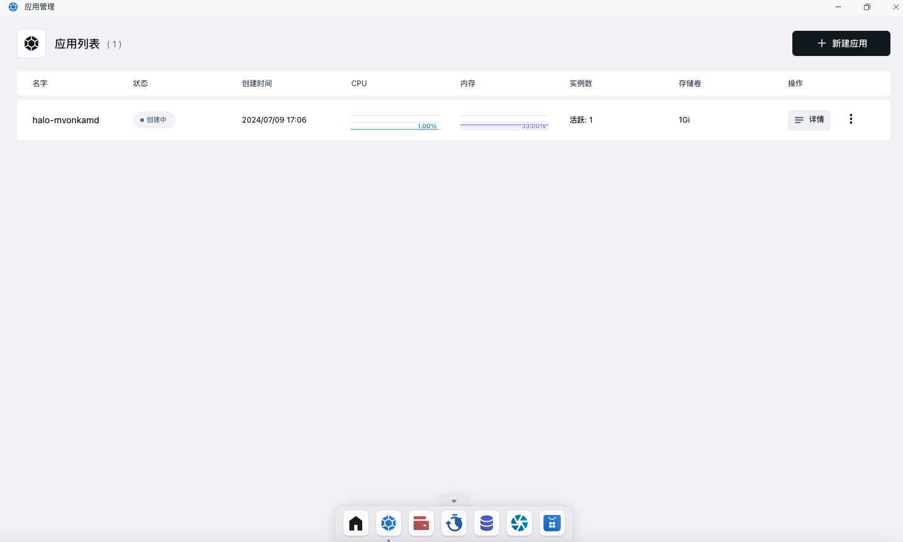
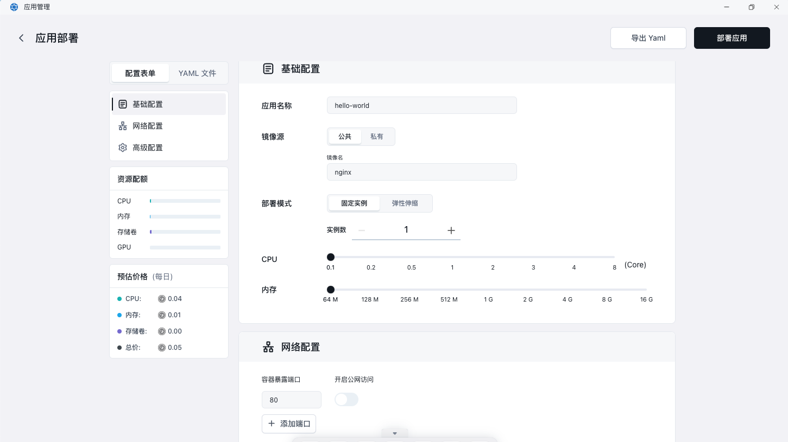
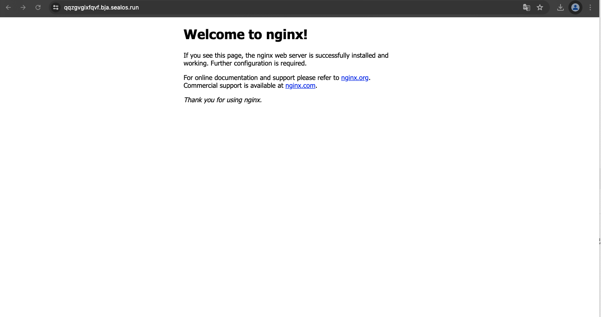

# 快速开始

下面将演示如何在 Sealos 云操作系统中，使用应用管理快速安装一些比较常见的应用。

## 快速安装 Nginx

首先在Sealos桌面环境中打开应用管理。

在打开后的页面中，可以查看自己已经部署的各种应用的具体情况。

点击右上角新建应用，进入新建应用界面。

在这个页面中可以配置应用启动的各种信息。

部署完成后点击「详情」进入应用详情界面。

可以看到 Nginx 应用的运行情况，包括 CPU 占用、内存占用等。如果配置了外网访问的话，点击外网地址即可通过外网域名直接打开 Nginx
界面。

