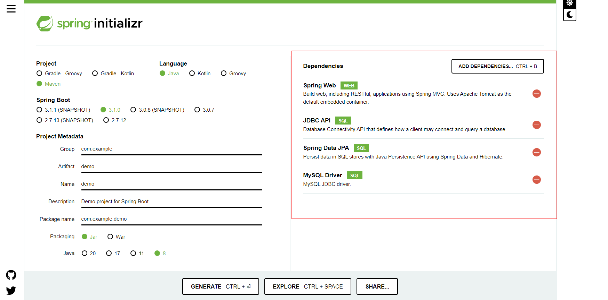
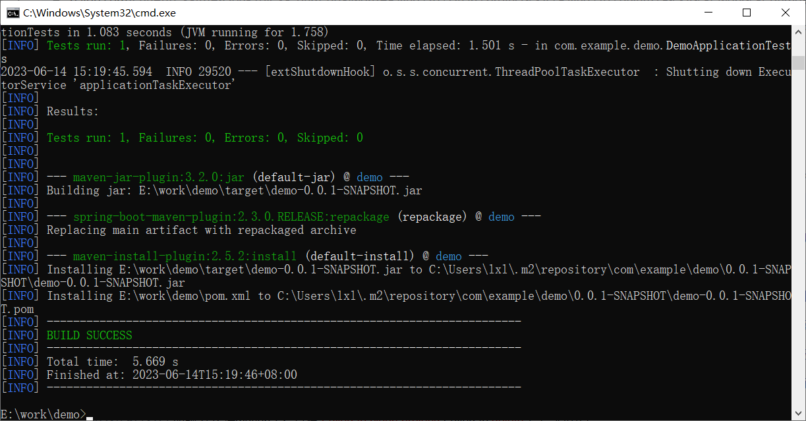
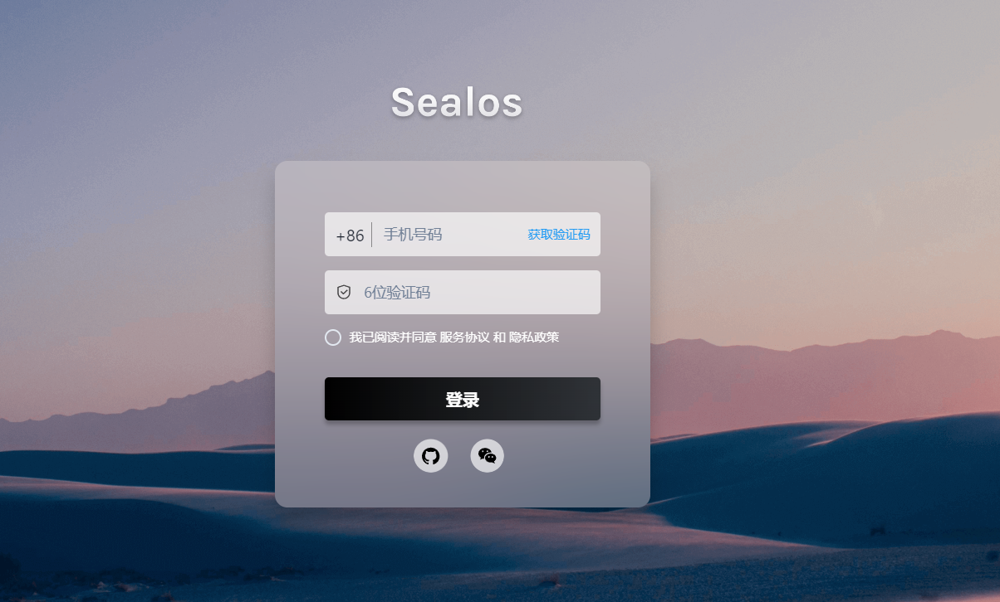
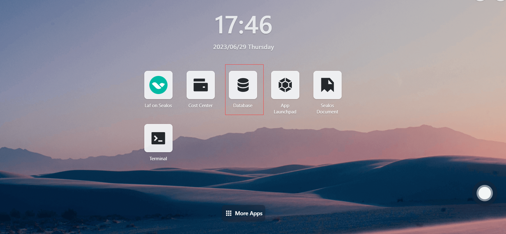
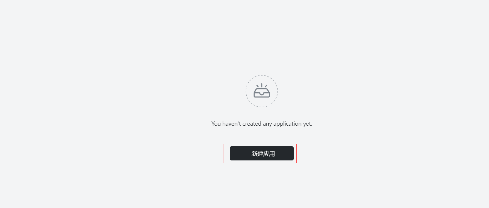
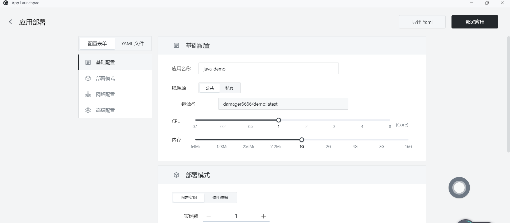
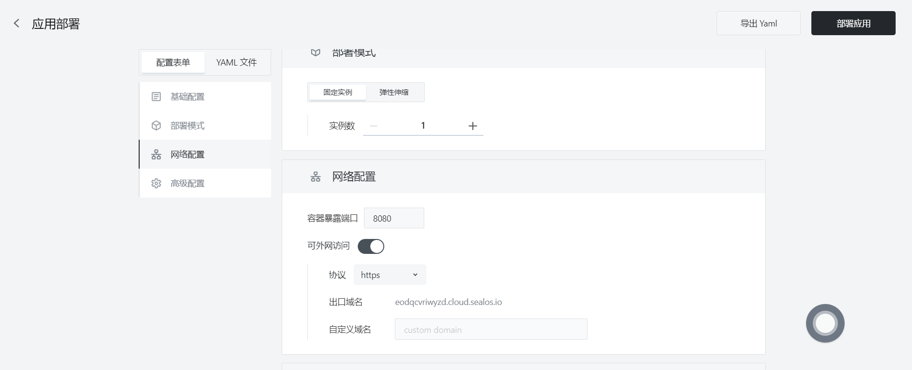
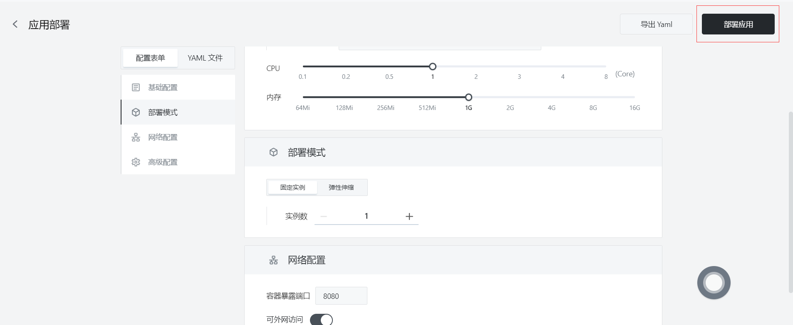
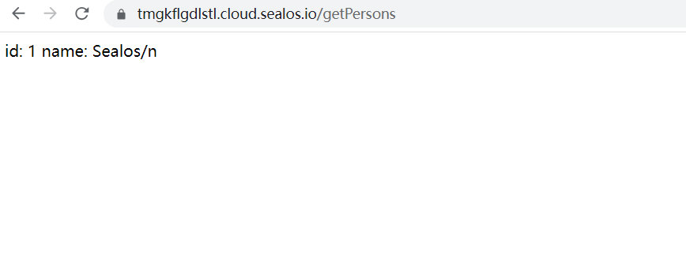

# 快速安装 Java 程序

首先，确保你已经安装了以下工具：

- Docker
- Maven

## 步骤1：编写你的 Java 程序

- 这里直接通过 [Spring Initializr](https://start.spring.io/) 生成生成一个基本的 Spring Boot 项目。



- 打开项目的 `pom.xml` 文件，在 `<dependencies>` 部分添加以下内容，以包含MySQL JDBC驱动：

  ```
  <dependency>
      <groupId>mysql</groupId>
      <artifactId>mysql-connector-java</artifactId>
  </dependency>
  ```

- 接下来，在 `src/main/resources` 目录下的 `application.properties` 文件中添加以下内容，以配置数据库连接：

  ```
  spring.datasource.url=jdbc:mysql://localhost:3306/test_db?useSSL=false&serverTimezone=UTC&characterEncoding=UTF-8
  spring.datasource.username=root
  spring.datasource.password=your_password
  spring.jpa.hibernate.ddl-auto=update
  ```

## 步骤2：创建实体类和存储类

在项目中创建一个新的Java类，如 `Person.java`，用于表示数据库中的实体。添加以下内容：

```java
import javax.persistence.Entity;
import javax.persistence.GeneratedValue;
import javax.persistence.GenerationType;
import javax.persistence.Id;

@Entity
public class Person {
    @Id
    @GeneratedValue(strategy = GenerationType.IDENTITY)
    private Long id;
    private String name;

    // Getters and setters
    // ...
}
```
- 然后创建一个存储库接口，如 `PersonRepository.java`：

  ```java
  import org.springframework.data.jpa.repository.JpaRepository;
  import org.springframework.stereotype.Repository;
  
  @Repository
  public interface PersonRepository extends JpaRepository<Person, Long> {
  }
  ```

## 步骤3：创建 Web 控制器

- 在项目的 `src/main/java` 目录下，创建一个简单的 Web 控制器。例如，创建一个名为 `PersonController.java` 的文件，并添加以下内容：

```java
import org.springframework.beans.factory.annotation.Autowired;
import org.springframework.web.bind.annotation.*;

import java.util.List;

@RestController
public class PersonController {
    @Autowired
    private PersonRepository personRepository;

    @GetMapping("/getPersons")
    public String getAllPersons() {
        List<Person> persons = personRepository.findAll();
        StringBuilder sb = new StringBuilder();
        for (int i = 0; i < persons.size(); i++) {
            sb.append("id: " + persons.get(i).getId() + " name: " + persons.get(i).getName() + "/n");
        }
        System.out.println(sb.toString());
        return sb.toString();
    }

    @PostMapping(value = "/addPerson")
    public Person addPerson(@RequestBody Person person) {
        return personRepository.save(person);
    }

}
```

## 步骤4：构建应用程序

- 使用maven构建项目，运行以下命令

  ```
  mvn clean install
  ```

  ​	

## 步骤5：创建Docker镜像

- 在 Java 项目的根目录下，创建一个名为 `Dockerfile` 的文件。这个文件将包含构建 Docker 镜像所需的指令。以下是一个简单的示例 Dockerfile：

  ```
  # 使用官方的 OpenJDK 镜像作为基础镜像
  FROM openjdk:8-jre-slim
  
  # 设置工作目录
  WORKDIR /app
  
  # 复制构建好的 JAR 文件到镜像中
  COPY target/demo-0.0.1-SNAPSHOT.jar /app/demo-0.0.1-SNAPSHOT.jar
  
  # 暴露应用程序的端口
  EXPOSE 8080
  
  # 设置启动命令
  CMD ["java", "-jar", demo-0.0.1-SNAPSHOT.jar"]
  ```

- 在项目根目录下，运行以下命令构建 Docker 镜像：

```
docker build -t java-demo .
```

## 步骤6：推送Docker镜像

- 将创建的Docker镜像推送到Docker仓库，如Docker Hub或者私有仓库。**假设您已经登录到Docker仓库**，使用以下命令推送镜像

  - 首先标记Docker镜像，在推送镜像之前，需要为其添加一个标签，以便 Docker 知道将其推送到哪个仓库。运行以下命令为镜像添加标签：

    ```
    docker tag your-image-name your-dockerhub-username/your-repo-name:your-tag
    ```

    将 `your-image-name` 替换为你的本地镜像名称，`your-dockerhub-username` 替换为你的 Docker Hub 用户名，`your-repo-name` 替换为你在 Docker Hub 上要创建的仓库名称，`your-tag` 替换为你为镜像设置的标签（例如：latest）。

    例如：

    ```
    docker tag java-demo damager6666/demo:v2
    ```

  - 接下来推送Docker镜像，使用以下命令将镜像推送到 Docker Hub：

    ```
    docker push your-dockerhub-username/your-repo-name:your-tag
    ```

    将 `your-dockerhub-username`、`your-repo-name` 和 `your-tag` 替换为实际的值。例如：

    ```
    docker push damager6666/java-demo:v2
    ```
  
## 步骤7：登陆 Sealos

- 进入 [Sealos](https://cloud.sealos.io/) 官网



## 步骤8：打开 「数据库」 应用



## 步骤9：创建数据库

- 点击新建数据库


- 基础配置：
  - 集群类型：mysql
  - 集群名称 : demo-db
  - CPU（推荐）：1 Core
  - 内存（推荐）：1 G
  - 实例数：1
  - 存储容量： 1 Gi
- 点击 部署集群

## 步骤10：配置数据库


- 点击一键连接到数据库执行以下语句：

  - 创建 test_db 数据库

    ```sql
    create database test_db;
    ```

  - 创建 test 表

    ```sql
    CREATE TABLE `name_info` (
      `id` int(11) NOT NULL,
      `name` varchar(12) COLLATE utf8mb4_unicode_ci DEFAULT NULL,
      PRIMARY KEY (`id`)
    );
    ```

  - 插入数据

    ```sql
    insert into test values (1,'Sealos');
    ```

## 步骤11：打开 「应用管理」 应用


## 步骤 12：新建应用

- 在 「应用管理」 中，点击「新建应用」来创建一个新的应用。



## 步骤13：应用部署

- 基础配置：

  - 应用名称（自定义）：java-demo
  - 镜像名：damager6666/java-demo:v2
  - CPU（推荐）：1 Core
  - 内存（推荐）：1 G

- 部署模式：

  - 实例数（自定义）：1



- 网络配置：

  - 容器暴露端口：8080

  - 外网访问：开启



## 步骤14：部署应用

- 点击「部署应用」开始部署应用。



## 步骤15：访问应用

- 点击「应用管理」查看，当应用的 STATUS 由 Pending 变为 Running，则表明该应用已成功启动。
- 当 STATUS 为 Running，即可直接访问外网地址。


- 在浏览器上输入

```
https://tmgkflgdlstl.cloud.sealos.io/getPersons
```



- 页面上显示之间插入到数据库的数据 ，表示你的 Java 应用程序已经在 Sealos 上运行