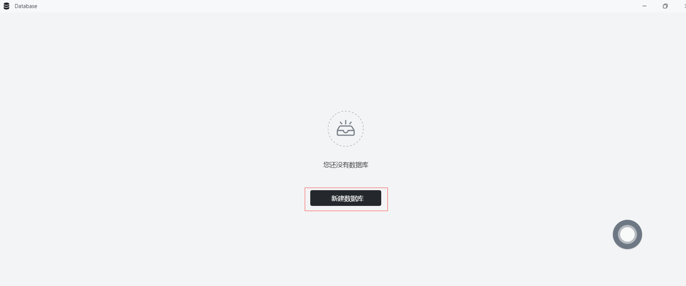
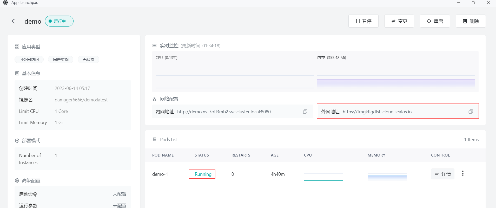

# 快速安装 Node.js 程序

首先，确保你已经安装了以下工具：

- Docker

## 步骤1：编写你的 Node.js 程序

- 在目录下创建一个名为 `app.js` 的文件，并添加以下代码：

  ```js
  const express = require('express');
  const mysql = require('mysql');
  const app = express();
  
  const db = mysql.createConnection({
    host: process.env.DB_HOST,
    user: process.env.DB_USER,
    password: process.env.DB_PASSWORD,
    database: process.env.DB_NAME,
  });
  
  db.connect((err) => {
    if (err) throw err;
    console.log('Connected to the database.');
  });
  
  app.get('/', (req, res) => {
    db.query('SELECT id, name FROM users', (err, results) => {
      if (err) throw err;
      res.send(JSON.stringify(results));
    });
  });
  
  app.listen(8080, () => {
    console.log('Server is running on port 8080');
  });
  
  ```

- 在项目根目录下创建一个名为 `package.json` 的文件，并包含以下内容：

  ```json
  {
    "name": "nodejs-web-app-mysql",
    "version": "1.0.0",
    "main": "app.js",
    "scripts": {
      "start": "node app.js"
    },
    "dependencies": {
      "express": "^4.17.1",
      "mysql": "^2.18.1"
    }
  }
  ```

## 步骤2：创建 Docker 镜像

- 在项目的根目录下，创建一个名为 `Dockerfile` 的文件。这个文件将包含构建 Docker 镜像所需的指令。以下是一个简单的示例 Dockerfile：

```dockerfile
FROM node:16

WORKDIR /app

COPY package*.json ./

RUN npm install

COPY . .

EXPOSE 8080

CMD ["npm", "start"]
```

## 步骤3：构建 Docker 镜像

- 在包含 `Dockerfile` 的目录中运行以下命令来构建 Docker 镜像：

  ```
  docker build -t nodejs-demo .
  ```

## 步骤4：推送Docker镜像

- 将创建的Docker镜像推送到Docker仓库，如Docker Hub或者私有仓库。**假设您已经登录到Docker仓库**，使用以下命令推送镜像

  - 首先标记Docker镜像，在推送镜像之前，需要为其添加一个标签，以便 Docker 知道将其推送到哪个仓库。运行以下命令为镜像添加标签：

    ```
    docker tag your-image-name your-dockerhub-username/your-repo-name:your-tag
    ```

    将 `your-image-name` 替换为你的本地镜像名称，`your-dockerhub-username` 替换为你的 Docker Hub 用户名，`your-repo-name` 替换为你在 Docker Hub 上要创建的仓库名称，`your-tag` 替换为你为镜像设置的标签（例如：latest）。

    例如：

    ```
    docker tag nodejs-demo damager6666/nodejs-demo:v1
    ```

  - 接下来推送Docker镜像，使用以下命令将镜像推送到 Docker Hub：

    ```
    docker push your-dockerhub-username/your-repo-name:your-tag
    ```

    将 `your-dockerhub-username`、`your-repo-name` 和 `your-tag` 替换为实际的值。例如：

    ```
    docker push damager6666/nodejs-demo:v1
    ```

    

## 步骤5：登陆 Sealos

- 进入 [Sealos](https://cloud.sealos.io/) 官网


## 步骤6：打开 「数据库」 应用


## 步骤7：创建数据库

- 点击新建数据库



- 基础配置：
  - 集群类型：mysql
  - 集群名称 : demo-db
  - CPU（推荐）：1 Core
  - 内存（推荐）：1 G
  - 实例数：1
  - 存储容量： 1 Gi
- 点击 部署集群

## 步骤8：配置数据库


- 点击一键连接到数据库执行以下语句：

  - 创建 test_db 数据库

    ```sql
    create database test_db;
    ```

  - 创建 test 表

    ```sql
    CREATE TABLE `name_info` (
      `id` int(11) NOT NULL,
      `name` varchar(12) COLLATE utf8mb4_unicode_ci DEFAULT NULL,
      PRIMARY KEY (`id`)
    );
    ```

  - 插入数据

    ```sql
    insert into test values (1,'Sealos');
    ```

    

## 步骤9：打开 「应用管理」 应用


## 步骤 10：新建应用

- 在 「应用管理」 中，点击「新建应用」来创建一个新的应用。


## 步骤11：应用部署

- 基础配置：

  - 应用名称（自定义）：nodejs-demo
  - 镜像名：damager6666/nodejs-demo:v1
  - CPU（推荐）：1 Core
  - 内存（推荐）：1 G

- 部署模式：

  - 实例数（自定义）：1


- 网络配置：

  - 容器暴露端口：8080

  - 外网访问：开启


## 步骤12：部署应用

- 点击「部署应用」开始部署应用。


## 步骤13：访问应用

- 点击「应用管理」查看，当应用的 STATUS 由 Pending 变为 Running，则表明该应用已成功启动。
- 当 STATUS 为 Running，即可直接访问外网地址。



- 在浏览器上输入

```
https://tmgkflgdlstl.cloud.sealos.io/getPersons
```


- 页面上显示之间插入到数据库的数据 ，表示你的 Node.js应用程序已经在 Sealos 上运行