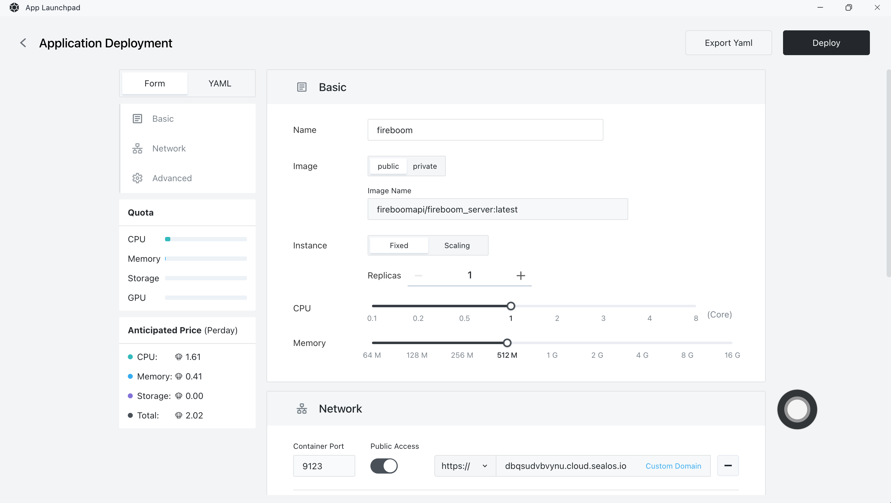
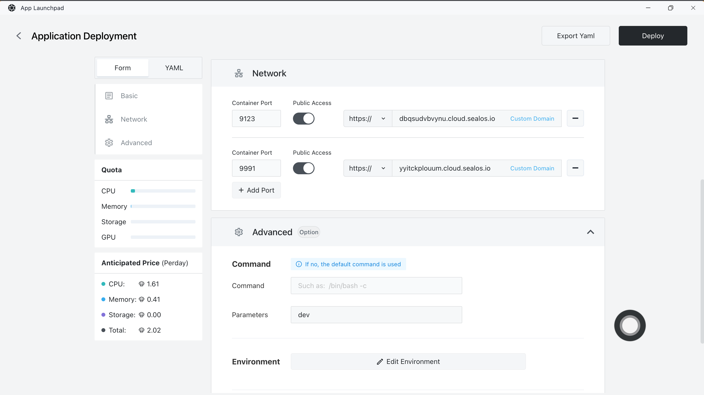
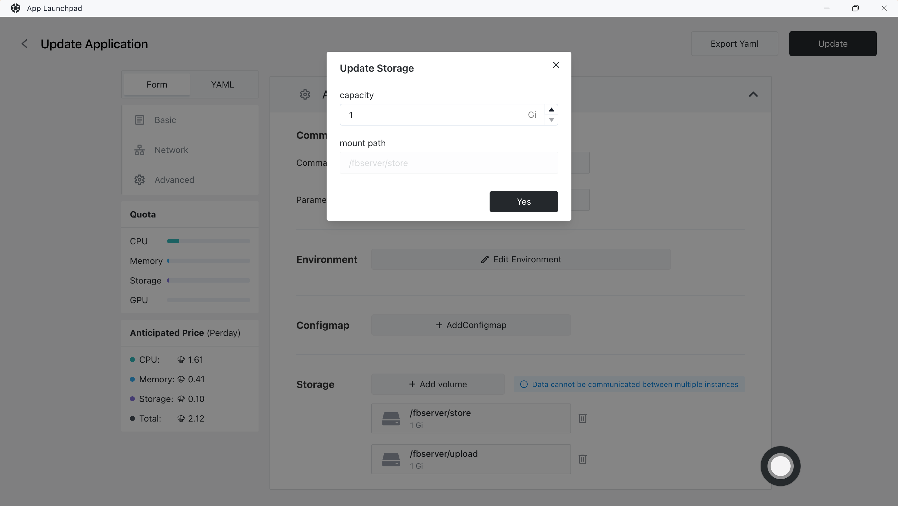
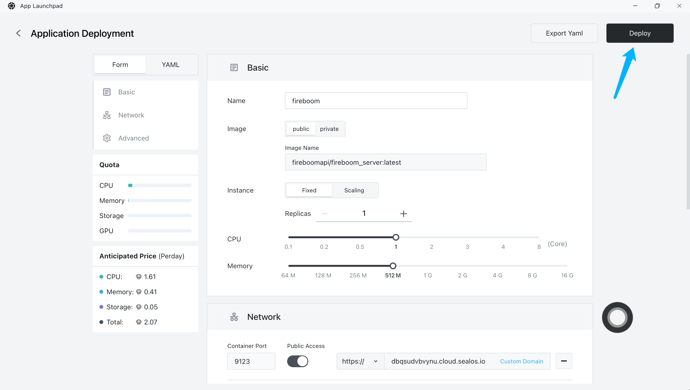
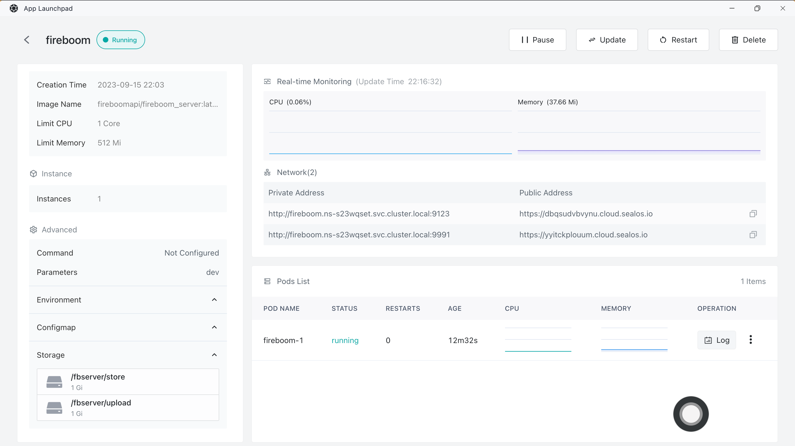

# 快速安装 Fireboom

[Fireboom](https://fireboom.io) ⾯向开发者的可视化 API 开发平台，为开发者提供**声明式开发框架**、**可视化编辑套件**和**钩子机制**。


官网地址： https://fireboom.io

**功能特性**

- 分钟级交付: 将传统模式下 2天才能完成的接⼝缩短⾄ 2分钟 

- 前端变全栈: 可视化开发，显著降低接⼝开发⻔槛，让前端搞定前后端秒变全栈 

- 后端不搬砖: 声明式编程，避免复制粘贴，减少bug概率，让后端专注于业务开发

## 步骤 1：新建应用

- 在 [Sealos](https://cloud.sealos.io) 桌面环境中打开 「应用管理」 应用


- 在 「应用管理」 中，点击「新建应用」来创建一个新的应用。


## 步骤 2：应用部署

- 基础配置：
  
  - 应用名称（自定义）：fireboom
  
  - 镜像名（默认最新版本）：fireboomapi/fireboom_server:latest
  
  - CPU（推荐）：2 Core ( 最低1 Core)
  
  - 内存（推荐）：4 G (最低 512 M)

- 部署模式：
  
  - 实例数（自定义）：1



- 网络配置：
  
  - 控制面板：9123
  - API端点：9991，开启外网



- 高级配置：

  - 命令设置：
    - 参数设置： dev （dev表示开发模式，start表示生产模式）
  
  - 持久化存储：

    - 元数据：/fbserver/store
    - 上传文件：/fbserver/upload




## 步骤 3：部署应用

1， 点击「部署应用」开始部署应用。



2， 点击「详情」查看，当应用的 STATUS 由 Pending 变为 Running，则表明该应用已成功启动。



## 步骤 4：访问应用

- 访问控制面板：9123对应的域名


- 访问API端点：9991对应的域名

```
status ok
```

## 步骤 5：配置Fireboom（可选）

设置后，可方便使用swagger文档~

1， 查看API外网地址： 设置-> 系统


2， 修改为：API端点地址，9991对应的公网地址

    - 静态值：选择静态值，设置为 **API端点** 公网域名
    - 环境变量：前往 环境变量 ，找到 FB_API_PUBLIC_URL 设置为 **API端点** 公网域名


3， 使用swagger文档测试API

