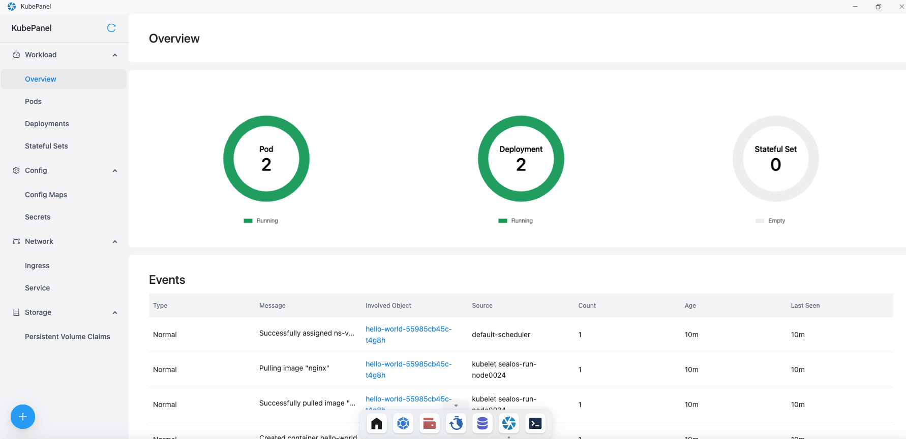
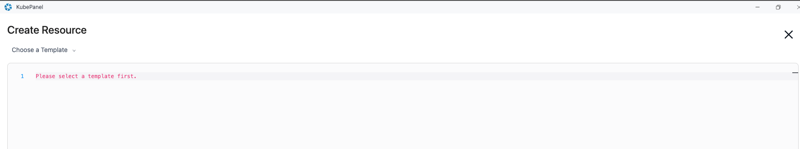
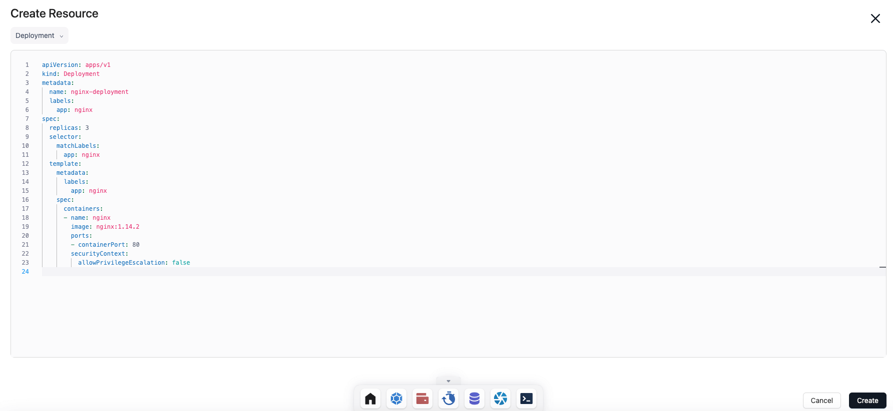

# Kubepanel

Kubepanel 是一款可视化的 Kubernetes 管理面板，如果您较为熟悉 Kubernetes，可以直接使用快速查看和管理您的各种 Kubernetes 资源。

## 快速开始

### 进入 Kubepanel

直接点击桌面上的 Kubepanel app 就可以直接进入 Kubepanel 页面。

可以在其中看到部署信息，资源概览，与发生事件等信息。

## 部署资源

进入 Kubepanel 后，点击左下角加号，即可使用其部署资源。

部署资源直接使用 yml 文件，可以自己编写或者导入，也可以点击左上角 choose a template 选择您所需要的模版然后进行修改。

修改完成配置文件之后，点击右下角的 create 即可开始部署，等待部署完成即可。
