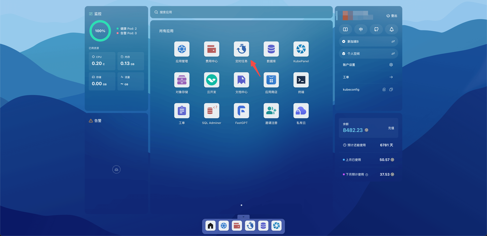
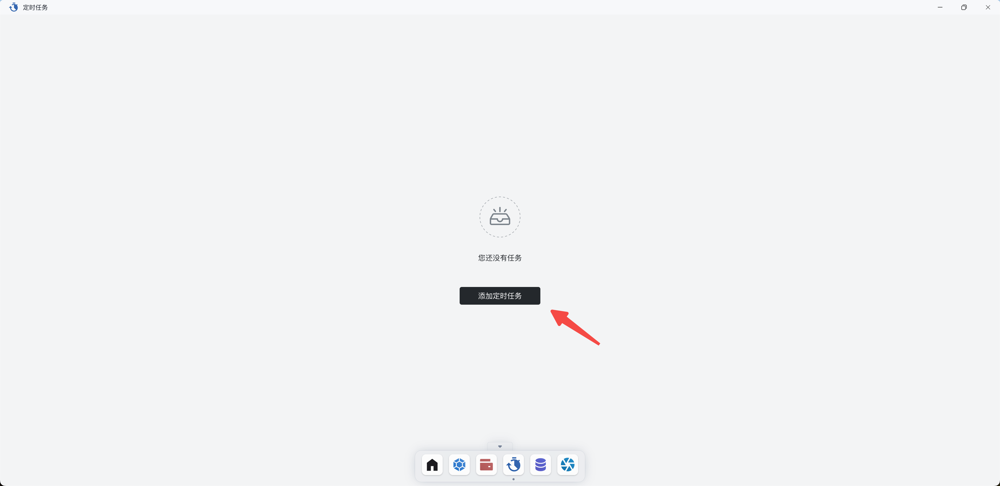

# 定时任务

定时任务用于按指定的时间表定期执行任务。

## 快速开始

打开 Sealos 桌面，点击定时任务。

点击添加定时任务。

这里启动了一个定时任务，每天下午 12 点时会将 nginx deployment 的实例数设置为 0。

输入自定义的任务名称，通过 Cron 表达式设置时间，类型选择扩缩容 Launchpad，App 名称选择 nginx（正在运行的 nginx
deployment），副本数 0，点击部署。

成功添加定时任务后，可以点击详情查看定时任务的执行情况。

详情中展示了成功数和失败数，以及历史任务的执行情况。

 