# 数据库

**数据库** 是一个应用的核心组成，Sealos 提供了一个数据库集群部署管理工具，可以帮助你快速部署数据库集群。目前支持
MySQL、PostgreSQL、MongoDB、Redis、Kafka等。目前**数据库** 支持如下特性。

+ 弹性伸缩
+ 支持多版本、多类型 数据库
+ 数据库 连接：一键连接、外网访问
+ 数据库 连接：手动备份、自动备份
+ 数据库 监控：资源、状态、性能监控
+ 数据库 迁移：公网迁移、文件迁移
+ 数据库 高可用：支持多个 数据库 实例
+ 可视化 数据库 管理：新建、删除、更新 、暂停、重启 数据库


## 快速开始

以部署一个 PostgreSQL 数据库为例，体验 **数据库** 的便捷性。

只需 6 步即可完成部署和访问：

1. 在 [Sealos](https://cloud.sealos.io) 桌面进入 **数据库** 应用：

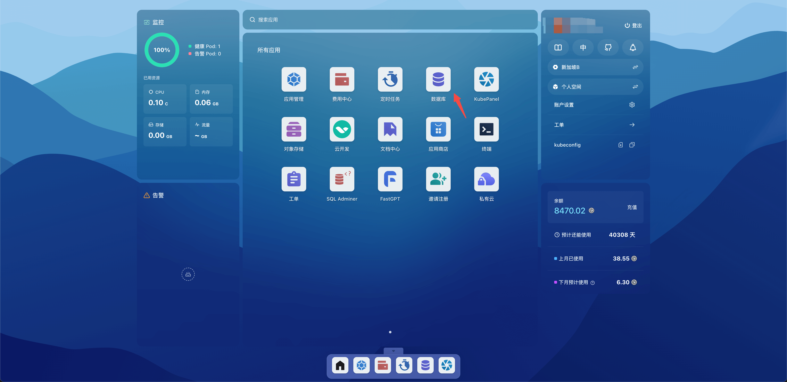

2. 点击新建集群：


3. 填写数据库名并选择对应的数据库和参数：

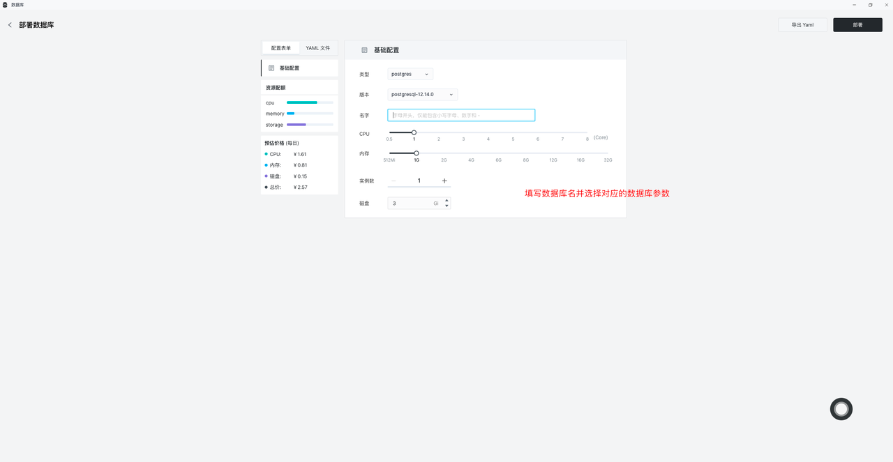

4. 点击部署：

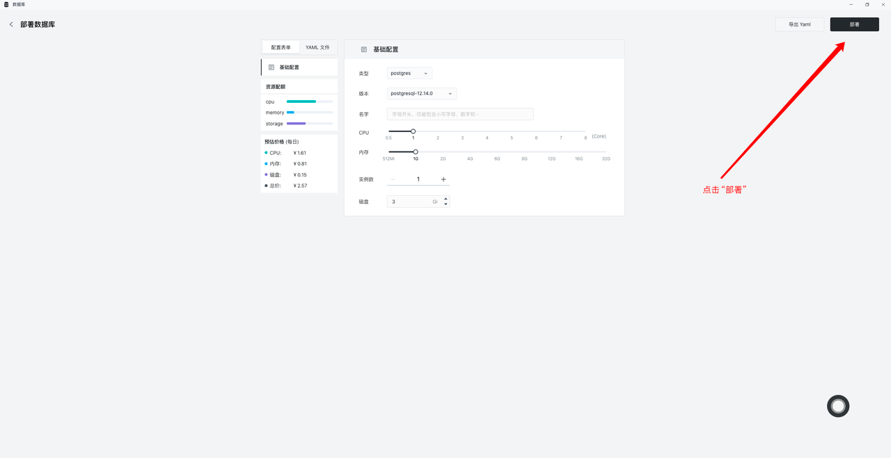

5. 查看数据库详情信息：

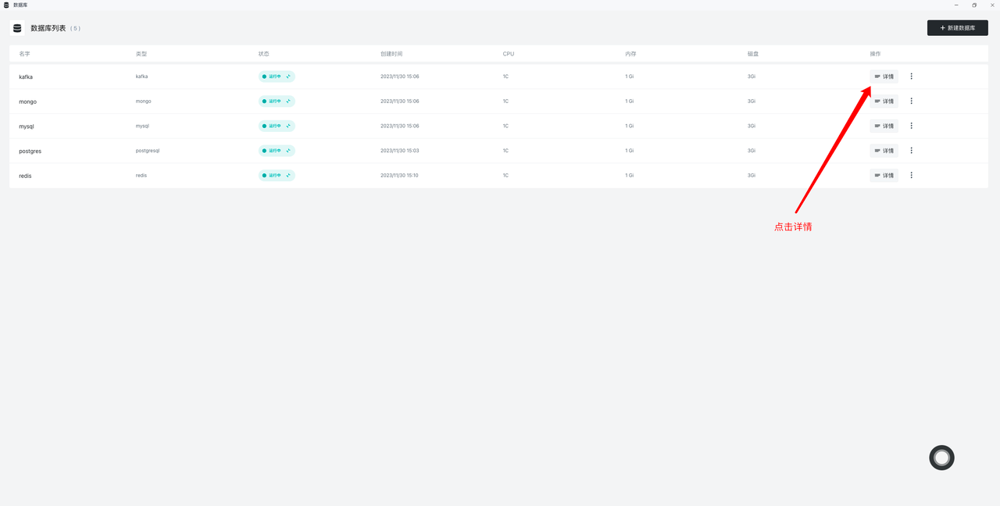

6. 数据库详情界面：


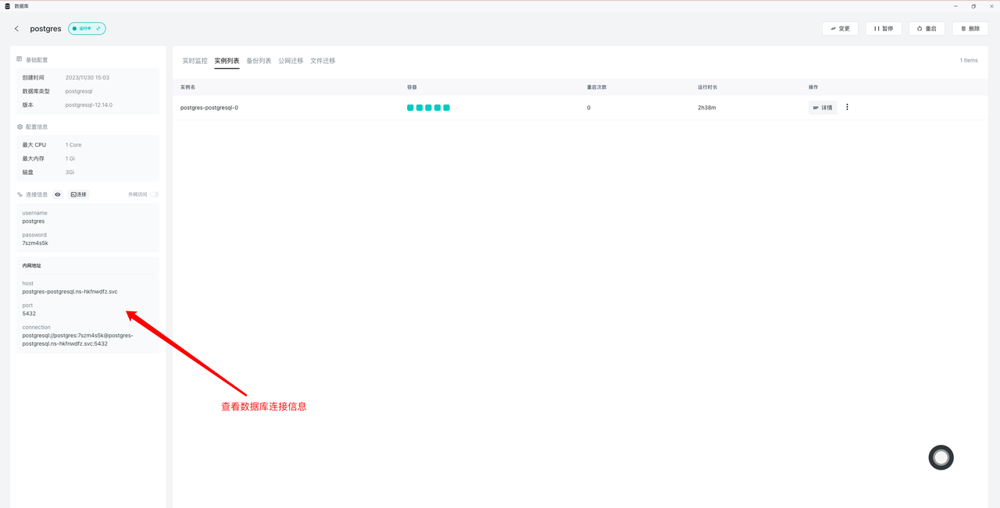

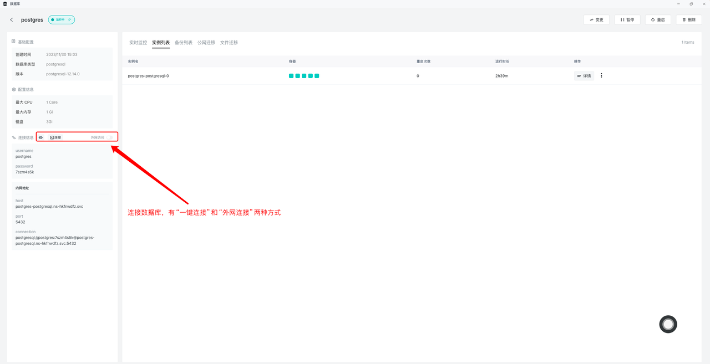


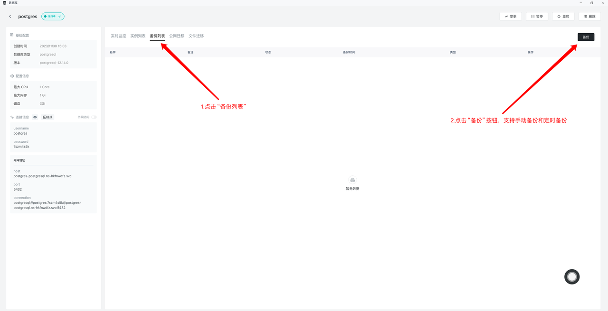

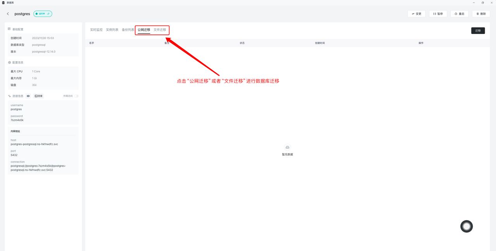

## 数据库连接

### 一键连接

1. 进入 **数据库** ，点击连接：


2. 在终端操作数据库：


### 外网访问

1. 进入 **数据库** ，开启外网访问：

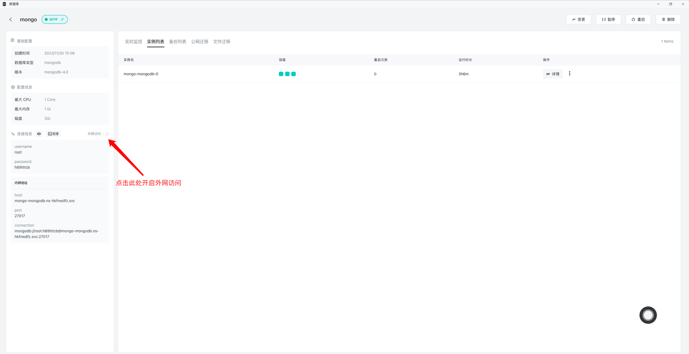

2. 确认开启：


3. 复制数据库连接信息：

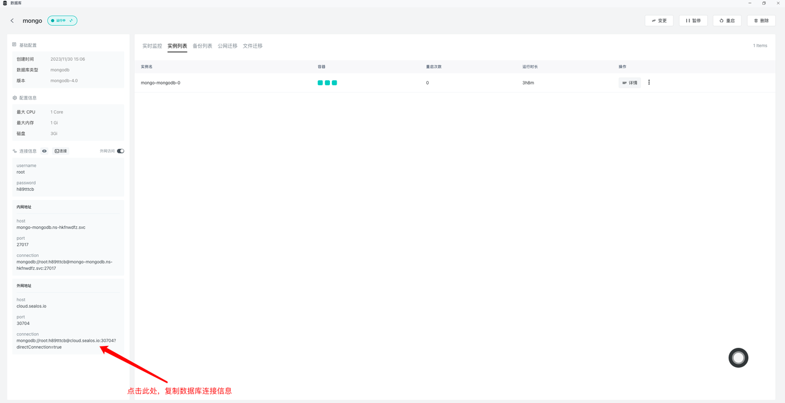

4. 在数据库连接工具中连接数据库：

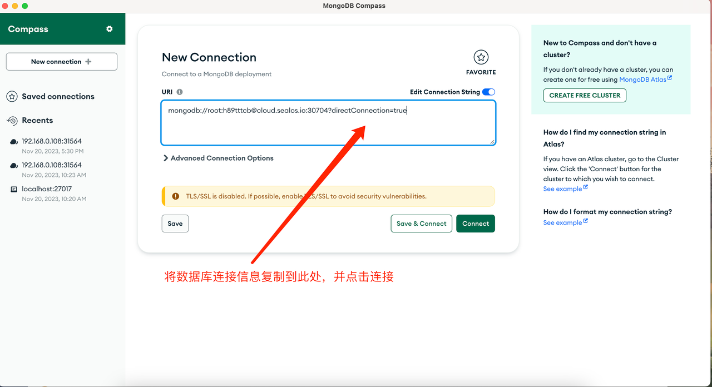

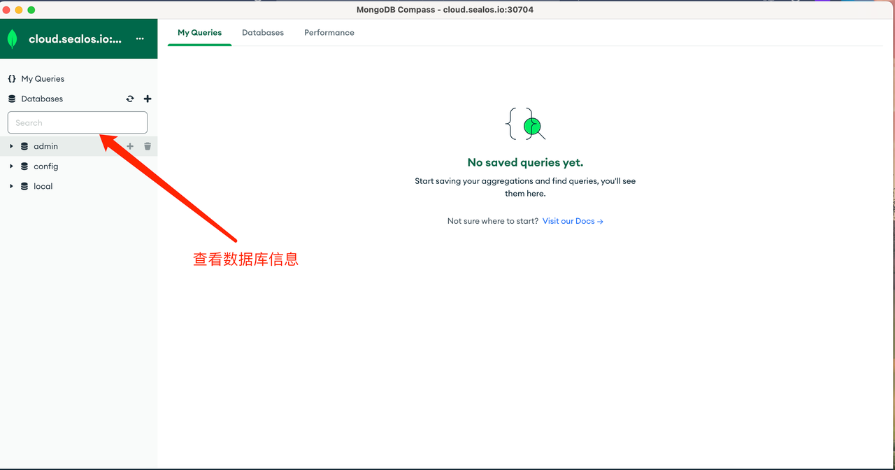

## 数据库备份

### 手动备份

1. 进入数据库备份界面，点击备份：


2. 填写备份信息，开始备份：


3. 查看备份状态：


### 自动备份

1. 进入数据库备份界面，点击备份：


2. 开启自动备份，填写备份信息：


## 数据库迁移

以 MySQL 数据库为例，介绍 数据库迁移 的过程。

### 公网迁移

公网迁移涉及两个数据库：源数据库、目标数据库。源数据库是迁移的数据来源，目标数据库是迁移的数据目的地。以下介绍中以本地数据库做为源数据库进行演示。

1. 进入目标数据库，连接目标数据库：


2. 在终端界面中创建对应的database（如果已经存在对应的database，则跳过这一步）：


```bash
# 创建数据库sql语句，示例：
$ create database testmysql;
```

3. 进入目标数据库公网迁移界面，点击迁移按钮：


4. 查看迁移配置信息：

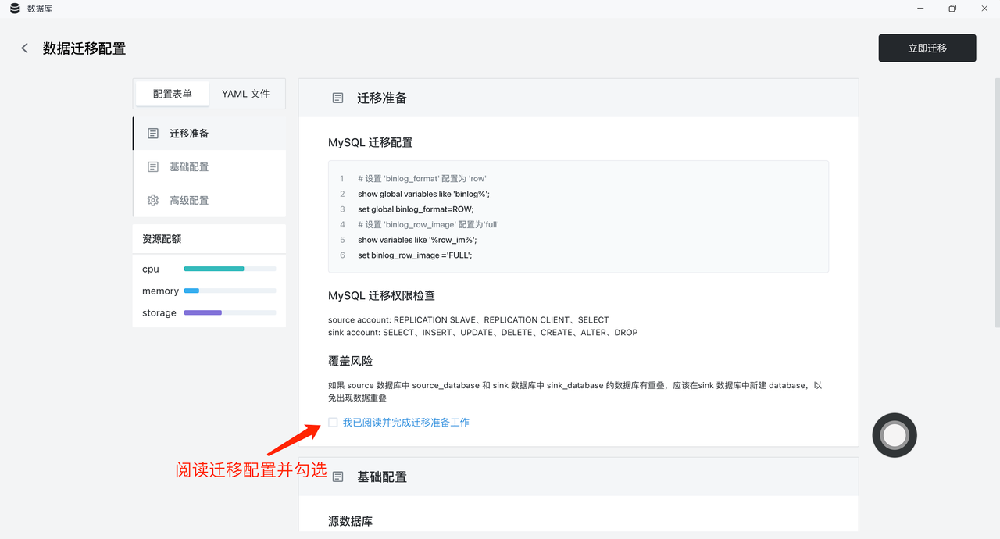

复制迁移配置信息，如下：
```bash
# 设置配置信息sql语句，示例：
$ set global binlog_format=ROW;
$ set binlog_row_image ='FULL';
```

5. 在源数据库中执行设置配置信息（MySQL、Postgres需要手动配置信息，Mongo不需要进行配置）：
```bash
# 设置配置信息sql语句，示例：
$ set global binlog_format=ROW;
$ set binlog_row_image ='FULL';
```

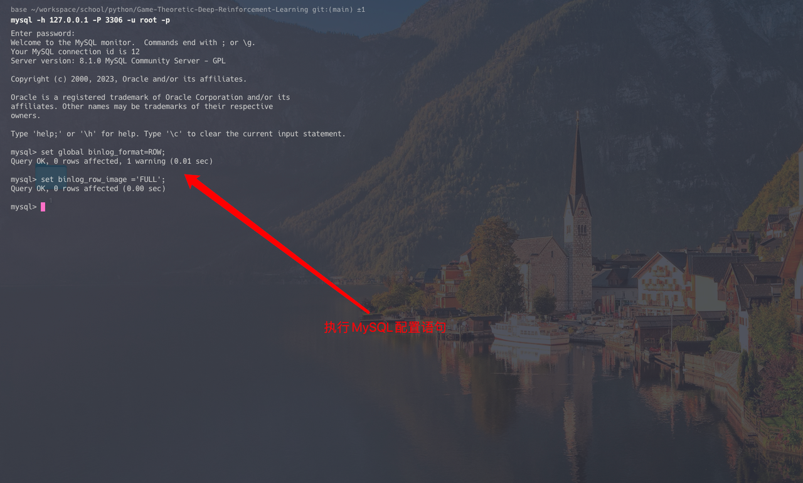

6. 进入目标数据库，填写源数据库的迁移信息，要迁移哪些表，并填写要迁移到目标数据库中哪个database：


如果需要持续从源数据库迁移数据，可开启高级配置中的持续迁移，如下：


7. 查看迁移任务信息：


8. 进入目标数据库，连接目标数据库，检查迁移数据是否完整：


### 文件迁移

1. 进入目标数据库，连接目标数据库：

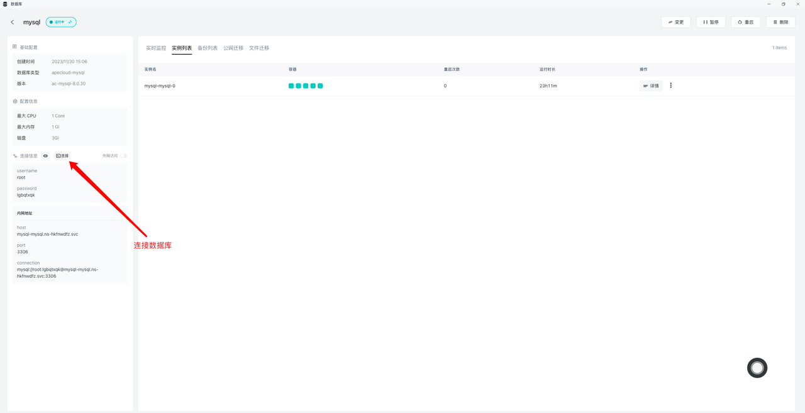

2. 在终端界面中创建对应的database（如果已经存在对应的database，则跳过这一步）：
```bash
# 创建数据库sql语句，示例：
$ create database testmysql;
```


3. 上传迁移文件、填写数据库名，开始迁移：


4. 文件迁移中，等待迁移结果：


5. 连接数据库，检查迁移数据是否完整：

