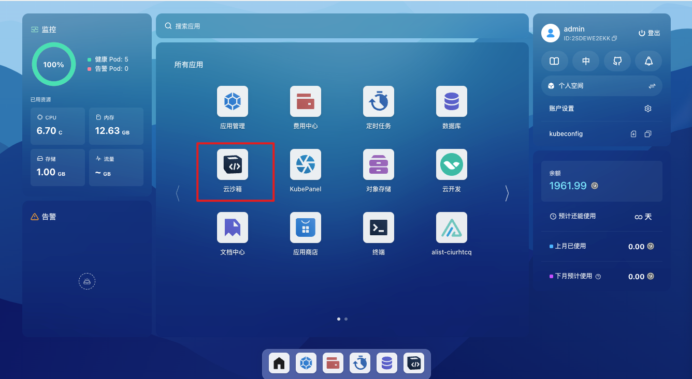
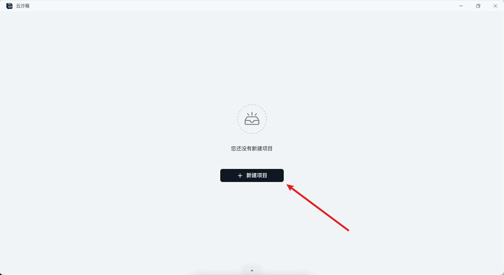

# Devbox

## 简介

To be continued.

## FAQ

### 1. Cursor 连接出现问题但是 VSCode 可以连接

Cursor 由于插件版本同步 VSCode 比较缓慢，比较落后的版本可能会导致连接出现问题。

解决措施：手动安装 Devbox 插件。

1. 从 VSCode 插件市场下载 [Devbox](https://marketplace.visualstudio.com/items?itemName=labring.devbox-aio) 插件的 vsix
   文件。



2. 打开 Cursor 的扩展窗口。

3. 将下载的文件拖拽到扩展窗口中。



### 2. Cursor 和 VSCode 都无法连接

首先明白 Devbox 插件的原理：即通过改动 ssh config 文件来添加远程环境信息，并通过 Remote-SSH 插件进行远程环境的连接。插件首先在
`~/.ssh/config` 写入下面这行代码（一些老版本可能写入的其他类似的内容）：

```bash
Include ~/.ssh/sealos/devbox_config
```

这行代码的作用是将 `~/.ssh/sealos/devbox_config` 这个文件的内容导入到当前文件。而 `devbox_config` 里则是正常的 SSH
配置内容，例如：

```config
Host usw.sailos.io_ns-rqtny6y6_devbox1234
  HostName usw.sailos.io
  User devbox
  Port 40911
  IdentityFile ~/.ssh/sealos/usw.sailos.io_ns-rqtny6y6_devbox1234
  IdentitiesOnly yes
  StrictHostKeyChecking no
```

所以如果出现问题，大概率是插件 BUG 读写文件出错，可以反馈给我们，或者自己尝试调整 SSH 文件。

### 3. 一直卡在下载 vscode-server 过程，或者是不断重试

原因：因为某种操作（在这个过程中重启 Devbox 等）导致下载 cursor 假死，重新下载产生冲突。

解决措施：

1. 进入Web 终端删除 `.cursor-server` 文件夹。
   1. 点击 Devbox 网页列表项右边操作按钮里的“终端”。
   2. 进入终端先进入用户目录，`cd ..`，然后通过 `ls -a ` 查看所有文件可以看到 `.cursor-server`。
   3. 删除 `rm -rf .cursor-server`。
   4. 重试连接即可。
2. 如果是刚创建里面没有内容的话，可以直接删除该 Devbox 重建。
