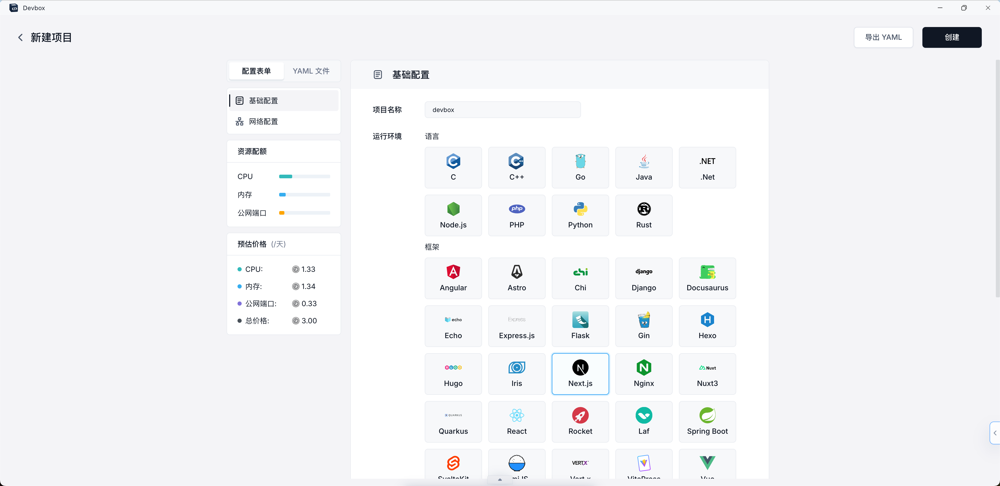

# Devbox

## 简介

> Sealos Devbox 是一个用于即时协作开发、无缝部署和严格环境隔离的平台，帮助你简化工作流程。

Sealos DevBox是一个一站式平台，集成了在线开发、测试和生产环境。它允许你一键创建环境和设置数据库依赖，让开发者在本地使用自己喜欢的IDE工作，同时简化了设置流程，还能自动部署应用，简直是开发者的得力助手。

### 主要特点和优势

#### 即时协作环境

Sealos Devbox 提供多种编程语言和框架的快速开发环境设置，支持团队立即开始协作，无论使用哪种技术栈。

#### 云开发环境

Sealos Devbox 提供统一云平台，消除了环境不一致的问题，让团队可以轻松共享代码、配置和测试数据，从而加速开发过程并提升效率。

#### 无头开发经验

Sealos Devbox 简化了开发流程，自动创建环境并与本地 IDE 无缝集成，为开发人员提供轻松的设置体验。

#### 简化持续交付

无需 Docker 或 Kubernetes 专业知识，Sealos Devbox 使团队能够轻松交付应用程序。开发人员只需指定版本，Sealos Devbox 负责处理构建和容器化等复杂任务。

#### 严格环境隔离

Sealos Devbox 提供隔离的开发环境，帮助团队避免依赖冲突。每个项目都可以拥有自己一致且可重现的工作空间，让开发人员可以专注于相关任务，而不必担心环境不一致。

#### 灵活的网络访问

Sealos Devbox 提供从内部网络和互联网访问应用程序的功能，并自动配置 TLS，确保安全和灵活的开发能力，让团队可以在全球任何地方工作。
