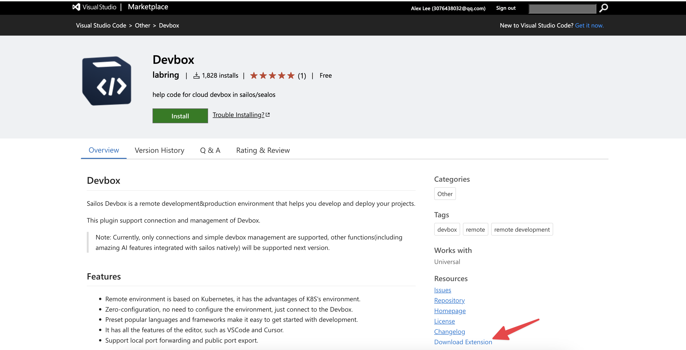

# Devbox

## 支持环境

系统：Windows、MacOS（两者在操作上没有任何区别），编辑器：VSCode、Cursor、VSCode Insider。

## 一些概念

Devbox：就是云沙箱，指一个远程编辑器环境 + 远程运行环境的整体。

## 一、创建你的第一个 Devbox

登录 [Usw Sailos](usw.sailos.io) 或者 [Hzh Sealos](hzh.sealos.run)，点击云沙箱。


新建项目。


填写你的 Devbox 配置。

- 填写项目名称；

- 选择你想要的运行环境和版本；

- 选择 CPU 和内存；

- 配置网络配置（可选）。

   - **什么时候用：当你想要通过域名访问你 Devbox 里跑的服务的时候**，举例如下：

   - 你在 nextjs 运行环境里运行 `npm run dev`，此时你的服务大概率跑在 3000 端口（你应该知道你的服务跑在哪些端口）。

  - 情况一：你提前知道 a中的事情，所以你在**创建时**就填写容器暴露端口 3000，**并打开公网访问**（后面的自定义域名可以先不搞，此时
    sealos 给你这个端口分配了一个固定的随机地址）。

   - 情况二：在运行完服务之后，你才想到打开这个端口，此时在**变更里**进行端口打开（关于怎么进入变更在下面我会讲）。

  - 此时，当你打开端口的公网访问之后，你就有了一个域名和你端口的一个对应关系，此时你访问 `qnedemdulyat.usw.sailos.io`
    （假设是这个），你就可以在网页里看到你的页面。

下图是我选择的：


点击右上角创建即可。

## 二、进入你的远程环境

在列表页进入你的编辑器环境：你可以选择 vscode、cursor、vscode Insider 的任何一种。这里我选择 Cursor（非常好用的 AI 版
VSCode）。


点击按钮就会跳转到 Cursor。


当你没有安装 Devbox 插件时，会自动为你安装插件并且打开远程环境。


成功进入远程环境。


## 三、编码并查看结果

编码：我这里就不改代码了哈。

运行开发环境：打开终端运行 `npm run dev`。


此时有两种方式看你的开发环境结果。

本地端口转发：左下角的弹窗是 vscode 自带的本地端口转发（Cursor
也有），你可以直接点击在浏览器打开或者自己设置端口转发（上图右下角就在终端的右边有个端口）。本地转发的意思就是把远程环境的端口转发到你的
localhost 的相同端口。


Sealos 公网端口转发：还记得**创建的时候我让你加上的端口设置**嘛（没创建也别着急，我立马就讲变更配置），此时我们重新进入
Sealos 桌面里的云沙箱，点击进入详情页。


点击外网地址（这个地址就对应我们刚才创建时的 3000 端口，你可以看左侧内网地址的端口，那个端口就能看出来这一行就是我们创建的3000
端口）。


大功告成！


## 关于变更

变更的进入方式有两种：

项目列表有变更按钮。


详情页也有变更按钮。


变更其实跟创建一样，但只能更改有限的项：CPU、内存和网络配置（最重要）。

我们在这里可以添加新的端口来适配我们的开发环境。


## 四、发布版本并且上线

### 上线前需要知道的事情

每一个远程项目里都有一个特殊的文件 `entrypoint.sh`。它的作用就是在上线时帮助你自动执行一些指令，一般是运行构建后包的命令。

**解读一下现在的这个文件：**

- `cd /home/sealos/project`（必须）：进入你的项目目录（**我们规定的你的项目在容器的一个目录，别改**）。
- `pnpm run start`（必须）：运行你的生产版本（**这就牵扯到一个问题，你需要在想要发版上线时提前打包好自己的应用**）。


### 发布过程

提前在开发环境里打包好项目（原因看**上线前需要知道的事情**）并确定 `entrypoint.sh` 文件符合运行生产版本服务的要求。


进入详情页，点击发布版本。


填写完成点击发布（注意发布后会暂时关闭机器，会导致 vscode 的连接断开重连，此时你只要等待发版完成后再重新打开 vscode
窗口即可）。


等待一小段时间。（发版时间略长）


点击上线。


上线会跳转到应用管理的应用部署页面，并自动把大部分参数从云沙箱传递到这里。

我这里仅仅修改一下应用名称，就点击上线了，你可以调整别的，这里有两个小点：从高级配置里可看出你 `entrypoint.sh`
文件的作用，其实就是用来启动镜像容器的命令。注意名称别和 devbox 名称一样，不然会冲突的。


上线成功后跳转应用管理详情页,点击公网地址即可看到页面。


## 五、其他的一些小技巧和注意点

- 直接通过 ssh 连接到远程环境：云沙箱详情页提供了 SSH 连接串和私钥的下载。下载完私钥之后将私钥文件的地址替换掉连接串-i 后面的
  yourPrivateKeyPath 即可。

- 发版之后删除 Devbox，并不会删除你已经发布的版本。所以你之后创建新的同名 Devbox 时仍然能够看到原来的版本历史。

- 暂时不支持在插件端从零创建和打开一个 Devbox（我们第二期就会补全这部分），你必须在网页端进入编辑器 IDE 才能进入远程环境。


- Devbox列表的 more 按钮里有一些便捷的途径去做一些事情，比如：发版、终端（和 sealos其他应用的终端一样，进入一个 web
  页终端）和常见的控制项（重启、关机、开机、删除）。


## FAQ

### 1、Cursor 连接出现问题但是 VSCode 可以连接

Cursor 由于插件版本同步 VSCode 比较缓慢，比较落后的版本可能会导致连接出现问题。

解决措施：手动安装 Devbox 插件。

1. 从 VSCode 插件市场下载 [Devbox](https://marketplace.visualstudio.com/items?itemName=labring.devbox-aio) 插件的 vsix
   文件。



2. 打开 Cursor 的扩展窗口。

3. 将下载的文件拖拽到扩展窗口中。


### 2、Cursor 和 VSCode 都无法连接

首先明白 Devbox 插件的原理：即通过改动 ssh config 文件来添加远程环境信息，并通过 Remote-SSH 插件进行远程环境的连接。插件首先在
`~/.ssh/config` 写入下面这行代码（一些老版本可能写入的其他类似的内容）：

```bash
Include ~/.ssh/sealos/devbox_config
```

这行代码的作用是将 `~/.ssh/sealos/devbox_config` 这个文件的内容导入到当前文件。而 `devbox_config` 里则是正常的 SSH
配置内容，例如：

```config
Host usw.sailos.io_ns-rqtny6y6_devbox1234
  HostName usw.sailos.io
  User devbox
  Port 40911
  IdentityFile ~/.ssh/sealos/usw.sailos.io_ns-rqtny6y6_devbox1234
  IdentitiesOnly yes
  StrictHostKeyChecking no
```

所以如果出现问题，大概率是插件 BUG 读写文件出错，可以反馈给我们，或者自己尝试调整 SSH 文件。

### 3、一直卡在下载 vscode-server 过程，或者是不断重试

原因：因为某种操作（在这个过程中重启 Devbox 等）导致下载 cursor 假死，重新下载产生冲突。

解决措施：

1. 进入Web 终端删除 `.cursor-server` 文件夹。
   1. 点击 Devbox 网页列表项右边操作按钮里的“终端”。
   2. 进入终端先进入用户目录，`cd ..`，然后通过 `ls -a ` 查看所有文件可以看到 `.cursor-server`。
   3. 删除 `rm -rf .cursor-server`。
   4. 重试连接即可。
2. 如果是刚创建里面没有内容的话，可以直接删除该 Devbox 重建。

### 4、报如下错误

```bash
upstream connect error or disconnect/reset before headers. retried and the latest reset reason: remote connection failure, transport failure reason: delayed connect error: 111
```

首先明白一下你此时的环境是开发环境，你现在连接的网址是测试网址，只用于开发环境，这个网址对应的是开发环境的端口。也就是说你必须运行开发环境，例如
`npm run dev` 让你的程序先运行起来，才能通过网址看到内容，否则就会报这个错误。