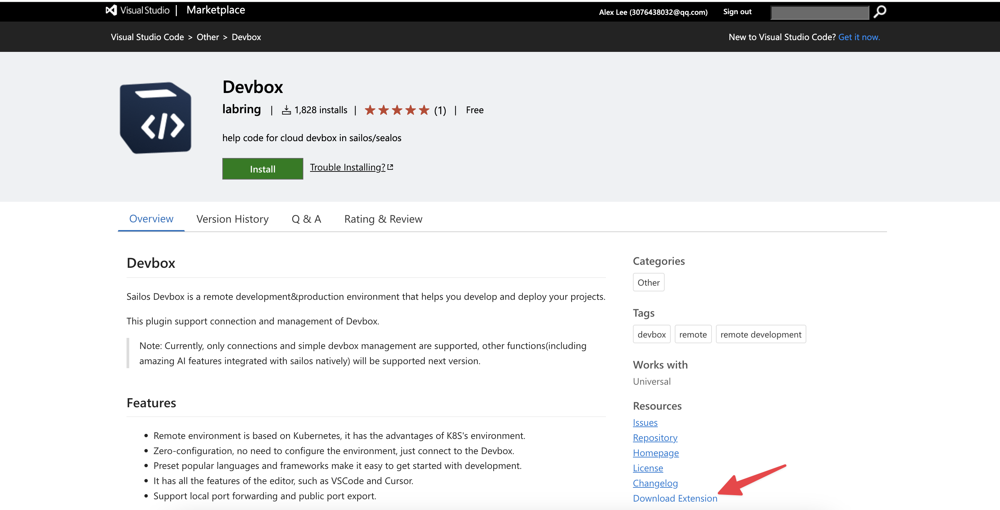
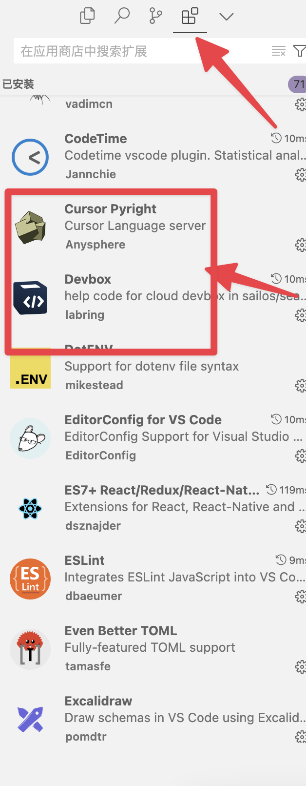
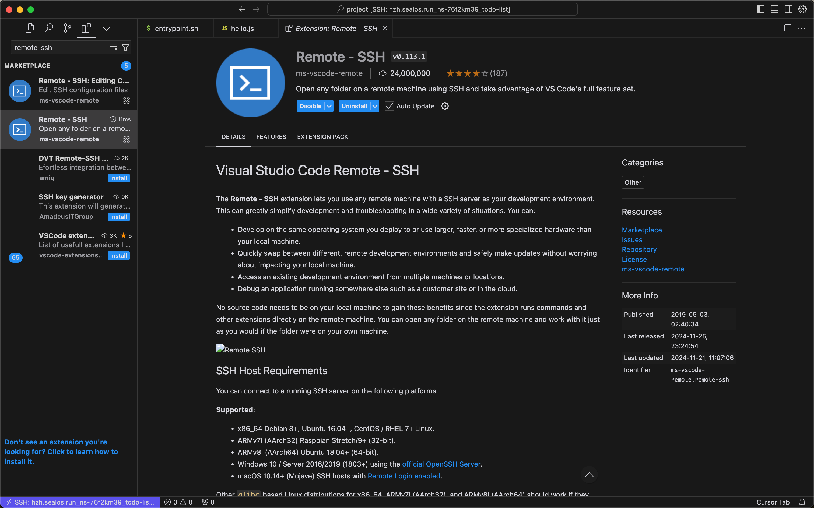

# FAQ

## 1、Cursor 连接出现问题但是 VSCode 可以连接

Cursor 由于插件版本同步 VSCode 比较缓慢，比较落后的版本可能会导致连接出现问题。

解决措施：手动安装 Devbox 插件。在 Cursor 扩展市场里安装 Remote-SSH，注意版本暂时应该是 v0.113.x。（注意必须在 Cursor 里安装这个版本，在网页里下载 Remote-SSH 再导入到 Cursor 里大概率版本不对应导致不兼容。）

1. 从 VSCode 插件市场下载 [Devbox](https://marketplace.visualstudio.com/items?itemName=labring.devbox-aio) 插件的 vsix 文件。



2. 打开 Cursor 的扩展窗口。

3. 将下载的文件拖拽到扩展窗口中。



4. 在 Cursor 里安装 Remote-SSH v0.113.x。



## 2、Cursor 和 VSCode 都无法连接

首先明白 Devbox 插件的原理：即通过改动 ssh config 文件来添加远程环境信息，并通过 Remote-SSH 插件进行远程环境的连接。插件首先在 `~/.ssh/config` 写入下面这行代码（一些老版本可能写入的其他类似的内容）：

```bash
Include ~/.ssh/sealos/devbox_config
```

这行代码的作用是将 `~/.ssh/sealos/devbox_config` 这个文件的内容导入到当前文件。而 `devbox_config` 里则是正常的 SSH 配置内容，例如：

```config
Host usw.sailos.io_ns-rqtny6y6_devbox1234
  HostName usw.sailos.io
  User devbox
  Port 40911
  IdentityFile ~/.ssh/sealos/usw.sailos.io_ns-rqtny6y6_devbox1234
  IdentitiesOnly yes
  StrictHostKeyChecking no
```

所以如果出现问题，大概率是插件 BUG 读写文件出错，可以反馈给我们，或者自己尝试调整 SSH 文件。

## 3、一直卡在下载 vscode-server 过程，或者是不断重试

原因：因为某种操作（在这个过程中重启 Devbox 等）导致下载 cursor 假死，重新下载产生冲突。

解决措施：

1. 进入Web 终端删除 `.cursor-server` 文件夹。
   1. 点击 Devbox 网页列表项右边操作按钮里的“终端”。
   2. 进入终端先进入用户目录，`cd ..`，然后通过 `ls -a ` 查看所有文件可以看到 `.cursor-server`。
   3. 删除 `rm -rf .cursor-server`。
   4. 重试连接即可。
2. 如果是刚创建里面没有内容的话，可以直接删除该 Devbox 重建。

## 4、报如下错误

```bash
upstream connect error or disconnect/reset before headers. retried and the latest reset reason: remote connection failure, transport failure reason: delayed connect error: 111
```

首先明白一下你此时的环境是开发环境，你现在连接的网址是测试网址，只用于开发环境，这个网址对应的是开发环境的端口。也就是说你必须运行开发环境，例如 `npm run dev` 让你的程序先运行起来，才能通过网址看到内容，否则就会报这个错误。

另一种可能的情况是等待一段时间就可以了，可能网络比较卡顿。

## 5、点击链接 Cursor，进入 cursor 界面报错 “Failed to fetch”

尝试打开 Cursor 的扩展市场，如果扩展市场无法正常加载，报错 `Error while fetching extensions.Failed to fetch`，则是网络问题无法加载 Cursor 的插件市场。请参考上面的手动安装教程手动安装 Devbox 插件或者尝试更换您的网络环境。

## 6、本地 localhost 能打开项目但是公网地址打不开

代码里暴露地址由于网络原因必须从 `localhost` 改为 `0.0.0.0`。

## 7、在 Devbox 中可以正常运行程序，但是在发版之后，程序无法正常运行

在发版之前请确保能在终端中运行 `entrypoint.sh` (这是推荐的发版后的启动脚本)，如果需要公网服务，也请同时检查公网地址是否联通。

```bash
./entrypoint.sh
```

如果遇到下面的问题:

```bash
bash: ./entrypoint.sh: Permission denied
```

可以在终端中输入如下的命令，并再次运行 `entrypoint` 脚本，并确保结果与期望的相同。

```bash
sudo chmod +x entrypoint.sh
```

同时，建议先在 Devbox 中预先构建完项目代码后并测试，测试成功后再发版，这可以有效避免在发版后的启动时的错误和 oom 问题。

## 8、应用程序监听的端口为 80 时，应用程序启动失败

在使用 Devbox 时，本地编辑器(vscode、cursor 等)
默认的用户为 Devbox，监听 1-1023 端口是管理员用户的特权。 如果需要正常使用，请使用管理员账户运行你的程序，例如在 go 的
Devbox 中，可以使用下面的命令:

```bash
sudo go run main.go
```

或者变更你的端口。


## 9、如何在 Devbox 中更换默认的用户为 root 用户

终端里运行`sudo su`即可切换到 root 用户。
