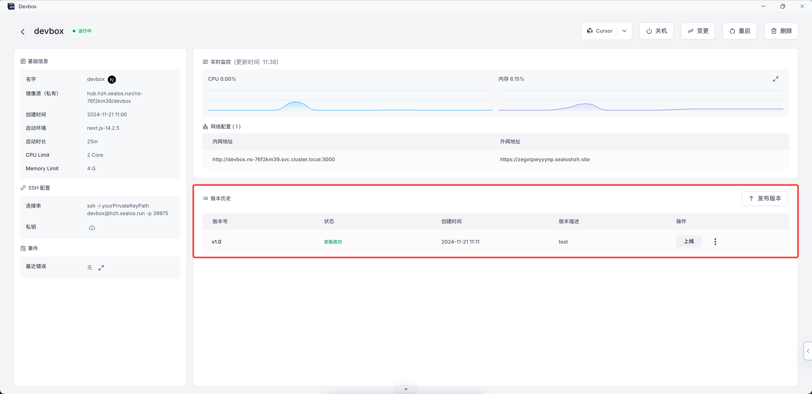

# 快速开始

> 本指南介绍如何使用 Sealos Devbox 创建、开发和部署 Next.js 应用。内容涵盖项目设置、使用 Cursor IDE 进行远程开发以及云端部署。

## 创建 Devbox 项目

1. 点击 Sealos 桌面的 Devbox，然后点击新建项目按钮，创建一个新项目。

2. 在运行环境部分，选择 Next.js 作为开发框架。然后设置项目的CPU和内存。


3. 设置网络配置：

- 容器暴露端口设置为 3000，这是 Next.js 开发环境的默认端口。（如果需要额外的端口，请点击添加端口）
- 开启公网访问，这会自动生成一个随机的公网域名。（如果想使用自定义域名，请点击自定义域名）

> 请确保容器暴露端口与 Next.js 应用配置的端口一致。如果你修改了 Next.js 配置中的端口，记得在此处同步更新。


4. 点击右上角的创建来创建项目。

## 连接 Cursor IDE

创建项目后，你可以在 Devbox 项目列表中找到它。每个项目都有一个操作列，可以在操作列的下拉框中切换不同的 IDE。


1. 启动本地 Cursor IDE：

- 选择操作列的下拉框中的 Cursor 来启动本地 Cursor IDE。

2. 本地 Cursor IDE 连接 Devbox：

- Cursor IDE 会弹出窗口提示你安装 Devbox 插件，安装后即可通过 SSH 与 Devbox 连接。

> 你可以随时切换不同的 IDE（VSCode、VSCode Insiders、Cursor 或 Windsurf）。

## 开发

1. 本地 Cursor IDE 成功连接 Devbox 后，你就可以在 Cursor IDE 中直接编辑项目文件。


> 通过远程连接，你可以在 Devbox 运行时运行代码，确保开发与生产环境一致，并在任何地方、任何安装了 Cursor 的设备上访问项目，方便团队协作。

2. 调试 Next.js 应用：

- 打开 Cursor IDE 终端。
- 导航到项目目录。
- 运行以下命令以开发模式启动 Next.js 服务：

```bash
npm run dev
```

3. 访问正在运行的应用：

- 打开 Sealos 桌面的 Devbox。
- 找到你的项目并点击详情按钮。
- 点击外网地址。


4. 成功打开你的 Next.js 应用。


## 发布

开发并测试 Next.js 应用后，你可以将其打包为 OCI 镜像（即容器镜像），这样可以方便地进行版本控制并准备部署。

1. 在 Cursor IDE 终端中，导航到项目目录并运行构建命令：

```bash
npm run build
```

此命令在 `.next` 目录中生成可用于生产的 Next.js 应用版本。

2. 转到项目详情页面：

- 打开 Sealos 桌面的 Devbox。
- 找到你的项目并点击详情按钮。

3. 在详情页面，找到“版本历史”部分。

4. 点击“版本历史”右上角的“发布版本”按钮。

5. 在弹出的“发布版本”对话框中，提供以下信息：

- 镜像名：预填为项目名。
- 版本号：输入版本号（如：v1.0）。
- 版本描述：简要描述版本内容（如：“初始版本”或“修复登录问题”）。


6. 填写完毕后，点击“发版”按钮。

7. 系统会处理发布，完成后，你会在“版本历史”中看到新版本的记录，包括版本号、状态、创建时间和描述。



通过这些步骤，你已成功创建 Next.js 应用的 OCI 镜像。此镜像可以用于部署或与团队共享，每次发布都会创建一个代码快照，方便版本管理和回滚。

> 每当有重大更改或里程碑时，记得发布新版本。这能帮助保持开发历史清晰，并使部署和协作更加顺畅。

## 部署

将 Next.js 应用发布为 OCI 镜像后，你可以将其部署到 Sealos Cloud 以供生产使用。操作步骤如下：

1. 在项目详情页面中，找到“版本历史”部分。

2. 找到需要部署的版本，点击“操作”栏中的“上线”按钮。

3. 系统会将你重定向到 Sealos 的应用管理界面。

4. 在应用管理中，按照部署向导配置应用设置。通常包括：

- 设置应用名称
- 设置资源限制（CPU和内存）
- 设置环境变量
- 设置卷或持久存储


5. 配置完毕后，点击右上角的“部署应用”按钮开始部署。

6. 部署完成后，进入应用详情页面。

7. 当状态变为“running”时，点击“公网地址”，即可在新标签页中打开你的 Next.js 应用。


通过这些步骤，你已成功将 Next.js 应用部署到 Sealos Cloud。现在，用户可以通过公网地址访问应用。

> 你可以随时通过 Devbox 创建新版本，并重复此过程更新应用。

此工作流程使你能够在云环境中开发和调试 Next.js 应用，同时使用本地 IDE。外部地址使你可以轻松地与团队或客户共享应用，任何地方都能访问。