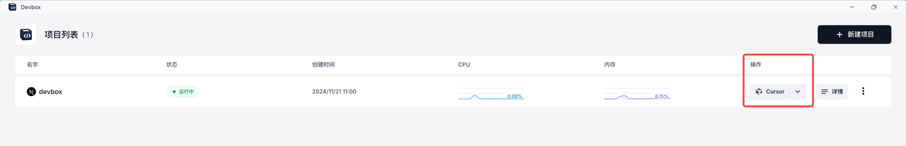
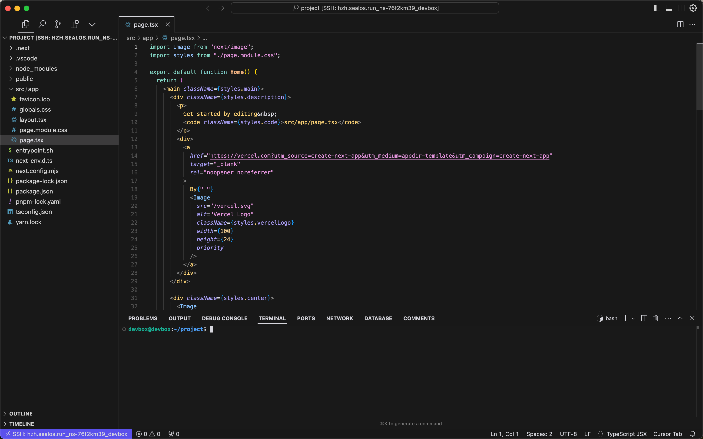
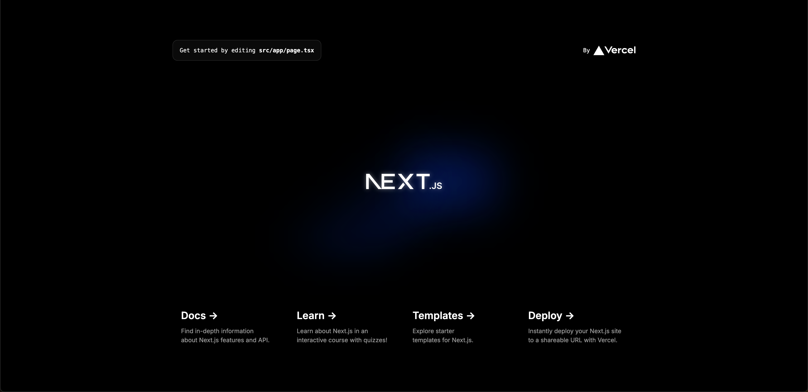
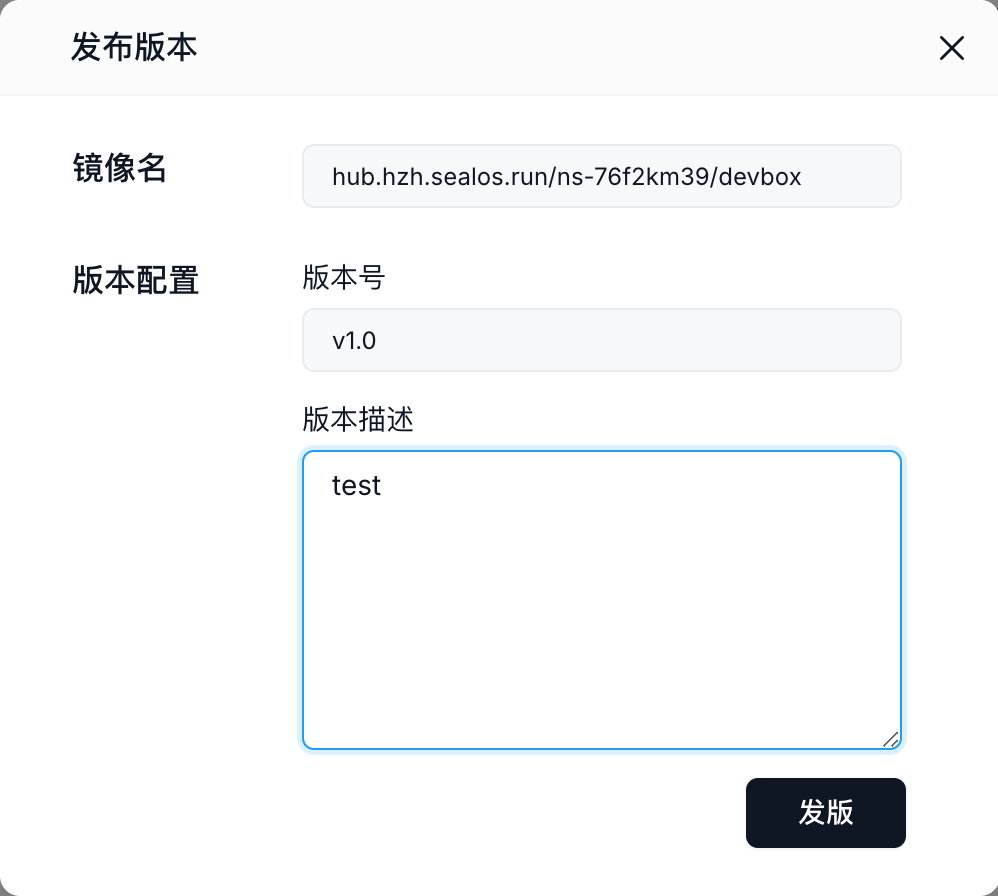
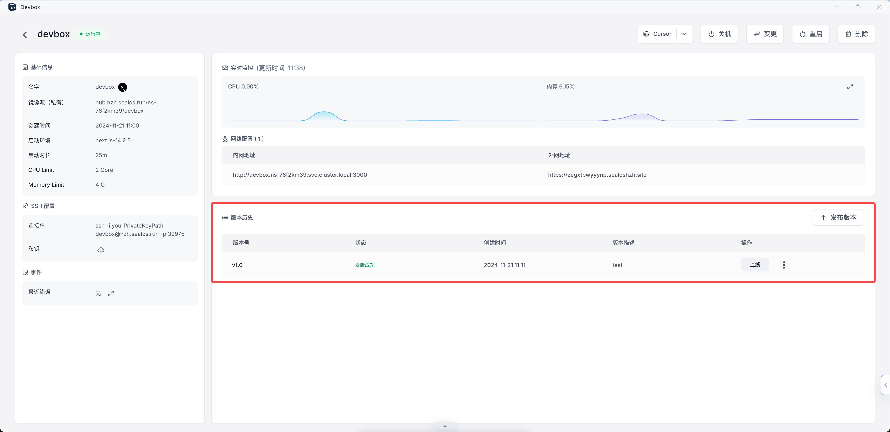
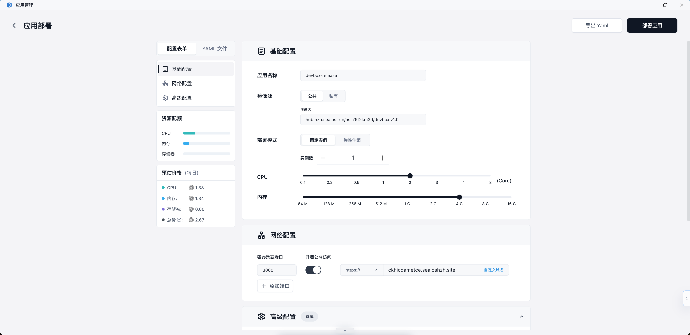
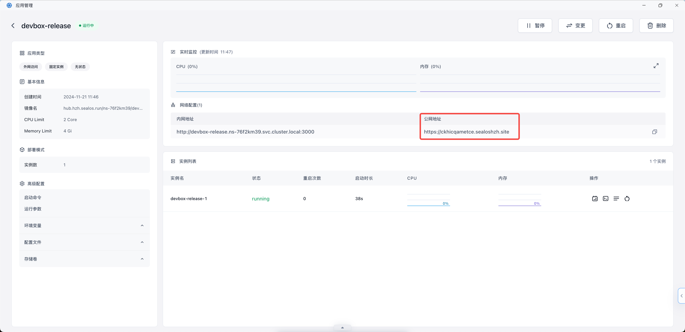

# Devbox

## 快速开始

> 了解如何使用 Sealos DevBox 创建、开发和部署 Next.js 应用。本指南涵盖项目设置、使用 Cursor IDE 进行远程开发以及云部署。

Sealos Devbox 是一个一体化平台，专为集成在线开发、测试和生产而设计。它提供无缝解决方案，只需单击一下即可创建环境和数据库依赖项，允许开发人员使用他们喜欢的
IDE 在本地工作，同时简化设置流程并实现自动应用程序部署。

在本指南中，我们将演示如何使用 Sealos Devbox 创建一个最小的 Next.js 演示项目。

### 创建 Devbox 项目

1. 点击 Sealos 桌面上的“Devbox”图标，然后点击“创建新项目”按钮，创建一个新项目。

2. 在“运行时”部分，选择“Next.js”作为开发框架。使用滑块设置项目的 CPU 核心和内存。


3. 设置基本环境后，您需要配置项目的网络设置：

- 向下滚动到配置页面的“网络”部分。
- 容器端口：
    - 在容器端口字段中输入“3000”。这是 Next.js 用于开发的默认端口。
    - 如果需要额外的端口，请单击“添加端口”按钮并指定它们。
- 启用 Internet 访问：
    - 切换开关以启用 Devbox 的互联网访问。这允许外部用户使用提供的域通过公共互联网访问您的 Next.js 应用程序。
- 域名：
    - 默认情况下，Sealos 为您的应用程序提供一个子域。
    - 如果您想使用自定义域，请点击“自定义域”并按照说明进行设置。

请记住，容器端口 (3000) 应与 Next.js 应用程序配置为在其上运行的端口相匹配。如果您在 Next.js 配置中更改端口，请确保也在此处更新它。


4. 单击“创建”按钮来创建您的项目。



### 连接 Cursor IDE

创建项目后，您会在 Devbox 列表中看到它。每个项目都有一个“操作”列，其中包含各种选项。



1. 要使用 Cursor IDE 连接到项目的 Devbox 运行时：

- 在 Devbox 列表中找到您的项目。
- 在“操作”列中，点击 VSCode 图标旁边的下拉箭头。
- 从下拉菜单中选择“光标”。
- 单击出现的“光标”选项。

2. 单击“Cursor”后，它将在本地计算机上启动 Cursor IDE 应用程序。在 Cursor 中，将出现一个弹出窗口，提示您安装 Cursor 的 Devbox
   插件。此插件可启用与 Devbox 运行时的 SSH 远程连接。

- 按照光标弹出窗口中的说明安装 Devbox 插件。
- 一旦安装，Cursor 将与您的 Devbox 运行时建立远程连接。

> 您可以随时使用“操作”列中的下拉菜单在不同的 IDE 选项（VSCode、Cursor 或 VSCode Insiders）之间切换。

### 开发

1. 建立连接后，您将能够直接在 Cursor IDE 环境中访问和编辑您的项目文件。


通过此远程连接，您可以使用 Cursor IDE 开发 Next.js 应用程序，并享受基于云的开发环境的所有优势：

- 您的代码在 Devbox 运行时运行，确保跨开发和生产环境的一致性。
- 您可以从任何地方、通过任何安装了 Cursor 的设备访问您的项目。
- 由于团队成员可以连接到同一个 Devbox 运行时，协作变得更加容易。

2. 您可以开始调试 Next.js 应用程序：

- 在 Cursor IDE 中打开终端。
- 如果您尚未到达项目目录，请导航到该目录。
- 运行以下命令启动 Next.js 开发服务：

```bash
npm run dev
```

- 此命令将以开发模式启动你的 Next.js 应用程序。

3. 要访问您正在运行的应用程序：

- 返回浏览器中的 Sealos Devbox 列表。
- 找到您刚刚创建的项目。
- 单击项目行右侧的“详细信息”按钮。

4. 在项目详细信息页面中：

- 查找“网络”部分。
- 您会看到一个“外部地址”字段。
- 点击此外部地址。



5. 这将在新浏览器选项卡中打开您的 Next.js 应用程序，允许您查看并与正在运行的服务进行交互。



### 发布

开发并测试 Next.js 应用程序后，您可以将其发布为 OCI（开放容器计划）镜像。这样您就可以对应用程序进行版本控制并准备部署。

1. 在 Cursor IDE 终端中，导航到您的项目目录并运行构建命令：

```bash
npm run build
```

此命令在“.next”目录中创建可用于生产的 Next.js 应用程序版本。

2. 导航到您的项目详细信息页面：

- 在浏览器中转到 Sealos Devbox 列表。
- 找到您的项目并点击项目行右侧的“详细信息”按钮。

3. 在项目详细信息页面上，查找“版本”部分。

4. 点击位于“版本”部分右上角的“发布”按钮。

5. 将出现“发布”对话框。在这里，您需要提供以下信息：

- 图像名称：此字段已预先填写您的项目图像名称。
- 标签：输入您发布的版本标签（例如，v1.0）。
- 描述：提供此版本的简要描述（例如，“初始版本”或“登录功能的错误修复”）。



6. 填写完所需信息后，点击对话框底部的“发布”按钮。

7. 系统将处理您的发布。完成后，您将在项目详情页面的“版本”部分看到一个新条目，其中显示发布的标签、状态、创建时间和描述。



通过执行这些步骤，您已成功创建 Next.js 应用程序的 OCI 映像。此映像现在可以用于部署或与其他团队成员共享。每次发布都会创建当前代码的快照，让您可以维护应用程序的不同版本并在需要时轻松回滚。

> 请记住，每当您在项目中做出重大更改或达到重要里程碑时，都要创建新版本。这种做法有助于保持应用程序开发的清晰历史记录，并有助于更轻松地部署和协作。

### 部署

将 Next.js 应用程序发布为 OCI 镜像后，您可以将其部署到 Sealos Cloud 以供生产使用。操作方法如下：

1. 在项目详细信息页面中，找到“版本”部分。

2. 找到需要部署的release，点击“操作”栏中的“部署”按钮。

3. 这会将您重定向到 Sealos 内的 App Launchpad 应用程序。

4. 在 App Launchpad 应用程序中，按照部署向导配置应用程序设置。这可能包括：

- 选择适当的环境
- 设置资源限制（CPU、内存）
- 如果需要，配置环境变量
- 设置任何所需的卷或持久存储



5. 配置完所有必要的设置后，单击右上角的“部署应用程序”按钮即可开始部署过程。

6. 您将被带到 App Launchpad 内的应用程序详细信息视图。

7. 一旦状态为“正在运行”，请单击“公共地址”下提供的地址。这将在新浏览器选项卡中打开您部署的 Next.js 应用程序。

通过执行这些步骤，您已成功使用 App Launchpad 应用程序将 Next.js 应用程序部署到 Sealos Cloud。您的应用程序现在可以通过公共地址访问，允许用户从互联网上的任何地方与其交互。

> 您可以随时通过在 Devbox 中创建新版本并使用 App Launchpad 对新版本重复此部署过程来更新您的应用程序。

此工作流程允许您在云环境中开发和调试 Next.js 应用程序，同时仍使用您首选的本地 IDE。外部地址使您可以轻松地与团队成员或客户共享您的工作，因为他们可以从任何有互联网连接的地方访问您正在运行的应用程序。