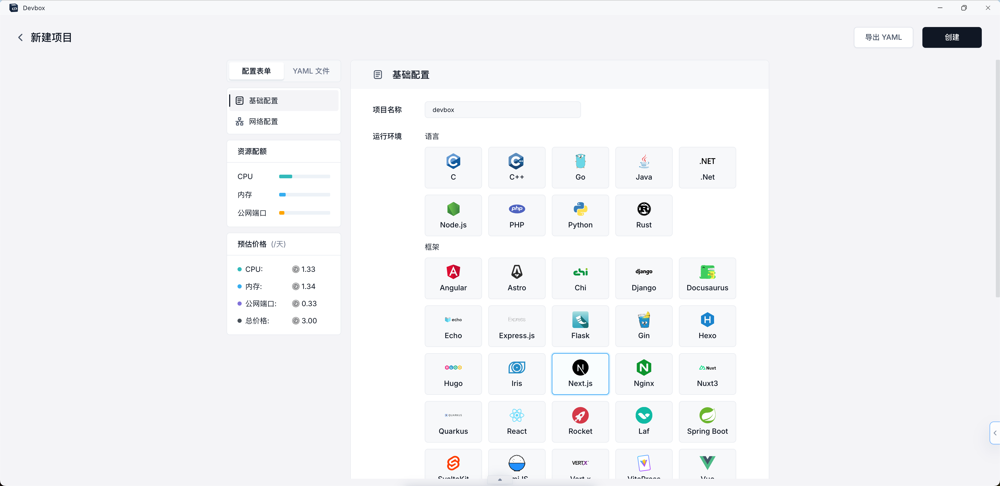
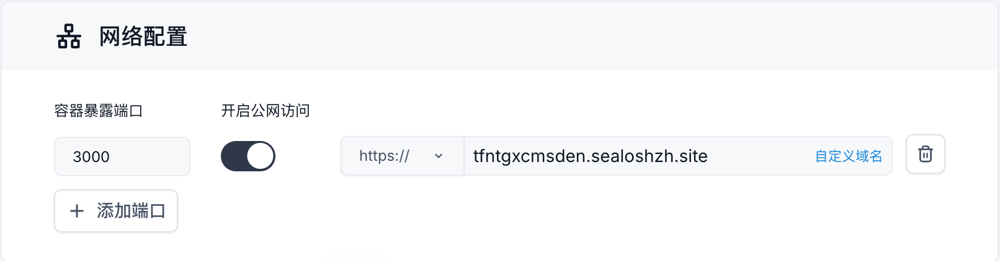
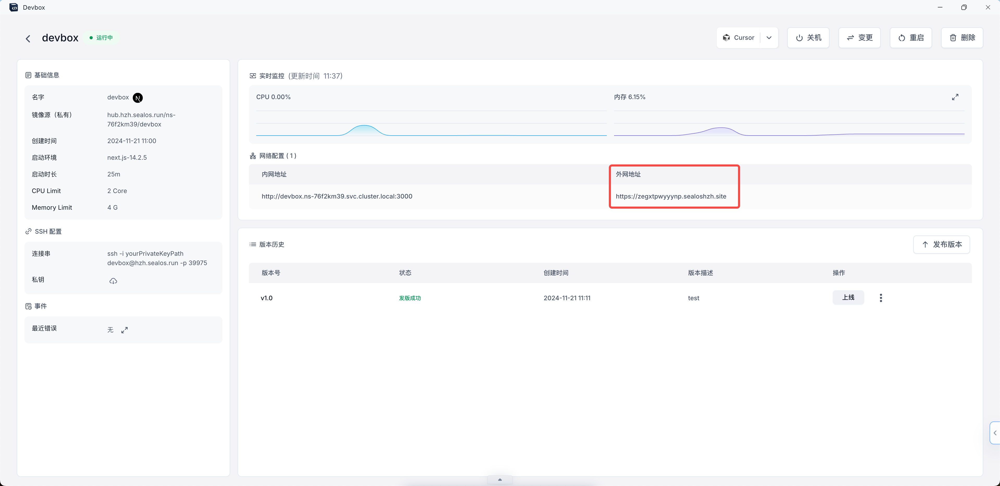

# Devbox

## 快速开始

> 了解如何使用 Sealos DevBox 创建、开发和部署 Next.js 应用。本指南涵盖项目设置、使用 Cursor IDE 进行远程开发以及云部署。

Sealos Devbox 是一个一体化平台，专为集成在线开发、测试和生产而设计。它提供无缝解决方案，只需单击一下即可创建环境和数据库依赖项，允许开发人员使用他们喜欢的
IDE 在本地工作，同时简化设置流程并实现自动应用程序部署。

在本指南中，我们将演示如何使用 Sealos Devbox 创建一个最小的 Next.js 演示项目。

### 创建 Devbox 项目

1. 点击 Sealos 桌面上的“Devbox”图标，然后点击“创建新项目”按钮，创建一个新项目。

2. 在“运行时”部分，选择“Next.js”作为开发框架。使用滑块设置项目的 CPU 核心和内存。



3. 设置基本环境后，您需要配置项目的网络设置：

- 向下滚动到配置页面的“网络”部分。
- 容器端口：
    - 在容器端口字段中输入“3000”。这是 Next.js 用于开发的默认端口。
    - 如果需要额外的端口，请单击“添加端口”按钮并指定它们。
- 启用 Internet 访问：
    - 切换开关以启用 Devbox 的互联网访问。这允许外部用户使用提供的域通过公共互联网访问您的 Next.js 应用程序。
- 域名：
    - 默认情况下，Sealos 为您的应用程序提供一个子域。
    - 如果您想使用自定义域，请点击“自定义域”并按照说明进行设置。

请记住，容器端口 (3000) 应与 Next.js 应用程序配置为在其上运行的端口相匹配。如果您在 Next.js 配置中更改端口，请确保也在此处更新它。



4. 单击“创建”按钮来创建您的项目。


### 连接 Cursor IDE

创建项目后，您会在 Devbox 列表中看到它。每个项目都有一个“操作”列，其中包含各种选项。


1. 要使用 Cursor IDE 连接到项目的 Devbox 运行时：

- 在 Devbox 列表中找到您的项目。
- 在“操作”列中，点击 VSCode 图标旁边的下拉箭头。
- 从下拉菜单中选择“光标”。
- 单击出现的“光标”选项。

2. 单击“Cursor”后，它将在本地计算机上启动 Cursor IDE 应用程序。在 Cursor 中，将出现一个弹出窗口，提示您安装 Cursor 的 Devbox
   插件。此插件可启用与 Devbox 运行时的 SSH 远程连接。

- 按照光标弹出窗口中的说明安装 Devbox 插件。
- 一旦安装，Cursor 将与您的 Devbox 运行时建立远程连接。

> 您可以随时使用“操作”列中的下拉菜单在不同的 IDE 选项（VSCode、Cursor 或 VSCode Insiders）之间切换。

### 开发

1. 建立连接后，您将能够直接在 Cursor IDE 环境中访问和编辑您的项目文件。



通过此远程连接，您可以使用 Cursor IDE 开发 Next.js 应用程序，并享受基于云的开发环境的所有优势：

- 您的代码在 Devbox 运行时运行，确保跨开发和生产环境的一致性。
- 您可以从任何地方、通过任何安装了 Cursor 的设备访问您的项目。
- Collaboration becomes easier as team members can connect to the same Devbox runtime.

2. You can start debugging your Next.js application:

- Open the terminal within Cursor IDE.
- Navigate to your project directory if you're not already there.
- Run the following command to start the Next.js development serve:

```bash
npm run dev
```

- This command will start your Next.js application in development mode.

3. To access your running application:

- Return to the Sealos Devbox List in your browser.
- Find the project you just created.
- Click on the "Detail" button on the right side of your project's row.

4. In the project details page:

- Look for the "Network" section.
- You'll see an "External Address" field.
- Click on this external address.


5. This will open your Next.js application in a new browser tab, allowing you to view and interact with your running
   service.


### Release

After you've developed and tested your Next.js application, you can release it as an OCI (Open Container Initiative)
image. This allows you to version your application and prepare it for deployment.

1. In the Cursor IDE terminal, navigate to your project directory and run the build command:

```bash
npm run build
```

This command creates a production-ready build of your Next.js application in the '.next' directory.

2. Navigate to your project's details page:

- Go to the Sealos Devbox List in your browser.
- Find your project and click on the "Detail" button on the right side of your project's row.

3. On the project details page, look for the "Version" section.

4. Click on the "Release" button located in the top right corner of the "Version" section.

5. A "Release" dialog box will appear. Here, you need to provide the following information:

- Image Name: This field is pre-filled with your project's image name.
- Tag: Enter a version tag for your release (e.g., v1.0).
- Description: Provide a brief description of this release (e.g., "Initial release" or "Bug fixes for login feature").


6. After filling in the required information, click the "Release" button at the bottom of the dialog box.

7. The system will process your release. Once completed, you'll see a new entry in the "Version" section of your project
   details page, showing the tag, status, creation time, and description of your release.


By following these steps, you've successfully created an OCI image of your Next.js application. This image can now be
used for deployment or shared with other team members. Each release creates a snapshot of your current code, allowing
you to maintain different versions of your application and easily roll back if needed.

> Remember to create new releases whenever you make significant changes or reach important milestones in your project.
> This practice helps in maintaining a clear history of your application's development and facilitates easier deployment
> and collaboration.

### Deploy

After releasing your Next.js application as an OCI image, you can deploy it to Sealos Cloud for production use. Here's
how to do it:

1. In your project's details page, locate the "Version" section.

2. Find the release you want to deploy and click the "Deploy" button in the "Operation" column.

3. This will redirect you to the App Launchpad application within Sealos.

4. In the App Launchpad application, follow the deployment wizard to configure your application settings. This may
   include:

- Selecting the appropriate environment
- Setting resource limits (CPU, memory)
- Configuring environment variables if needed
- Setting up any required volumes or persistent storage


5. Once you've configured all necessary settings, click the "Deploy Application" button in the top right corner to start
   the deployment process.

6. You'll be taken to the application details view within App Launchpad.

7. Once the status is "Running", Click on the address provided under "Public Address". This will open your deployed
   Next.js application in a new browser tab.

By following these steps, you've successfully deployed your Next.js application to Sealos Cloud using the App Launchpad
application. Your application is now accessible via the public address, allowing users to interact with it from anywhere
on the internet.

> You can always update your application by creating a new release in Devbox and repeating this deployment process with
> the new version using App Launchpad.

You can always update your application by creating a new release in Devbox and repeating this deployment process with
the new version using App Launchpad.

This workflow allows you to develop and debug your Next.js application in a cloud environment while still using your
preferred local IDE. The external address makes it easy to share your work with team members or clients, as they can
access your running application from anywhere with an internet connection.