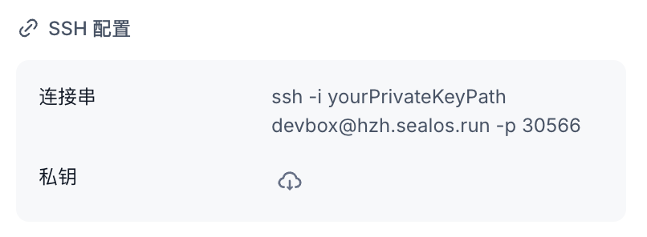
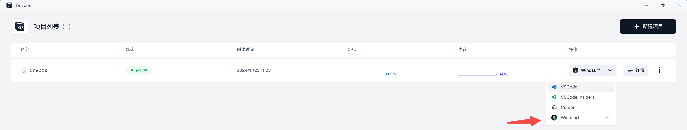
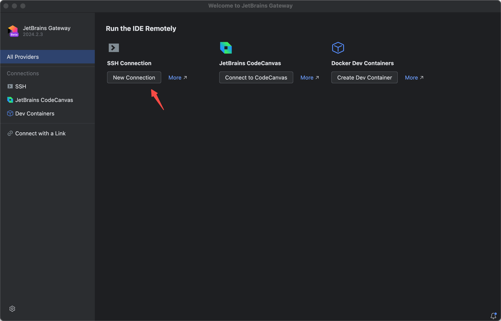
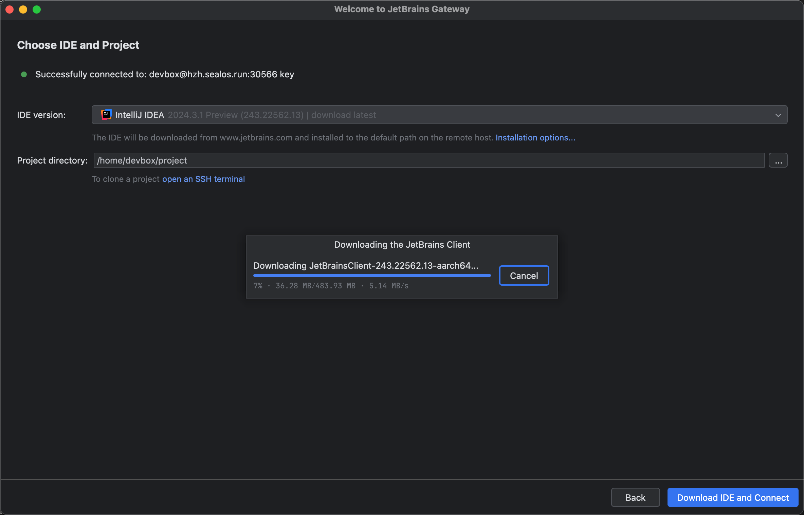
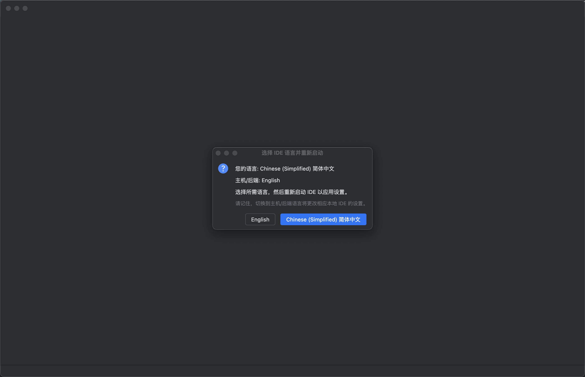
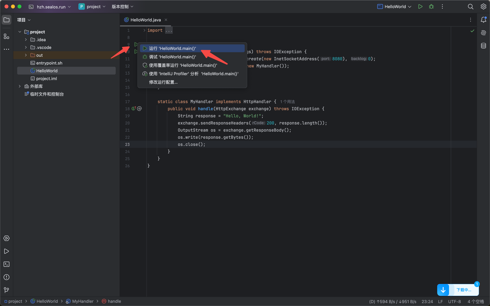
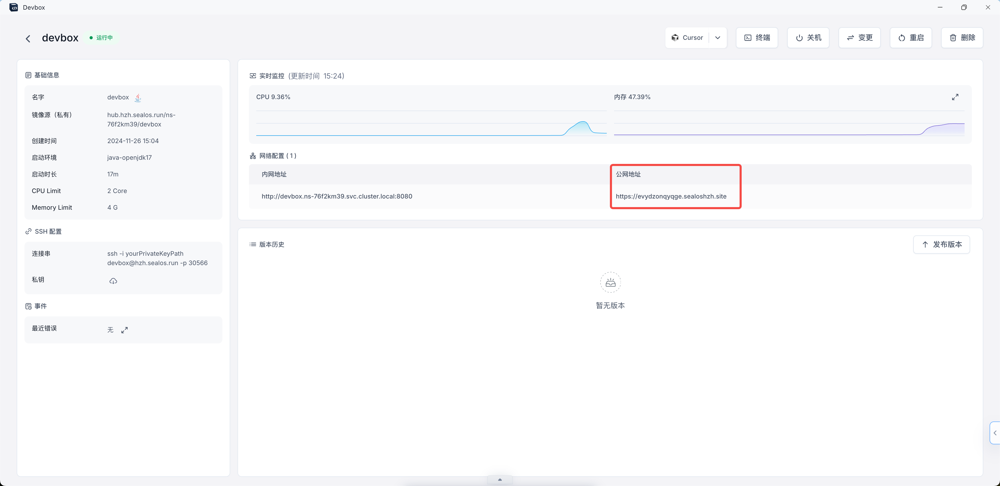

# 使用 JetBrains IDE 开发

> 本指南介绍如何使用 JetBrains IDE 中的 IntelliJ IDEA 来开发基础环境为 Java 的 Devbox。

## 前置准备

1. 需要提前下载好 [JetBrains Gateway](https://www.jetbrains.com/remote-development/gateway/) 应用。

2. 启动一个 Devbox 项目。

3. 下载 Devbox 项目的私钥到本地。查看 Devbox 项目详情中的 SSH 配置（Username：devbox，Host：hzh.sealos.run，Port：30566）。

## 开始使用

1. 打开 Devbox，选择 JetBrains IDE 并点击。

2. 自动唤起本地的 JetBrains Gateway，点击 `New Connection`。

3. 打开 JetBrains Gateway，填写 Username、Host 和 Port，勾选 Specify private key，选择私钥的所在路径。点击 `Check Connection and Continue`，即可测试 SSH 连接。

4. IDE 版本选择 `IntelliJ IDEA 2024.3.1 Preview`（因为 Devbox 的运行环境是 Java，所以选择 IDEA，根据具体的语言选择不同 IDE），项目路径选择 `/home/devbox/project`。点击 Download IDE and Connect，即可下载 IDE 和连接。

需要等待 IDE 下载完毕。

5. 自动唤起本地的 IntelliJ IDEA，语言选择 Chinese 简体中文，打开项目文件，点击绿箭头来运行 Java 服务。

6. 打开 Devbox 项目的详情，点击公网地址，即可跳转访问 Java 服务。

7. 成功访问 Java 服务。

