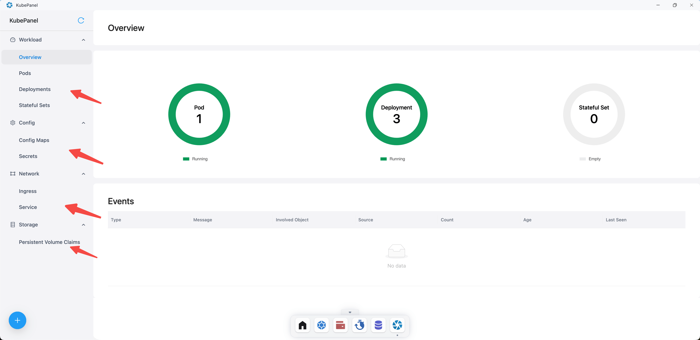
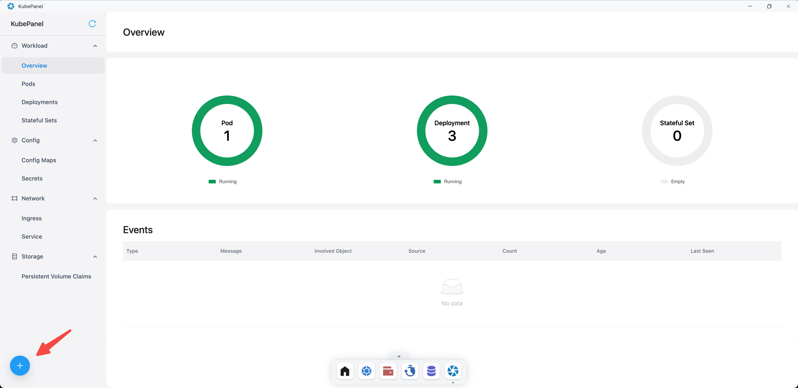
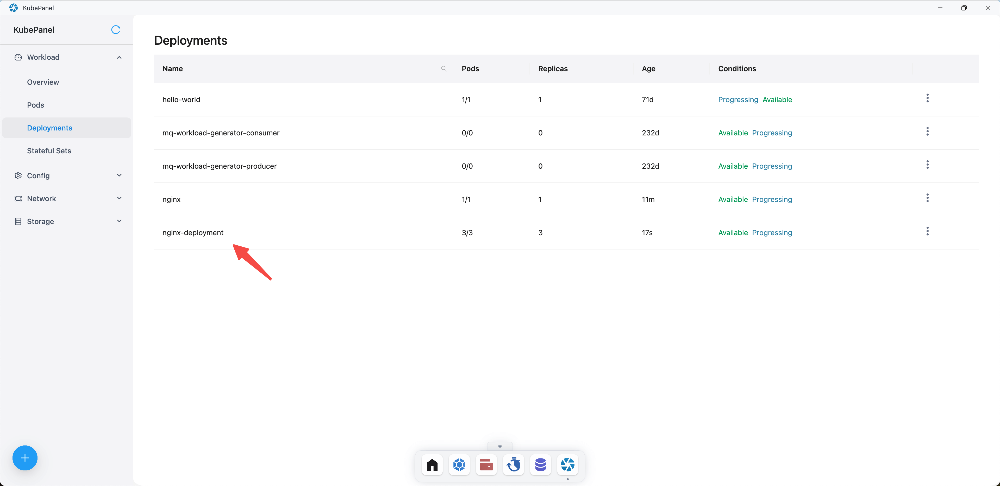
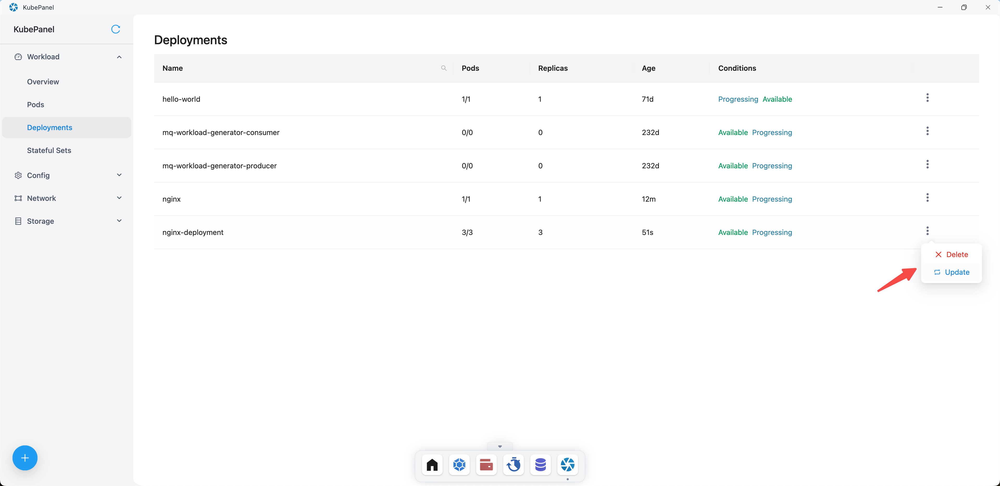

# Kubepanel

Kubepanel 是一个款 Kubernetes IDE（集成开发环境）。它提供了一个用户友好的图形界面来管理 Kubernetes
集群，具有实时监控和资源可视化管理的功能。它旨在使 Kubernetes 更加易于访问和管理，即使对于那些不太熟悉 Kubernetes
命令行工具的人也是如此。

## 快速开始

打开 Sealos 桌面，点击 Kubepanel。

### 查看资源

Kubepanel 内可以查看 Workload、Config、Network 和 Storage 资源。

### 部署资源

点击➕加号。

需要先选择一个模板，然后才可以编写资源 YAML。

这里选择了 Deployment 模板，点击 Create 创建 Deployment 资源。

创建成功后，可以在 Workload/Deployments 中看到该 Deployment 资源。

也支持对资源进行删除或者更新操作。

