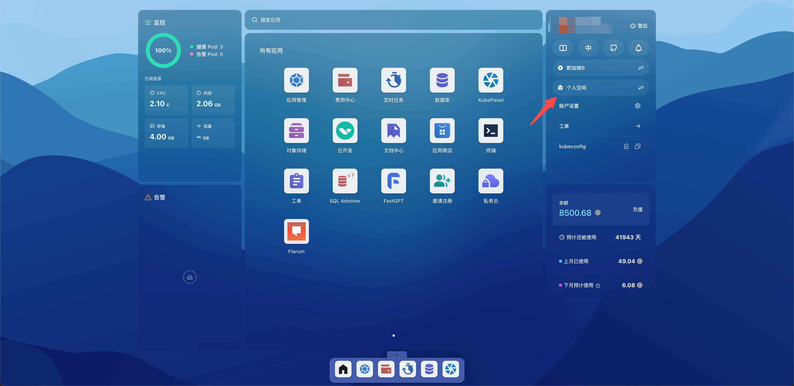
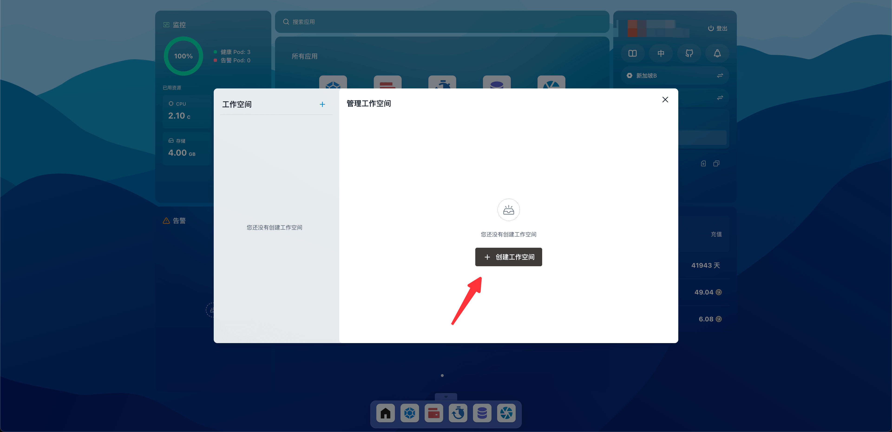
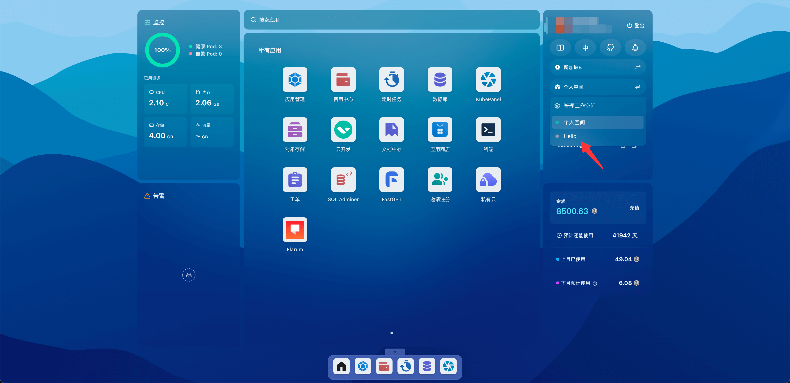
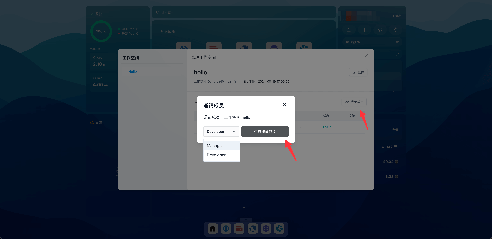
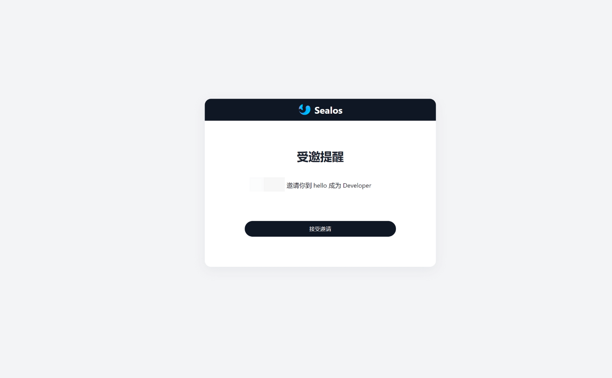

# 工作空间

工作空间是一种多租户资源隔离机制，它将一个集群划分为多个独立的工作空间，每个空间都有自己的资源配额和权限。这种机制支持团队协作与资源分配。

个人空间是工作空间的一种特殊形式，用户拥有一个与其用户名相同的个人空间。尽管个人空间的资源配额和权限与普通工作空间相同，但它无法被删除，也无法添加其他用户。

## 快速开始

### 创建工作空间

打开 Sealos 桌面，点击个人空间，点击管理工作空间。

点击创建工作空间。

### 切换工作空间

回到 Sealos 界面，点击个人空间，点击 hello 工作空间即可切换到 hello。

### 邀请用户

在管理工作空间中，点击邀请成员，选择成员的身份权限，点击生成邀请链接，然后将链接发送给其他用户。

工作空间中的用户有三种不同的角色，角色和权限的说明如下：

- 所有者（Owner）：所有者拥有工作空间的所有权限，包括删除工作空间、查看/创建/修改工作空间中的所有资源、邀请用户以管理员/开发者身份加入工作空间等。

- 管理员（Manager）：拥有工作空间的管理权限，包括查看/创建/修改工作空间中的所有资源、邀请用户以开发者身份加入工作空间等。

- 开发者（Developer）：拥有工作空间的开发权限，包括查看工作空间中的资源状态。

### 接受邀请

用户收到邀请链接，访问链接，点击接受邀请即可加入工作空间。

