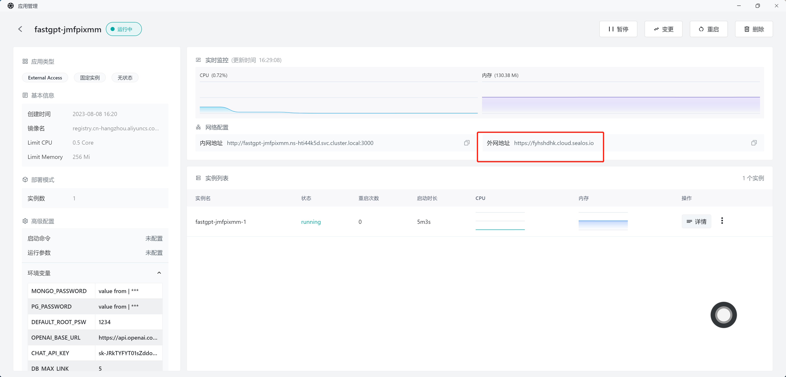

# Quick Installation of FastGpt AI Knowledge Base

No server, no magic, no domain name, click to deploy 👇

The database needs to be deployed. After the deployment, you need to wait 2 to 4 minutes to access the database. The minimum configuration is used by default, and the first access is a little slow.

## Run

Click on the [external address] provided by sealos to use it. The login user name is root, and the password is the newly set environment variable (1234 in the figure above)

