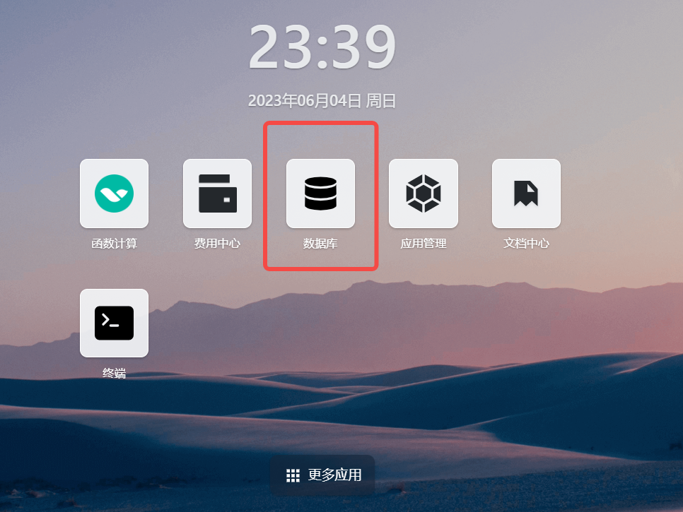
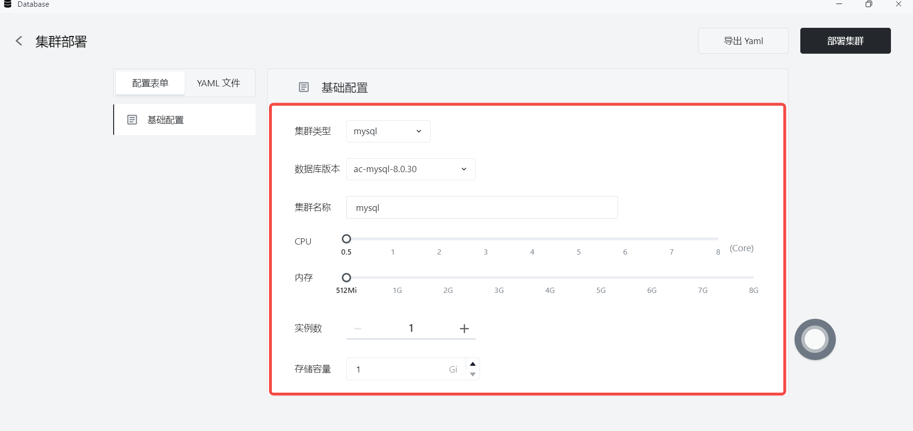
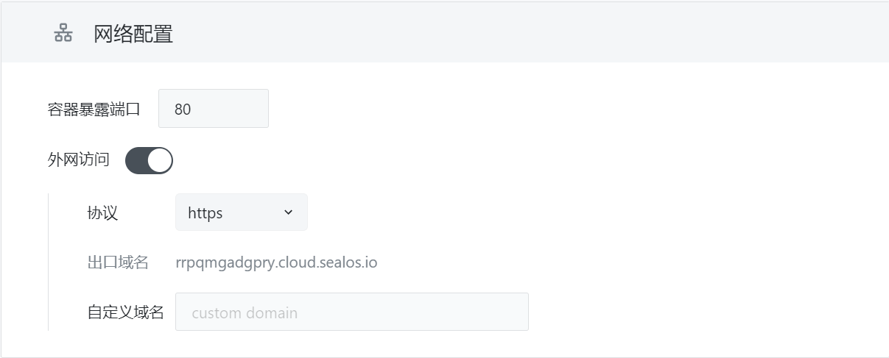
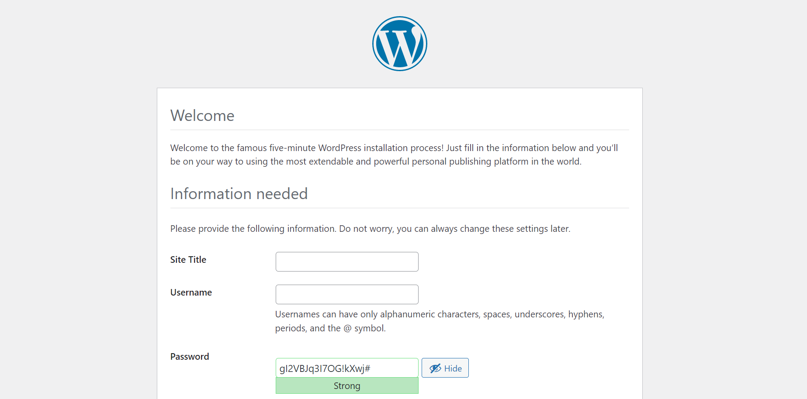

# Quick Installation of WordPress

[WordPress](https://github.com/WordPress/WordPress) is a powerful, user-friendly and open source content management system (CMS) that can be used to publish websites, news, blogs and other content online. It provides convenient methods for content editing, publishing and updating, and can also be highly customized through themes and plugins. WordPress has become a very successful and popular CMS system, with over 30 million websites built on WordPress worldwide.

> By deploying **WordPress** with **Sealos**, you can greatly reduce deployment time and start users' content publishing journey at lightning speed.

WordPress requires a MySQL database to be installed and used together. As a best practice for using Sealos, it is recommended to deploy the MySQL database independently using a database application, and quickly install WordPress based on the independent database.


## Create MySQL instance

Open the **Database** application in the [Sealos](https://cloud.sealos.io) desktop environment, quickly set up the required database instance and wait for the database deployment to be completed.






## Create a New Database

When installing a MySQL instance through the **Database** application, user-defined databases are not automatically created. When connecting an application to the MySQL database, you need to manually create the corresponding database in the MySQL instance.

You can access the database terminal command line in the following ways:


Alternatively, you can access the database terminal command line using the following methods:

`mysql -u username -p -h yourhost`


After successfully connecting to the database, you can create a new database using the following command:

`CREATE DATABASE yourdb;`

At this point, you have manually created a user-defined database in the MySQL instance.

## App Launchpad

Click on App Launchpad to enter the installation interface.


## Basic Configuration

Begin by setting a custom application name and selecting the image to install. Sealos supports both public and private image sources. In this example, the official image source is used, and if no image version is specified, the latest version will be pulled by default.

Next, configure CPU and memory resources for WordPress. WordPress is very lightweight, and a small amount of resources is sufficient to ensure the normal operation of the program.


## NetWork Configuration

For network configuration, enable external access, and Sealos will automatically assign an exit domain name for users to access from the internet. If the user has already registered their custom domain, they can create a CNAME record pointing to the assigned exit domain name, allowing the custom domain to be used to access the installed application.

Note: In subsequent demonstrations, a randomly generated exit domain name by Sealos will be used.




## Advanced Configuration

In the advanced configuration, you need to configure the environment variables for WordPress based on the actual database situation.

In the advanced configuration, you need to set environment variables and local storage for WordPress.

Common WordPress environment variables are shown below:

```Plain
WORDPRESS_DB_HOST       IP address of the database instance
WORDPRESS_DB_USER       Database user for connection
WORDPRESS_DB_PASSWORD   User password required for connecting to the database
WORDPRESS_DB_NAME       Name of the connected database
```

Based on the previously installed MySQL example, you can configure the environment variables as follows:

```Plain
WORDPRESS_DB_HOST     Database IP Address
WORDPRESS_DB_USER     Database username
WORDPRESS_DB_PASSWORD Database password
```

The storage volume mount point for the official WordPress image is: /var/www/html. Users can allocate storage space for the application according to their needs.

With this, WordPress is also successfully installed. Click on the details, and you can successfully access it through the external network address.


Click on the link, and the following page shows that the installation was successful:



**Note: If the deployment fails, first check whether the user-defined database that WordPress is trying to access exists in the MySQL instance.**


