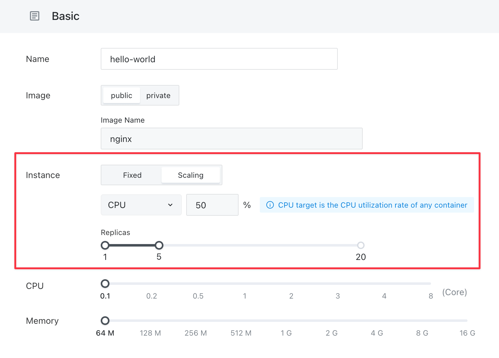

# Autoscaling

In [Sealos](https://cloud.sealos.io), the "[App Launchpad](/guides/applaunchpad/applaunchpad.md)" feature enables the automatic adjustment of application instance numbers to effectively respond to varying load conditions. This functionality is known as "**Autoscaling**," or more technically, the Horizontal Pod Autoscaler (HPA).

Autoscaling operates by dynamically altering the count of application instances based on specific metrics like CPU and memory usage. This ensures that the applications run efficiently and resources are optimally utilized.

> Key Point: In Autoscaling, "usage" typically refers to the average use across all instances of an application. For example, if an app runs on two instances, its average CPU usage is calculated as the mean of the usage of these two instances.

The workings of Autoscaling are as follows:

1. **Monitoring**: It continuously monitors crucial performance indicators like CPU and memory usage.
2. **Decision Making**: Based on predefined thresholds (e.g., maintaining CPU usage below 50%), it calculates the required adjustments in the instance count.
3. **Adjustment**: Following this, Autoscaling automatically instructs the Sealos controller to modify the number of instances, ensuring the usage stays within the desired range.

For instance, if we set up an application with specific Autoscaling rules such as a maximum CPU usage of 50% and the ability for instance numbers to vary between 1 and 5, Autoscaling will:

- Increase the number of instances when the average CPU usage exceeds 50%, up to a maximum of 5.
- Decrease the number of instances when the average CPU usage drops below 50%, but always maintain at least one instance in operation.

