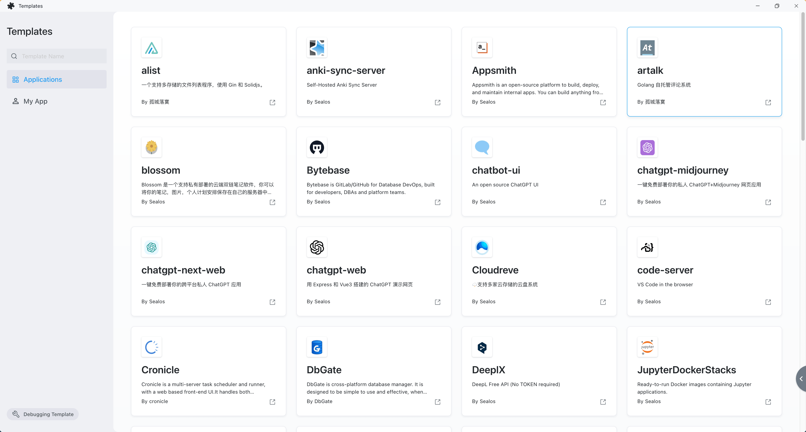

# Templates

import Highlight from '@site/src/components/Highlight'

<Highlight content="Use a template" url="https://template.cloud.sealos.io" />

Sealos's [templates](https://template.cloud.sealos.io/) offers an array of pre-designed templates, ideal for quickly setting up and launching websites and a range of applications. This marketplace hosts a variety of template types, including blogs, AI applications, low-code solutions, cloud storage, IM applications, and middleware. These templates aim to make the development process more efficient, allowing developers to rapidly initiate and deploy projects without the need to build a website from scratch or concern themselves with the intricacies of application dependencies.

Contrasting with Vercel's template marketplace, Sealos provides a different range of applications and functionalities. Vercel primarily targets front-end project deployment, offering templates that enhance website interfaces and user interactions. However, Vercel does not offer persistent data storage, resulting in data being temporary and lost upon application restart.

In contrast, Sealos's application templates encompass both front-end and back-end projects, along with a variety of other applications. Significantly, Sealos includes support for persistent storage, an essential aspect for applications that require extensive data storage or need to maintain data continuity. This is particularly critical for applications like e-commerce websites, large-scale social media platforms, and enterprise-level applications, where data persistence is a key requirement.

