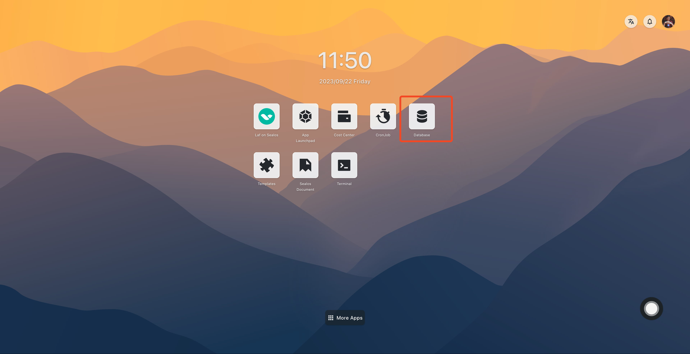
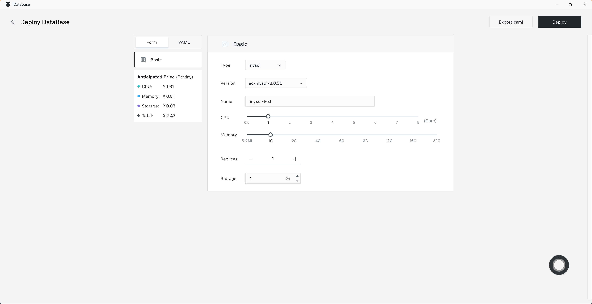
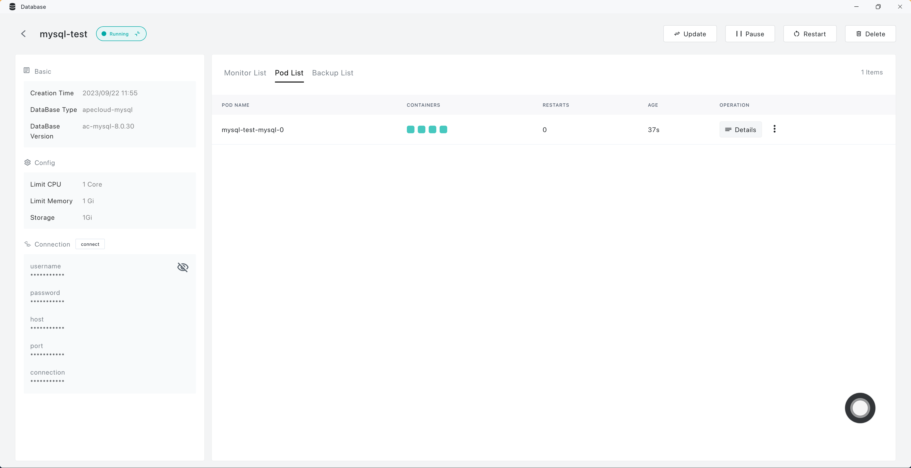
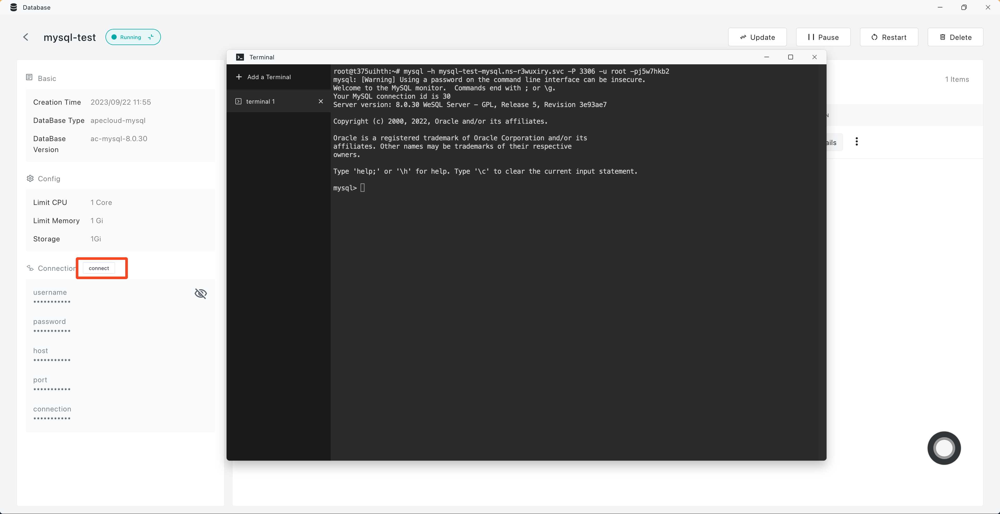
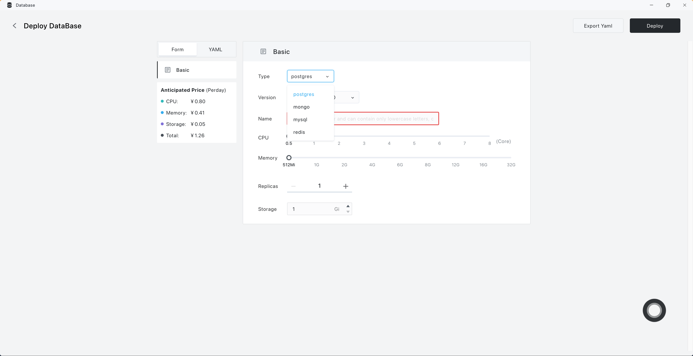

# Use Database

Databases are fundamental tools for data management, designed for efficient storage and access. Sealos offers a user-friendly database interface, eliminating the complexities of command-line operations. This assists in managing an array of databases, such as relational databases, NoSQL, vector databases, and streaming databases. With just a few clicks in the "[Database](/guides/dbprovider/dbprovider.md)" app, you can seamlessly create a variety of databases, including MySQL, PostgreSQL, MongoDB, Redis, and many more.

This guide will show you how to install MySQL use Databse app.

## Install MySQL

1. Open Database app in the [Sealos](https://cloud.sealos.io) desktop.

2. Click on 'Create Database' and finalize the basic configuration.

3. Click on 'Deploy' then click 'Confirm' to wait for the successful creation of the MySQL.

4. Click on 'connect', which will directly launch the "Terminal" application, leading you to the database command line.

## Install PostgreSQL and MongoDB

The installation process for PostgreSQL and MongoDB mirrors that of MySQL. Simply choose the respective database type on the basic configuration page.

