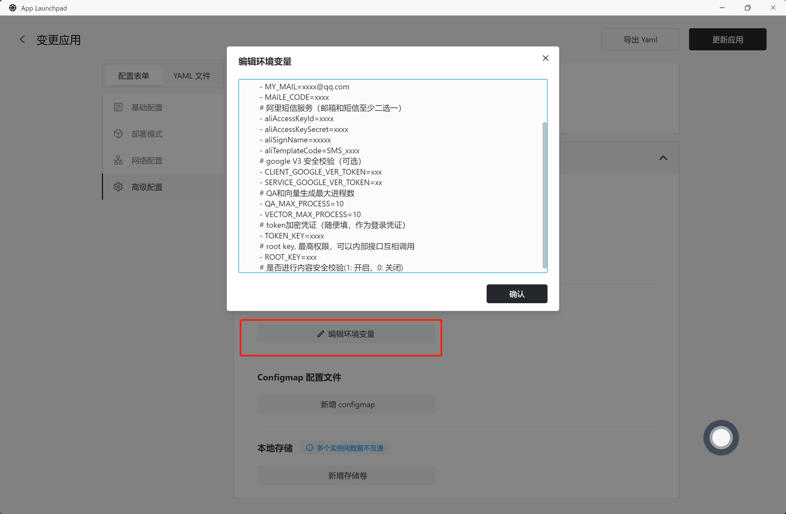

# 环境变量

在 [Sealos](https://cloud.sealos.io) 中，环境变量扮演着至关重要的角色，它们是管理容器应用配置数据的关键工具。通过使用环境变量，可以为应用提供必要的配置信息，而无需直接修改应用的代码或其镜像，从而提高应用的可维护性和可扩展性。

在「[应用管理](/guides/applaunchpad/applaunchpad.md)」界面，环境变量是通过批量输入的方式来定义的。用户可以通过按行输入的方式来定义多个环境变量，其中每个环境变量由键（key）和值（value）组成，两者之间可以使用等号（=）或冒号（:）作为分隔符，「[应用管理](/guides/applaunchpad/applaunchpad.md)」会自动清除键（key）中的无效字符，以确保环境变量的正确性和有效性。



**可正常解析的环境变量格式：**

```bash
host=127.0.0.1
port:3000
name: sealos
- username=123
- password:123
# 这一行的注释会被忽略。因为不包含等号（=）或冒号（:）这两种标记字符。
```

**不可解析的环境变量格式：**

```bash
host=127.0.0.1 # 这一行会被解析，因为包含了等号（=）或冒号（:）这两种标记字符。这里的注释也会被解析，因为前面已经有等号（=）了。
```