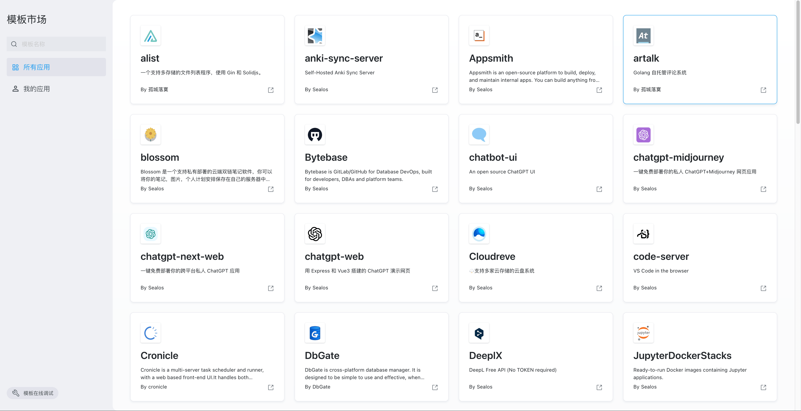

# 模板市场

import Highlight from '@site/src/components/Highlight'

<Highlight content="使用模板" url="https://template.cloud.sealos.io" />

Sealos 的[模板市场](https://template.cloud.sealos.io/)提供了一系列预制的模板，这些模板可用于快速创建和部署网站和各种应用程序。你可以在模板市场中找到各种类型的模板，比如博客、AI 应用、低代码应用、网盘、IM 应用、中间件等等。这些模板旨在简化开发过程，使开发者能够快速启动和部署项目，而无需从零开始构建整个网站，也无需关心应用之间的各种依赖关系。

与 Vercel 的模板市场相比，Sealos 的模板市场在应用范围和功能上有所不同。Vercel 主要专注于前端项目的部署，它的模板主要是为了支持网站的界面和用户交互部分，但它不支持数据的持久化存储，所有的数据都是临时的，一旦应用重启，数据就会丢失。

Sealos 应用模板不仅支持前端项目，还支持后端和其他各类应用的部署。更重要的是，Sealos 支持挂载持久化存储，这对于需要存储大量数据或者保持数据持久化的应用来说至关重要。例如，对于电商网站、大型社交媒体应用或企业级应用来说，数据的持久化是必不可少的功能。

