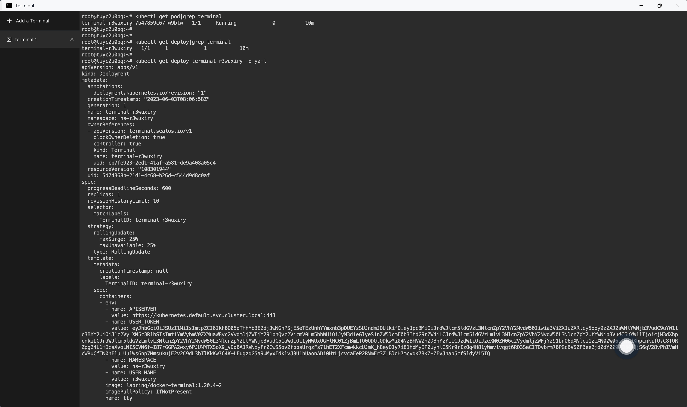
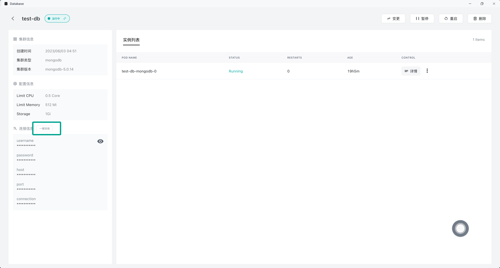

# 终端

终端是 [Sealos](https://cloud.sealos.io) 云操作系统内置的应用，它是一款非常强大的应用，与单机操作系统的终端一样，允许用户与操作系统进行直接交互，用户可以通过键入命令来执行各种操作。


终端的价值在于其高效，灵活和强大的特性。对于许多任务来说，使用终端比使用图形用户界面（GUI）更快更简洁。对于开发者而言，终端是必不可少的工具。使用终端，可以让用户深入理解和控制 Sealos 云操作系统。

**每一个用户的终端实际上都运行在 Kubernetes 的一个 Pod 中**，可以在终端中通过以下命令查看：



## 进入应用容器的终端

也可以直接通过终端 App 进入每个应用所在容器的终端。假设你在应用管理中部署了一个应用 Nginx，可以直接进入 Nginx 应用的详情页面，依次点击详情右侧的三个点，再点击「终端」，便进入了 Nginx 应用的终端。


## 终端一键直连数据库

还可以在终端中一键直连[数据库 App](../dbprovider/dbprovider.md) 中创建的数据库。

进入数据库详情页面，点击左侧的「一键连接」：



就会直接跳转到终端 App 并连接数据库：


## 终端直接操作 Kubernetes 资源

:::danger

以下操作需要一定的 Kubernetes 和容器相关知识基础，否则不要轻易操作。

:::

资深 Kubernetes 用户可以直接使用终端来操作 Kubernetes 资源，对于资深用户而言，终端的优势有很多：

+ 可以批量操作和自动化
+ 高度灵活性
+ 可以进行深入的故障排查

以下是一些常见的终端中操作 Kubernetes 资源的示例：

### 查看用户的 Pod 列表

```bash
kubectl get pods
```

### 创建和管理资源对象

```bash
# 使用YAML或JSON文件创建资源
$ kubectl create -f <filename>

# 使用YAML或JSON文件创建或更新资源
$ kubectl apply -f <filename>

# 删除指定类型和名称的资源
$ kubectl delete <resource-type> <resource-name>

# 查看指定 Deployment 的滚动更新状态
$ kubectl rollout status deployment/<deployment-name>
```

### 故障排查

```bash
# 获取指定资源的详细信息，包括事件和状态
$ kubectl describe <resource-type> <resource-name>

# 获取指定 Pod 中指定容器的日志
$ kubectl logs <pod-name> -c <container-name>

# 在指定 Pod 中打开一个终端，以便进行调试
$ kubectl exec -it <pod-name>
```