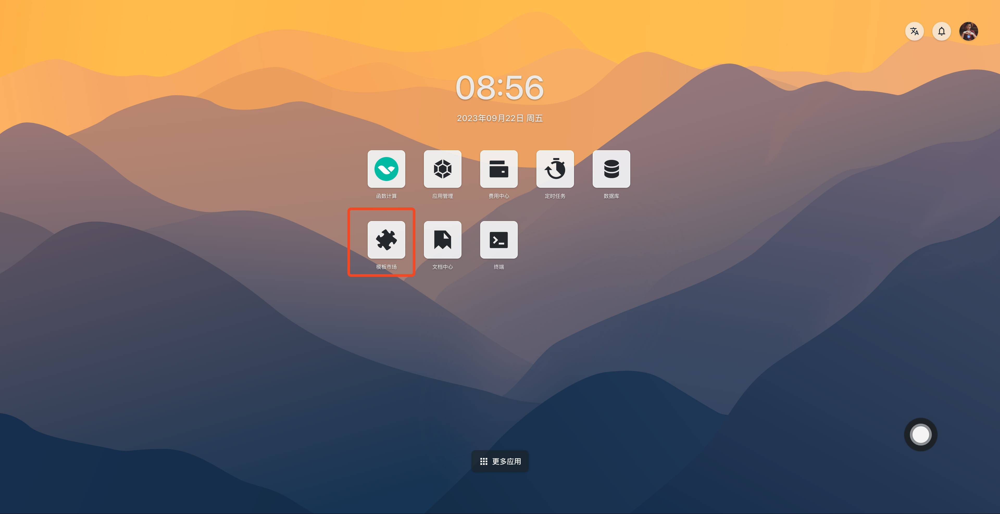
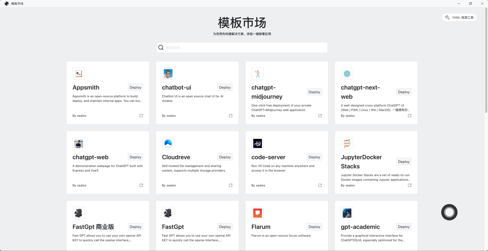
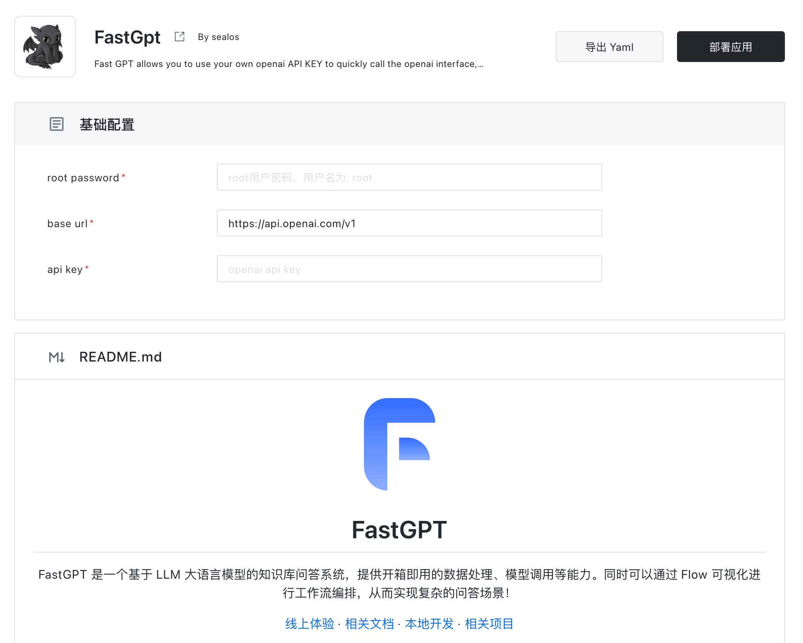

# 使用模板

这篇文档将会向您展示如何使用应用模板来快速安装各种分布式应用，并最大限度地发挥 Sealos 的功能。

## 1. 选择模板

首先在 [Sealos](https://cloud.sealos.run) 桌面环境中打开「模板市场」。

选择自己想要部署的应用模板。

不知道部署哪个应用？可以试试 [FastGPT AI 知识库](/examples/ai-applications/install-fastgpt-on-desktop.md)

## 2. 将模板应用部署到 Sealos

选择模板之后，设置好相应的参数值，点击「部署应用」按钮开始部署。

部署完成后，点击「确认」跳转到应用详情。

等待应用的状态变成 `running` 之后，点击外网地址即可通过外网域名直接打开应用的 Web 界面。

