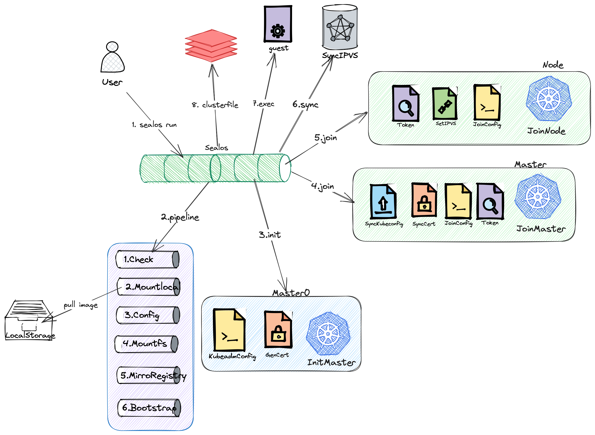

# Sealos Run 的工作原理

以下是 `sealos run` 命令的详细工作原理。为了帮助您更好地理解，我们将其分解为九个主要步骤。

## 1. 执行命令

首先，用户通过执行以下命令启动 Sealos：

```bash
sealos run kubernetes:v1.23.8
```

## 2. 执行 Pipeline

命令执行后，Sealos 开始执行一系列相关的操作步骤，我们称之为 "Pipeline"。这个过程包括以下几个子步骤：

### 2.1 节点检查

Sealos 会对所有节点进行检查，以确保它们都是可用的。例如，检查是否存在重复的主机名，以及所有节点的时间是否已经同步。

### 2.2 拉取镜像

接着，Sealos 从远程仓库拉取 Kubernetes 的镜像，并将其加载到本地存储。

### 2.3 渲染配置

然后，Sealos 会对拉取到的镜像的 rootfs（文件系统）进行配置渲染，这是为了准备后续的节点分发。

### 2.4 分发镜像文件

配置渲染完成后，Sealos 会将渲染后的 rootfs 文件分发到各个节点。

### 2.5 分发 Registry 目录

此外，Sealos 也会将镜像中的 registry 目录分发到对应的 registry 角色节点。Sealos 支持两种模式：

- **scp模式**：直接通过 scp 将目录复制到每个节点，这种方式会占用大量的网络带宽。
- **镜像同步模式**：使用 skopeo sdk 的镜像同步机制，能够实现增量镜像同步，从而节省网络带宽。该功能可通过环境变量 `SEALOS_REGISTRY_SYNC_EXPERIMENTAL=true` 来开启。

### 2.6 执行 Bootstrap

Bootstrap 是关键步骤，包括以下操作：

#### 2.6.1 添加 Host 解析

Sealos 会在每个节点上添加 registry 的 host 解析。

#### 2.6.2 执行 Registry-Init 脚本

在添加完 host 解析后，Sealos 会执行 registry-init 脚本。

#### 2.6.3 执行 Init 脚本

最后，Sealos 会执行 init 脚本，启动 Kubernetes 服务。

## 3. 执行 InitMaster0

Pipeline 执行完成后，Sealos 进入 InitMaster0 阶段。在此阶段，Sealos 会执行以下操作：

### 3.1 生成 Kubeadm 配置

首先，Sealos 生成 Kubeadm 的初始化配置文件。

### 3.2 生成并分发证书文件

然后，Sealos 生成集群的所有

证书文件，并将它们分发到各个节点。

### 3.3 初始化 Master0

最后，Sealos 执行`kubeadm init`初始化 Master0 节点。

## 4. 执行 JoinMaster

初始化完 Master0 节点后，Sealos 进入 JoinMaster 阶段。在此阶段，Sealos 会执行以下操作：

### 4.1 同步 Kubeconfig

首先，Sealos 将 Kubeconfig 文件同步到各个节点。

### 4.2 同步证书文件

接下来，Sealos 同步证书文件到各个节点。

### 4.3 生成 Join 配置

然后，Sealos 生成 JoinMaster 配置文件。

### 4.4 生成 Join 令牌

接着，Sealos 生成 Join 令牌。

### 4.5 执行 Join Master 流程

最后，Sealos 执行`kubeadm join`流程，让其他 Master 节点加入集群。

## 5. 执行 JoinNode

所有 Master 节点加入集群后，Sealos 进入 JoinNode 阶段，执行以下操作：

### 5.1 生成 Join 令牌

首先，Sealos 再次生成 Join 令牌。

### 5.2 生成 IPVS 规则

然后，Sealos 生成 IPVS 规则。

### 5.3 生成 Join 配置

接下来，Sealos 再次生成 JoinNode 配置。

### 5.4 执行 Join Node 流程

最后，Sealos 执行 Join Node 流程，让 Worker 节点加入集群。

## 6. 同步 IPVS

所有节点加入集群后，Sealos 将 Master 的 IPVS 规则同步到所有节点。这里主要是通过 lvscare 的静态 pod，根据 Master 节点的数量同步静态 pod 的配置。

## 7. 执行 Guest 阶段

IPVS 规则同步完成后，Sealos 执行 Guest 阶段。这是执行集群镜像命令的阶段。

## 8. 写入 Clusterfile

最后，Sealos 将最终的执行结果写入 Clusterfile。

这就是 `sealos run` 命令的工作原理。希望通过这篇文章，您能对 `sealos run` 命令有更深入的理解。以下是我们提到的全景图，以帮助您更好地理解整个流程。


