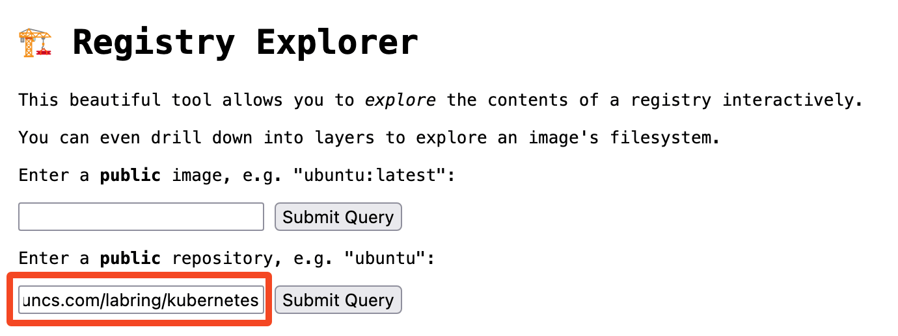

# 安装 K8s 集群

Sealos 支持安装 `amd64` 和 `arm64` 架构的 K8s 集群。

## 先决条件 

首先需要[下载 Sealos 命令行工具](/self-hosting/lifecycle-management/quick-start/install-cli.md)，sealos 是一个简单的 Golang 二进制文件，可以安装在大多数 Linux 操作系统中。

以下是一些基本的安装要求： 

+ 每个集群节点应该有不同的主机名。主机名不要带下划线。
+ 所有节点的时间需要同步。
+ 需要在 K8s 集群的**第一个 master 节点**上运行 `sealos run` 命令，目前**集群外的节点不支持集群安装**。
+ 建议使用干净的操作系统来创建集群。**不要自己装 Docker！**
+ 支持大多数 Linux 发行版，例如：Ubuntu、CentOS、Rocky linux。
+ 支持 [Docker Hub](https://hub.docker.com/r/labring/kubernetes/tags) 中的所有 Kubernetes 版本。
+ 支持使用 Containerd 作为容器运行时。
+ 在公有云上安装请使用**私有 IP**。

## 查看集群镜像

Sealos 所有的集群镜像都可以在 [cluster-image-docs](https://github.com/labring-actions/cluster-image-docs) 仓库里找到。除了推送到 Docker Hub 之外，这些镜像还被同步到了阿里云的镜像仓库。

Docker Hub 上可以通过以下链接查看 Sealos 所有的集群镜像：[https://hub.docker.com/u/labring](https://hub.docker.com/u/labring).

使用 [Registry Explorer](https://explore.ggcr.dev/) 可以查看 K8s 集群镜像的所有版本，直接输入 `registry.cn-shanghai.aliyuncs.com/labring/kubernetes`，然后点击 “Submit Query”：



就会看到这个集群镜像的所有 tag。

Docker Hub 同理，输入 `docker.io/labring/kubernetes` 即可查看所有 tag。

:::info注意

K8s 的小版本号越高，集群越稳定。例如 v1.28.x，其中的 x 就是小版本号。建议使用小版本号比较高的 K8s 版本。到本文截止时间为止，v1.27 最高的版本号是 v1.27.7，而 v1.28 最高的版本号是 v1.28.3，所以**建议使用 v1.27.7**。你需要根据实际情况来选择最佳的 K8s 版本

:::

## 安装 K8s 单机版

```shell
# sealos version must >= v4.1.0
$ sealos run registry.cn-shanghai.aliyuncs.com/labring/kubernetes:v1.27.7 registry.cn-shanghai.aliyuncs.com/labring/helm:v3.9.4 registry.cn-shanghai.aliyuncs.com/labring/cilium:v1.13.4 --single
```

## 安装 K8s 集群

```shell
$ sealos run registry.cn-shanghai.aliyuncs.com/labring/kubernetes:v1.27.7 registry.cn-shanghai.aliyuncs.com/labring/helm:v3.9.4 registry.cn-shanghai.aliyuncs.com/labring/cilium:v1.13.4 \
     --masters 192.168.64.2,192.168.64.22,192.168.64.20 \
     --nodes 192.168.64.21,192.168.64.19 -p [your-ssh-passwd]
```

注意：labring/helm 应当在 labring/cilium 之前。

参数说明：

| 参数名 | 参数值示例 | 参数说明 |
| --- | --- | --- |
| --masters |  192.168.0.2 | K8s master 节点地址列表 |
| --nodes | 192.168.0.3 | K8s node 节点地址列表 |
| --ssh-passwd | [your-ssh-passwd] | ssh 登录密码 |
|kubernetes | labring/kubernetes:v1.25.0 | K8s 集群镜像 |

在干净的服务器上直接执行上面命令，不要做任何多余操作即可安装一个高可用 K8s 集群。

## 安装各种分布式应用

```shell
sealos run registry.cn-shanghai.aliyuncs.com/labring/helm:v3.9.4 # install helm
sealos run registry.cn-shanghai.aliyuncs.com/labring/openebs:v3.9.0 # install openebs
sealos run registry.cn-shanghai.aliyuncs.com/labring/minio-operator:v4.5.5 registry.cn-shanghai.aliyuncs.com/labring/ingress-nginx:4.1.0
```

这样高可用的 Minio 等应用都有了，不用关心所有的依赖问题。

## 增加 K8s 节点

增加 node 节点：

```shell
$ sealos add --nodes 192.168.64.21,192.168.64.19 
```

增加 master 节点：

```shell
$ sealos add --masters 192.168.64.21,192.168.64.19 
```

## 删除 K8s 节点

删除 node 节点：

```shell
$ sealos delete --nodes 192.168.64.21,192.168.64.19 
```

删除 master 节点：

```shell
$ sealos delete --masters 192.168.64.21,192.168.64.19  
```

## 清理 K8s 集群

```shell
$ sealos reset
```


## 离线安装 K8s

离线环境只需要提前导入镜像，其它步骤与在线安装一致。

首先在有网络的环境中导出集群镜像：

```shell
$ sealos pull registry.cn-shanghai.aliyuncs.com/labring/kubernetes:v1.27.7
$ sealos save -o kubernetes.tar registry.cn-shanghai.aliyuncs.com/labring/kubernetes:v1.27.7
```

### 导入镜像并安装

将 kubernetes.tar 拷贝到离线环境, 使用 load 命令导入镜像即可：

```shell
$ sealos load -i kubernetes.tar
```

剩下的安装方式与在线安装的步骤一致：

```shell
$ sealos images # 查看集群镜像是否导入成功
$ sealos run registry.cn-shanghai.aliyuncs.com/labring/kubernetes:v1.27.7  # 单机安装，集群安装同理
```

### 快速启动 K8s 集群

也可以不用 load 命令导入镜像，直接使用以下命令即可安装 K8s：

```shell
$ sealos run kubernetes.tar # 单机安装，集群安装同理
```

## 集群镜像版本支持说明

### 支持 Containerd 的 K8s

推荐使用 Containerd 作为容器运行时 (CRI) 的集群镜像版本，Containerd 是一种轻量级、高性能的容器运行时，与 Docker 兼容。使用 Containerd 的 Kubernetes 镜像可以提供更高的性能和资源利用率。以下是支持 Containerd 的集群镜像版本支持说明：

| K8s 版本 | Sealos 版本       | CRI 版本 | 集群镜像版本               |
| -------- | ----------------- | -------- | -------------------------- |
| `<1.25`  | `>=v4.0.0`        | v1alpha2 | labring/kubernetes:v1.24.0 |
| `>=1.25` | `>=v4.1.0`        | v1alpha2 | labring/kubernetes:v1.25.0 |
| `>=1.26` | `>=v4.1.4-rc3`    | v1       | labring/kubernetes:v1.26.0 |
| `>=1.27` | `>=v4.2.0-alpha3` | v1       | labring/kubernetes:v1.27.0 |
| `>=1.28` | `>=v5.0.0`        | v1       | labring/kubernetes:v1.28.0 |

根据 Kubernetes 版本的不同，您可以选择不同的 Sealos 版本和 CRI 版本。例如，如果您要使用 Kubernetes v1.26.0 版本，您可以选择 sealos v4.1.4-rc3 及更高版本，并使用 v1 CRI 版本。

### 支持 Docker 的 K8s

当然，你也可以选择使用 Docker 作为容器运行时，以下是支持 Docker 的集群镜像版本支持说明：

| K8s 版本 | Sealos 版本       | CRI 版本 | 集群镜像版本                      |
| -------- | ----------------- | -------- | --------------------------------- |
| `<1.25`  | `>=v4.0.0`        | v1alpha2 | labring/kubernetes-docker:v1.24.0 |
| `>=1.25` | `>=v4.1.0`        | v1alpha2 | labring/kubernetes-docker:v1.25.0 |
| `>=1.26` | `>=v4.1.4-rc3`    | v1       | labring/kubernetes-docker:v1.26.0 |
| `>=1.27` | `>=v4.2.0-alpha3` | v1       | labring/kubernetes-docker:v1.27.0 |
| `>=1.28` | `>=v5.0.0`        | v1       | labring/kubernetes-docker:v1.28.0 |


与支持 Containerd 的 Kubernetes 镜像类似，您可以根据 Kubernetes 版本的不同选择不同的 Sealos 版本和 CRI 版本。例如，如果您要使用 Kubernetes v1.26.0 版本，您可以选择 sealos v4.1.4-rc3 及更高版本，并使用 v1 CRI 版本。

### 支持 Containerd 的 k3s

| K3s 版本   | Sealos 版本  | 集群镜像版本        |
|----------|------------|---------------------|
| `>=1.24` | `>=v5.0.0` | labring/k3s:v1.24.0 |

## 总结

您可以根据自己的需求和偏好，在不同的镜像类型和版本中进行选择。同时，不要忘记查看 [更新日志](https://github.com/labring/sealos/blob/main/CHANGELOG/CHANGELOG.md)，以了解各个版本的更新内容和修复问题。
