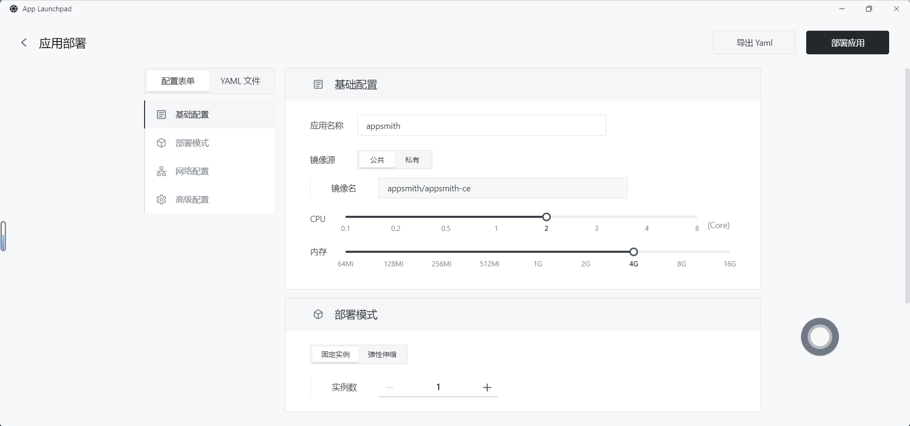
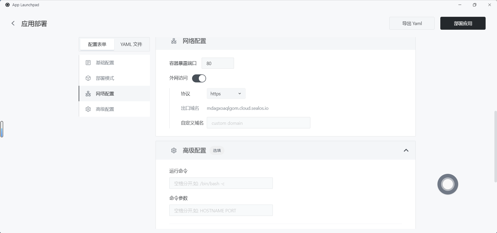
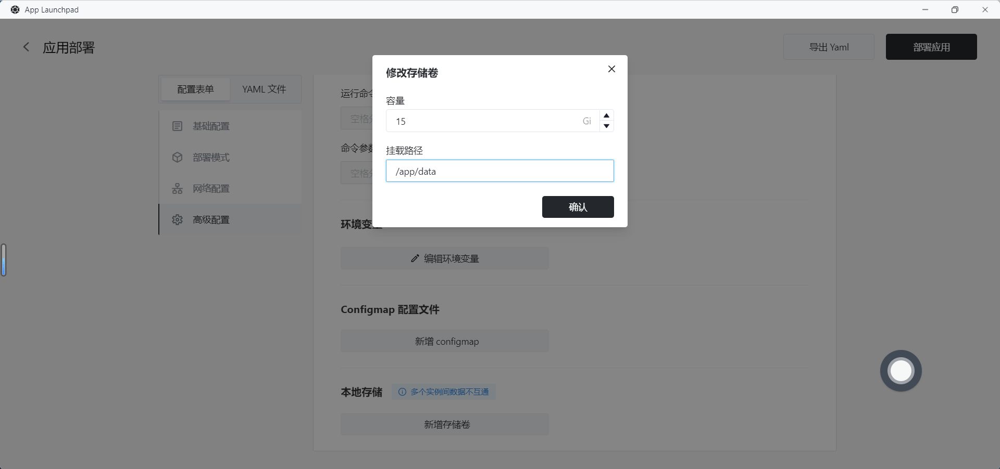
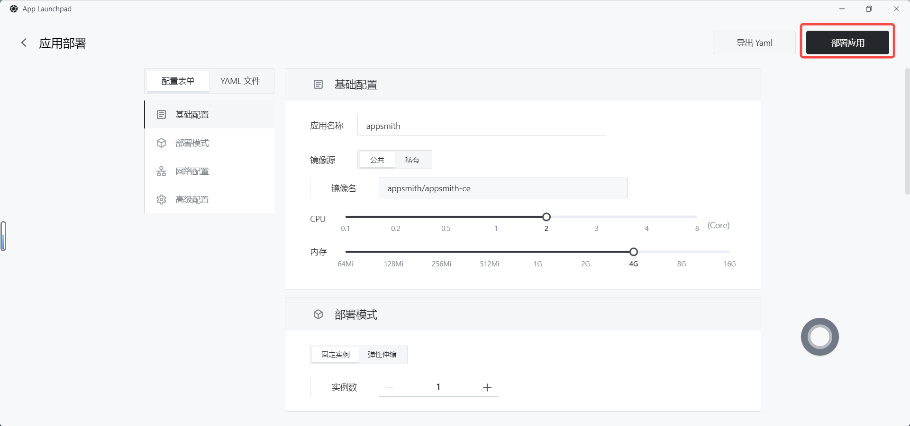

# Quick installation of Appsmith

[Appsmith](https://github.com/appsmithorg/appsmith) is an open-source platform to build, deploy, and maintain internal
apps. You can build anything from simple CRUD apps, admin panels, dashboards to custom business apps and complicated
multi-step workflows.

## Step 1: Step 1: open the App Launchpad application in the [Sealos](https://cloud.sealos.io) desktop environment

## Step 2: create a new application

- In App Launchpad, click "New Application" to create a new application.

## Step 3: application deployment

- Basic configuration:

    - Application name (Custom): appsmith

    - Image name (default latest version): appsmith/appsmith-ce

    - CPU (recommended): 2 Core

    - Memory (recommended): 4 GB

- deployment mode:

    - number of instances (custom): 1

- Network configuration:

    - Container exposure port: 80

    - Public network access: enabled

- Advanced configuration:

    - Customize local storage and persist Appsmith data (15 GB is recommended).

## Step 4: deploy the application

- Click "deploy Application" to start deploying the application.

## Step 5: access the application

- Click "details" to view, when the STATUS of the application has changed from Pending to Running, it indicates that the
  application has been launched successfully.

- When STATUS is Running, you can directly access the public network address.

- The visit was successful!

