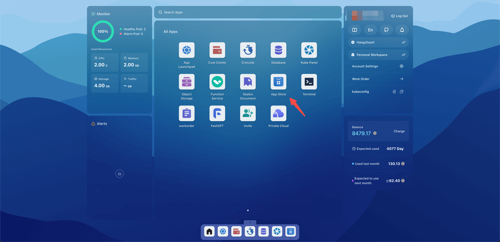
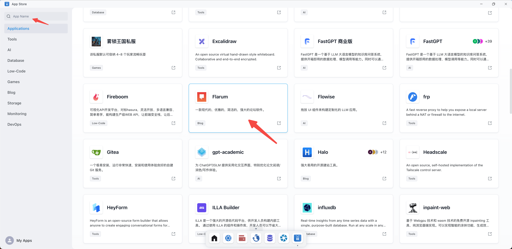
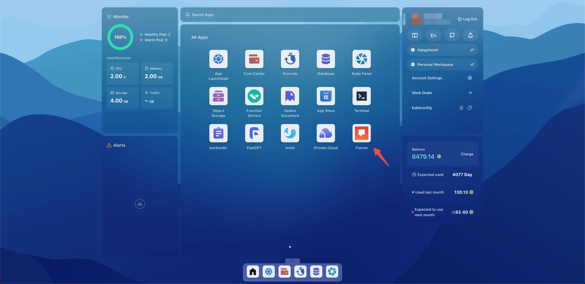
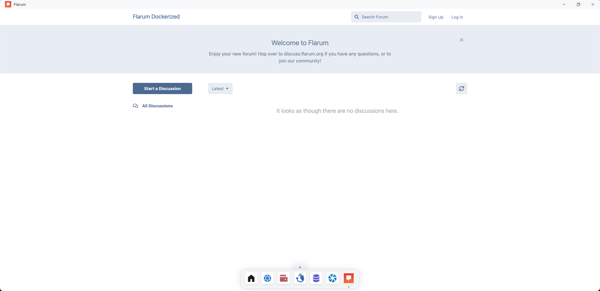

# Quick Start

Deploy Flarum quickly with Sealos.

> Flarum is a very simple open source forum software. It's responsive, easy to use, and has all the features you need to
> build a successful community. It's also extremely extensible, allowing for ultimate customizability.

Open the Sealos desktop and click App Store.

Click on the Flarum app (the search bar in the upper left corner can quickly find the app).

Click Deploy App.

Wait for the status of all components to change to running, which means that the components have been started (you can
re-enter the current page refresh state).

Return to the Sealos desktop and click on the Flarum app.

Successfully accessed Flarum.

