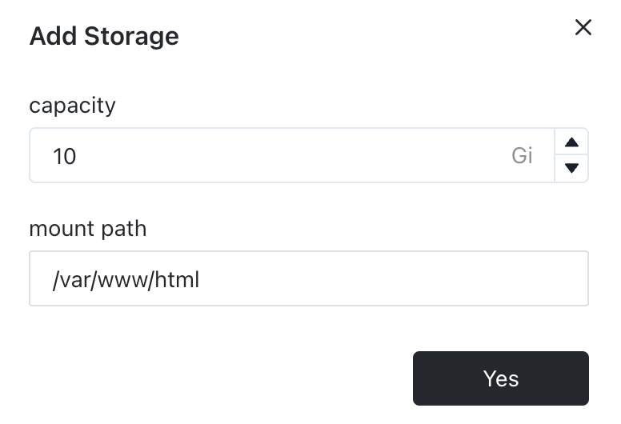

# Persistent Volume

[Sealos](https://cloud.sealos.io) offers a flexible environment where containers can be effortlessly created and
destroyed. This flexibility is advantageous for application deployment and management, but it also raises the issue of
maintaining data persistence. In scenarios where data is stored within an application container, its destruction leads
to the loss of all stored data.

To counter this problem, the use of persistent storage is essential. Persistent storage ensures that data is stored
externally, thereby preserving it even through container restarts or redeployments. This is particularly vital for
applications requiring data retention, like databases, file storage systems, or any services involving user data.

For instance, in deploying Nextcloud, all data associated with its container is located in the `/var/www/html`
directory. To maintain data continuity, it's necessary to use external storage solutions for persisting data in this
directory.

