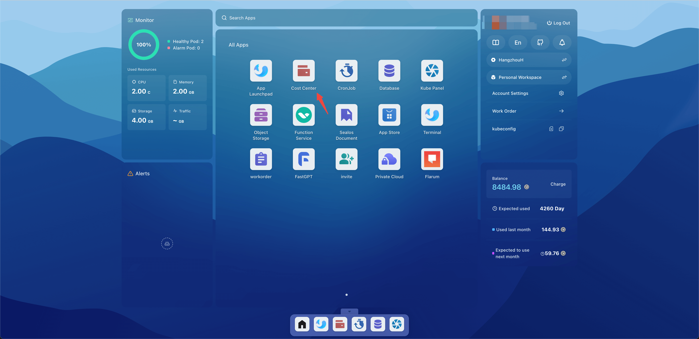
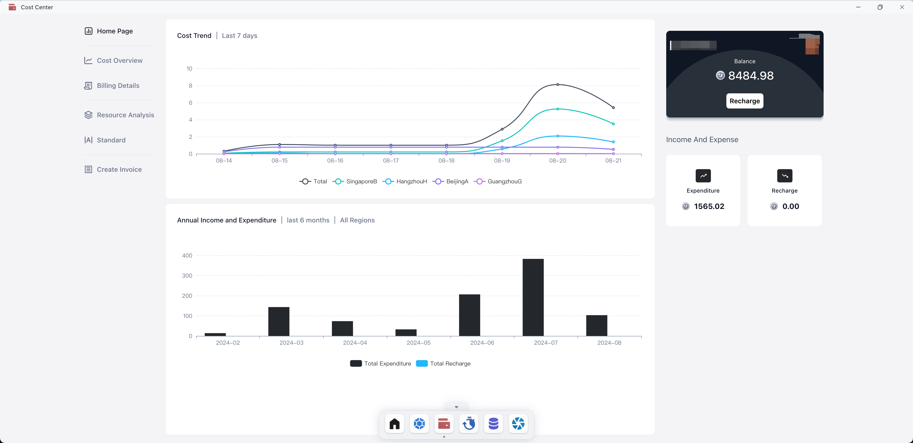
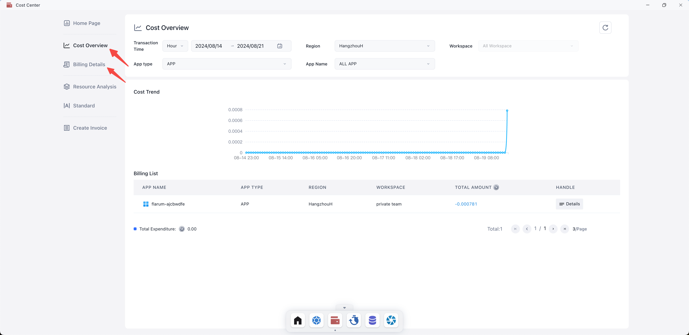
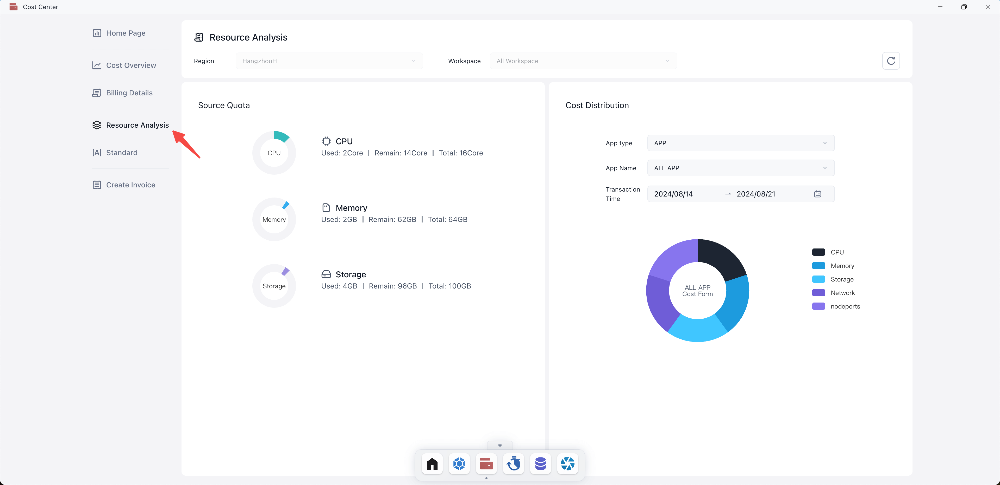
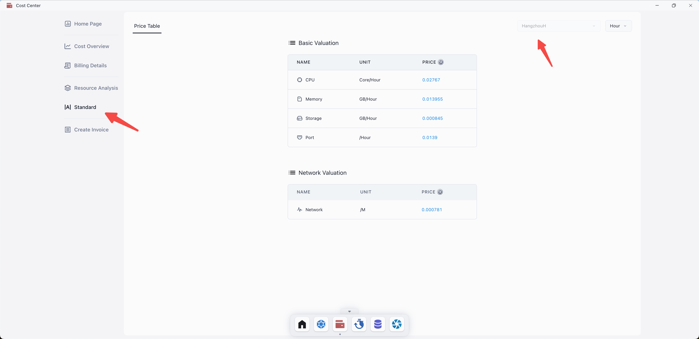
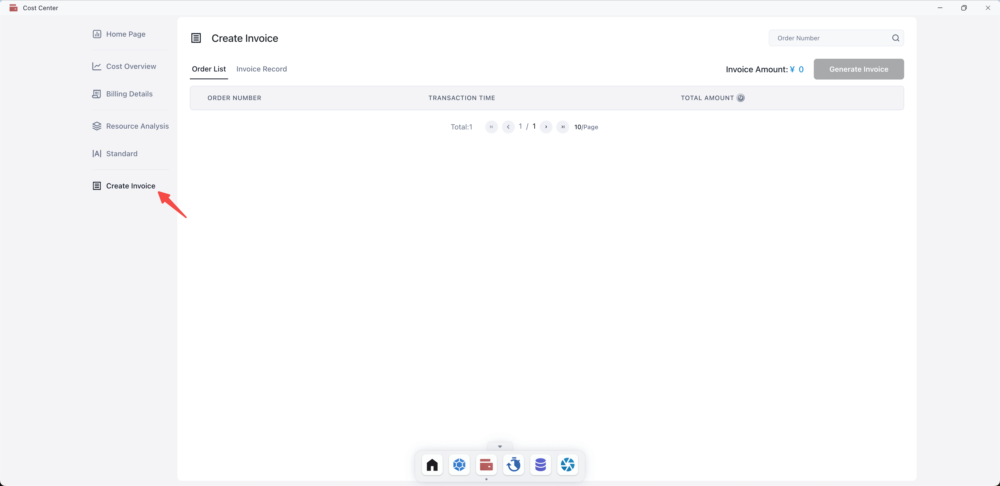

# Cost Center

The Cost Center consists of five modules: Cost Overview, Billing Details, Resource Analysis, Standard, and Create
Invoice.

Cost Overview and Billing Details display the overall income and expenditure of the account and the expenses of various
applications, Resource Analysis shows the expenditure distribution of each resource, Standard explains pricing
information, and the Create Invoice module supports generating invoices for recharges.

## Quick Start

Open the Sealos desktop and click on the Cost Center.

### Home Page

Displays cost trend charts for all available zones and annual income and expenditure charts.

### Cost Overview and Billing Details

Supports quick bill lookup and filtering by setting time range, available zones, workspaces, application types, and
application names.

### Resource Analysis

Shows resource quota and cost distribution charts, with filtering options by setting time range, available zones,
workspaces, application types, and application names.

### Standard

Displays resource pricing and supports filtering by setting available zones.

### Create invoice

Invoice Generation.

