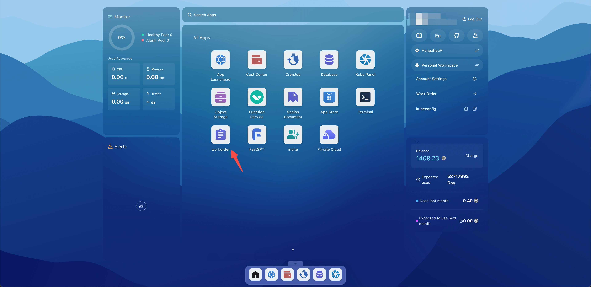
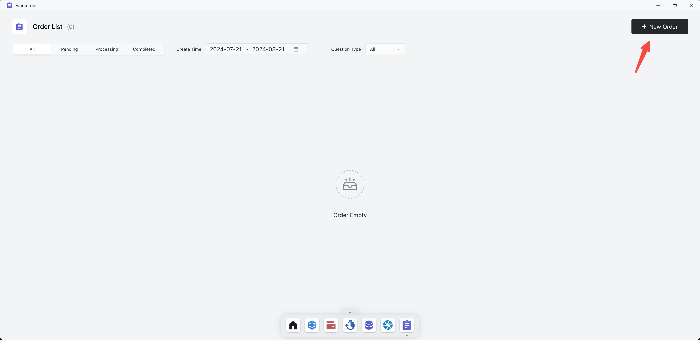
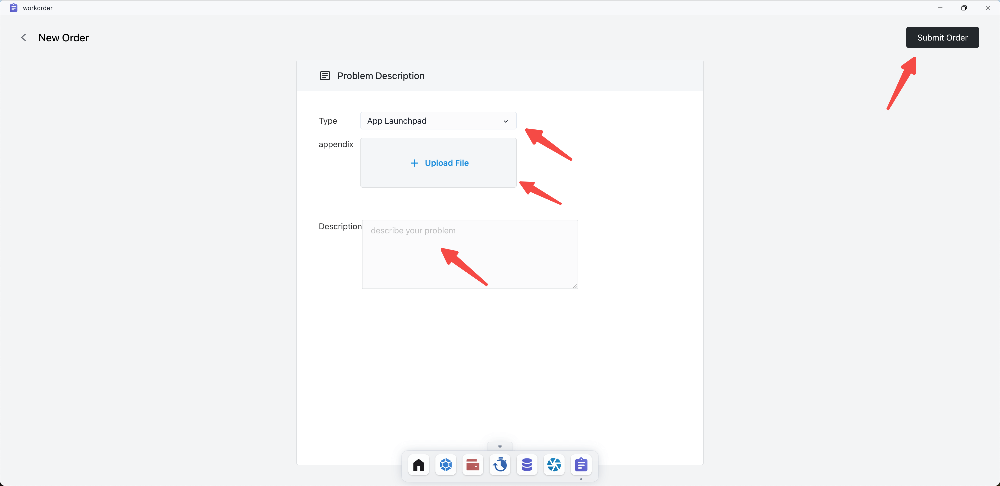
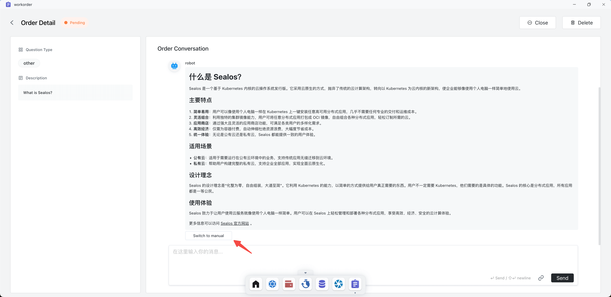
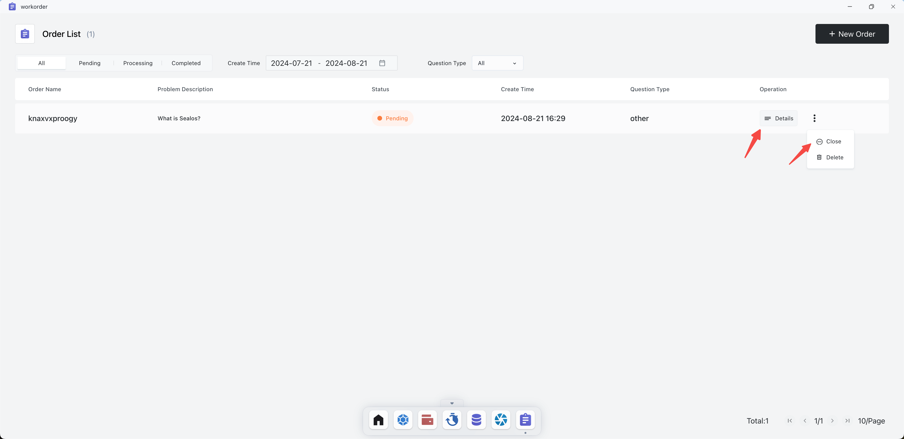

# Work Order

If you encounter any issues while using Sealos, you can use the Work Order to submit your questions and feedback. We
will address them as soon as possible.

## Quick Start

Open the Sealos desktop and click on Work Order.

Click on New Order.

Select the type of issue, upload relevant appendix, describe the details of the issue, and then click Submit Order.

After submitting the order, a 🤖 chatbot will respond to your queries. If you find that the chatbot’s response does not
resolve the issue, you can click Switch to Manual to connect with a human agent.

Click on the Order details to re-enter the chat interface. If the issue is resolved, you can click Close to close the
order.

