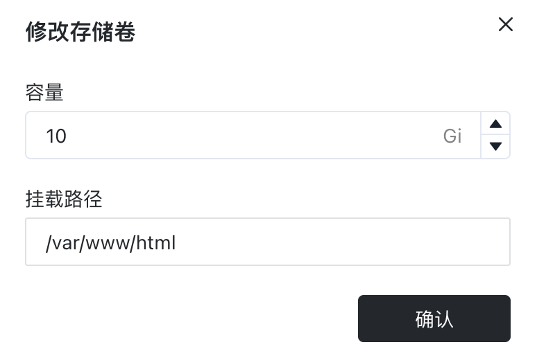

# 持久化存储

在 [Sealos](https://cloud.sealos.io)
中，容器可以轻松地被创建和销毁。虽然这为部署和管理应用带来了灵活性，但它也带来了数据持久性的挑战。如果应用在容器内部存储数据，那么当容器被销毁时，所有存储在容器内的数据也会丢失。

持久化存储可以确保数据存储在容器外部，即使在容器重启或重新部署的情况下也能保证数据不会丢失。**如果你的应用需要保留数据（例如数据库、文件存储系统或任何存储用户数据的服务），一定要使用持久化存储！**

假设你要部署一个 Nextcloud，Nextcloud 容器的所有数据都存储在 `/var/www/html` 这个目录下，因此我们需要将该目录下的数据通过外挂存储进行持久化。

