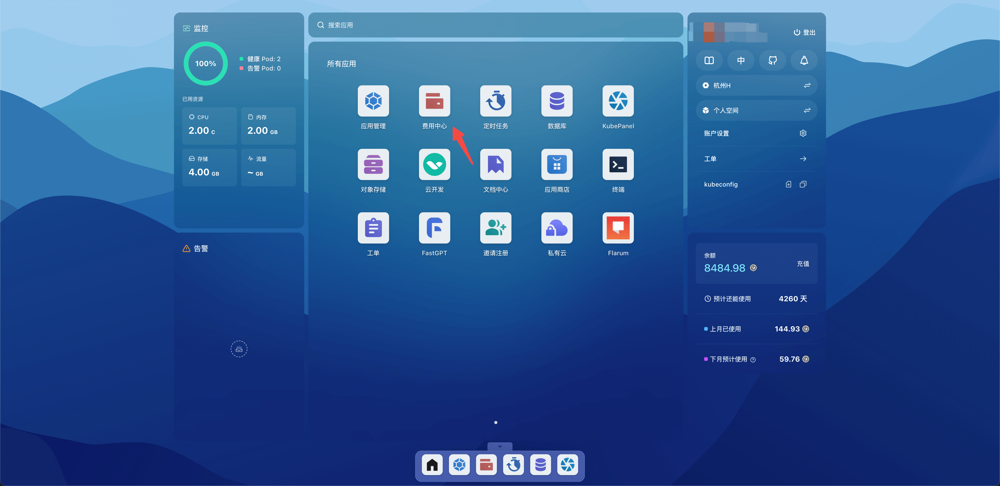
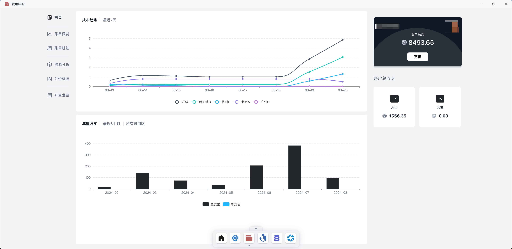
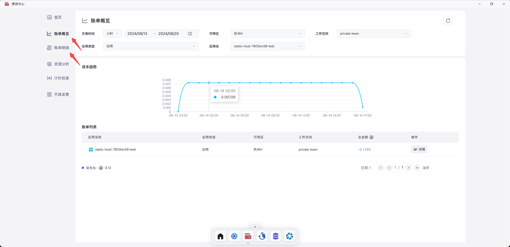
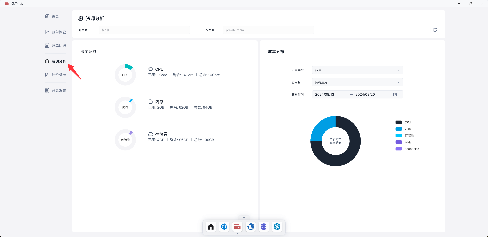
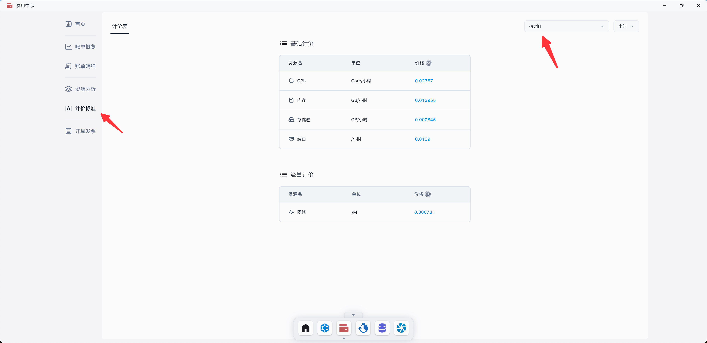
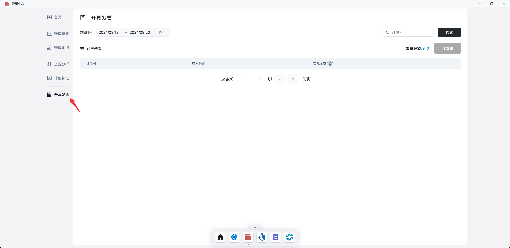

# 费用中心

费用中心包含五个模块：账单概览、账单明细、资源分析、计价标准和开具发票。

账单概览和账单明细展示账户的总体收支情况和各应用的支出，资源分析显示各资源的支出占比，计价标准解释定价信息，而开具发票模块则支持为充值生成发票。

## 快速开始

打开 Sealos 桌面，点击费用中心。

### 首页

展示了所有可用区的成本趋势图和年度收支图。

### 账单概览和账单明细

支持快速查找账单，并支持通过设置时间范围、可用区、工作空间、应用类型和应用名称来筛选。

### 资源分析

展示了资源配额和成本分布图，并支持通过设置时间范围、可用区、工作空间、应用类型和应用名称来筛选。

### 计价标准

展示了资源定价，并支持通过设置可用区进行筛选。

### 开具发票

支持为充值订单申请开具发票。

