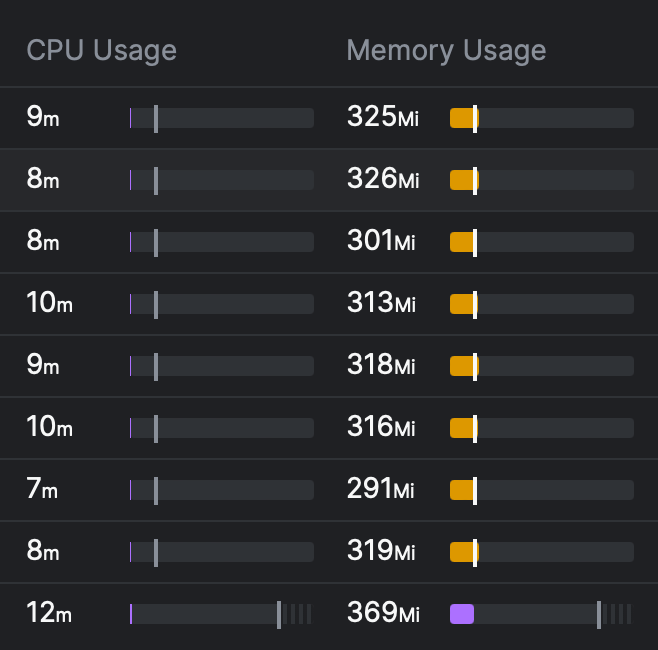
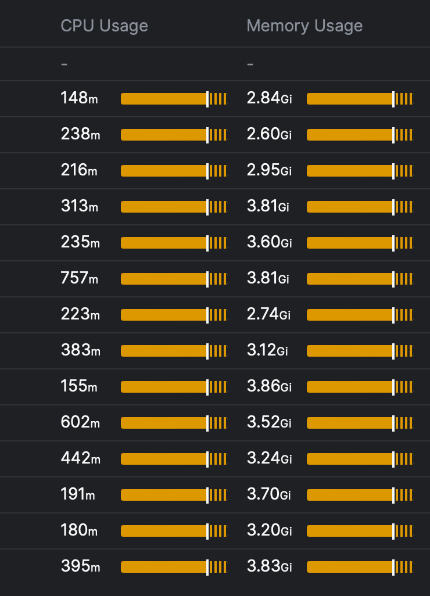
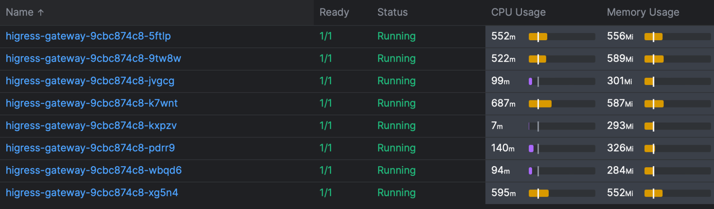

[Sealos](https://sealos.io) Cloud has stretched the capabilities of nearly all the leading open-source gateways to their limits. This article aims to serve as a practical guide, helping to navigate common challenges and offering advice for choosing the right gateway.

<!--truncate-->

## Complex Challenges in Sealos Cloud

Ever since the launch of [Sealos Cloud](https://cloud.sealos.io), the platform has seen a meteoric rise in user numbers, currently standing at **87,000 registered users**. Each of these users creates applications, and each application demands its individual access point, leading to an extraordinarily large number of routing entries across the entire cluster. **This necessitates support for ingress capabilities on the scale of hundreds of thousands.**

Furthermore, offering shared cluster services on the public internet places stringent demands on multi-tenancy. It's crucial that user routes are completely isolated from one another to ensure optimal route integrity, demanding high-quality isolation and sophisticated traffic control measures.

The exposure to potential cyber threats is extensive in public clouds. Hackers not only target applications running on the cloud but also aim at the platform's outbound network infrastructure, thereby intensifying the security challenges.

The demands on controller performance and stability are substantial. Many controllers, when faced with an increasing number of routing entries, consume extensive resources, which can sometimes lead to Out of Memory (OOM) issues, ultimately causing gateway failures.

## Nginx Ingress

Our initial choice was Nginx Ingress, but we eventually faced several critical issues that proved to be deal-breakers:

* **Reload dilemma**: Every ingress modification results in brief disconnections. In a cluster bustling with users, the high frequency of ingress adjustments leads to consistent network instability.
* **Unreliable long connections**: Due to the dynamic nature of adjustments, long-term connections are prone to frequent disruptions.
* **Suboptimal performance:** The gateway's responsiveness is sluggish, and it's relatively resource-hungry.

These significant concerns have led us to move away from gateways rooted in Nginx architecture. Our empirical testing revealed that Envoy-based gateways significantly outperform others, showing minimal performance overhead in both the control and data planes.

Here's a glimpse of Envoy's performance:



In contrast, here's what we observed with Nginx's performance:



The disparity is pronounced, leading us to decisively set aside options based on Nginx and fully embrace the robust capabilities of Envoy.

## APISIX

[APISIX](https://github.com/apache/apisix) is a commendable project, particularly in addressing Nginx reload issues. At [Laf](https://github.com/labring/laf), we initially embraced APISIX. However, we encountered instability with its Ingress Controller, leading to frequent major disruptions and controller OOM issues. Despite our preference for APISIX, these persistent issues necessitated a switch to an alternative gateway. The APISIX community is actively working on these challenges, and we look forward to its continued improvement.

In summary, while APISIX demonstrates excellent stability, its controller still requires significant optimization and stability enhancements. The community provides robust support, but **due to our immediate operational challenges, we had to transition to a different gateway solution.**

## Cilium Gateway

Having switched our [CNI](https://sealos.io/docs/self-hosting/lifecycle-management/quick-start/deploy-kubernetes#install-kubernetes-cluster) to Cilium early on, we recognized its potential and contemplated using the Cilium Gateway. However, reality presented its challenges.

[Cilium Gateway](https://cilium.io/use-cases/gateway-api/) exclusively supports LB mode, creating a dependency on cloud provider LBs. Given our need for private deployment scenarios, this dependence was undesirable. In terms of stability, the Ingress activation delay in scenarios with numerous routes was significantly prolonged, taking minutes instead of the preferable 5 seconds. **Therefore, we concluded that it's necessary to wait for further development in this aspect.**

## Envoy Gateway

In the realm of Kubernetes (K8s) standards, there is a noticeable shift from the traditional Ingress to the Gateway standard. Our foundational preference for Envoy leads us to consider the implementation of the [Envoy Gateway](https://github.com/envoyproxy/gateway) as a promising option. Our exploration of the Envoy Gateway revealed that it is still in a preliminary phase, plagued by several instability issues like memory overflows, path policies not being effective, and certain functionalities not working in the merge gateway mode. We are actively engaged in resolving these issues and are contributing to the upstream community with constructive feedback and improvements. Our aim is to nurture the Envoy Gateway to a level where it becomes fully viable for production environments.

## The High-Prestige but Less Practical Gateway Standard

The Gateway standard finds itself in a tricky situation. It appears the designers may not have thoroughly explored multi-tenant environments in practice. When a cluster is shared among multiple tenants, it is crucial to clearly define and separate the rights and responsibilities of administrators and users. Gateway's initial design overlooked this aspect. For instance:

```yaml
apiVersion: gateway.networking.k8s.io/v1
kind: Gateway
metadata:
  name: eg
spec:
  gatewayClassName: eg
  listeners:
  - name: http
    port: 80
    protocol: HTTP
    # hostname: "*.example.com"
  - name: https
    port: 443
    protocol: HTTPS
    # hostname: "*.example.com"
    tls:
      mode: Terminate
      certificateRefs:
      - kind: Secret
        name: example-com
```

Settings like listening ports should ideally be managed by cluster administrators rather than ordinary users. On the other hand, configuring TLS certificates should be more user-centric, although administrators might still need some control. However, in this setup, the delineation of permissions is unclear. Consequently, users are also given the ability to configure the Gateway, leading to the necessity for intricate permission control in the controller, such as managing port whitelists and detecting conflicts.

A more sophisticated design approach might involve relocating tenant-level fields to HTTPRoute or establishing a separate CRD, thereby clarifying the distinction between regular users and super administrators. The current approach is functional, but it tends to be somewhat muddled and less efficient.

## Higress: The Clear Winner

Beyond the key projects we focused on, numerous others were evaluated but are not listed here. Ultimately, Sealos chose [Higress](https://github.com/alibaba/higress) for its gateway needs.

Our criteria for gateway selection were straightforward: we sought a solution that was not only functionally adequate but also highly stable. Higress emerged as our choice, essentially by process of elimination.

**Stability was our primary concern. Among the contenders, Higress was the only one meeting our production standards**, although some challenges arose. Thankfully, the proactive Higress community swiftly resolved these issues. Notable challenges included:

1. **Ingress Activation Speed** – Initially, it took over two minutes for new routes to activate when dealing with many entries. This was optimized by the community to about 3 seconds, a remarkable improvement that eliminated the need for further optimization, as it now outpaces the container Ready time. Higress's use of an incremental configuration loading approach ensures exceptional performance, even with a high volume of routing entries.
2. **Controller OOM** – Previously, the controller faced memory issues due to high resource consumption without dynamic loading. These issues have been effectively addressed.
3. **Timeout Issues** – In one of our primary clusters, we encountered sporadic request timeouts related to the onDemandRDS configuration. We've temporarily disabled this feature and are investigating further. This problem was not present in our other clusters.

From a security standpoint, many issues we faced were linked to performance bottlenecks, such as traffic surges overwhelming the gateway. This underscores the vital importance of gateway performance. In our tests, Envoy demonstrated remarkable robustness, and the design of the controller proved to be a critical factor in operational success. Higress has shown exceptional performance in this regard:




Given our extensive routing and high-volume traffic, Higress stands out for its remarkably low resource demand.

Higress also boasts compatibility with Nginx Ingress syntax, mainly in annotations. Our prior reliance on Ingress meant there was almost no need for code migration, allowing for a swift upgrade process within minutes.

To further encourage community development, we also have recommendations for Higress:

* Enhanced support for the Gateway standard is needed. Although it already supports the v1 version, it lacks full compatibility with the features available on Ingress.
* We suggest the introduction of more sophisticated functionalities, especially in areas like security and circuit breaking. We are open to paying for these features, but as our platform evolves, stronger functionalities become necessary.
* We advise developing additional peripheral features through a plugin mechanism, aiming to make the core features more cohesive, simpler, and more reliable.

## Summary

Gateways are a fundamental component for cloud services and applications. As our scale grows, we face an array of new challenges. Our aim is to build strong collaborations with the broader community, enhancing the development of open-source gateways and benefiting a larger pool of developers.

The gateways mentioned are all of high quality. Sealos not utilizing them is not a commentary on their effectiveness but a reflection of our unique and stringent scenarios. Gateways that support multi-tenancy in public internet environments are few. Therefore, it's crucial for decision-makers to consider their specific scenarios. Our choices should serve as a guideline, and Sealos is dedicated to maintaining an open approach in monitoring the evolution of various gateways.

We are immensely grateful to the Higress open-source community for their substantial support and to the Alibaba Cloud Native Team for contributing such a valuable project to the community.
