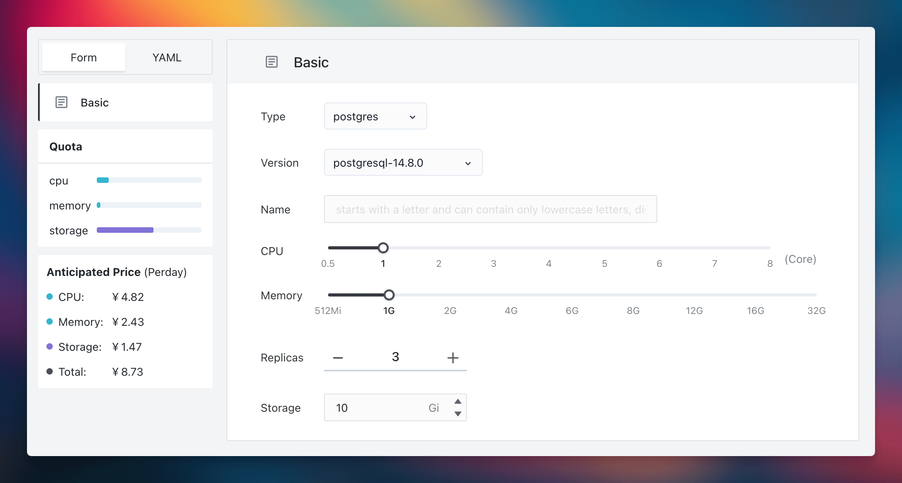

Yesterday, an insightful article by Mr. Feng explored [the drawbacks of deploying databases in K8S](https://mp.weixin.qq.com/s/4a8Qy4O80xqsnytC4l9lRg).

Debating the merits of containerized databases might have been relevant four years ago, but in 2023, it's crucial to understand the broader acceptance of this technology.

<!--truncate-->

I began working with K8s from its 0.9 version. Initially, with the CSI still in its nascent stage, true stability wasn't achieved until version 1.0. During my time at iFLYTEK, I played a key role in developing and maintaining a comprehensive system that was integral to the company's internal PaaS services.

We set up a cluster with 30 physical machines, deceptively small yet technologically advanced, running around 3000 applications of varied types including microservices, databases, message queues, and caches. **This cluster, utilized by hundreds of our developers, was maintained with less than half a person's effort, illustrating the efficiency brought by K8s.**

Additionally, we managed to upgrade the Linux kernel seamlessly, a task unimaginable without the support of K8s. Normally, coordinating such an upgrade could take as long as six months.

I've also seen a cluster hosting 400 databases, which required 400 servers and a 40-person team, yet operated at less than 10% efficiency. This cluster, a victim of excessive manual maintenance, reflects a common challenge many teams encounter in managing and optimizing their infrastructure efficiently.

Upon joining Alibaba, I observed that all databases for delivery purposes were operated on K8s. For over five years now, we've been running databases in containers flawlessly, with no incidents.

## Democratizing Database Expertise on K8s

In the business sector, companies often confront two primary challenges with database management: either their management skills are not robust enough to maximize database potential, or they face significant expenditures in managing their databases. The concept of "[Database on K8s](https://sealos.io/docs/guides/dbprovider/)" introduces a standardization that addresses these issues. Such standardization facilitates collaboration and alters the dynamics of productivity and production relationships, leading to a substantial increase in efficiency. This approach empowers teams, even those lacking in specialized skills, to leverage professional capabilities. This is analogous to the distinct roles in agriculture and animal husbandry, where focus in their respective domains enhances overall efficiency and output.

The KubeBlocks team is a prime example of this. Their expertise and accumulation of knowledge in database management are likely superior to that of most companies. They have transformed their experiential knowledge into code, crafting controllers that enable other businesses to operate in an exceptionally streamlined manner. K8s plays a crucial role in making this feasible.

One common query is: Why not opt for Ansible? Operational staff often favor Ansible due to its compatibility with their tools. However, Ansible is primarily focused on deployment and operational tasks. K8s controllers, on the other hand, are built on the principle that **tasks achievable by machines should not be manually performed by humans**. They facilitate **a constant, 24-hour synchronization between desired and actual states**, a challenging task with Ansible. Would Ansible be the choice for setting up a routine task?

This mirrors the era before operating systems when programmers manually punched holes in paper tapes to execute programs. Running programs on paper tapes or CDs was possible, but it begged the question of the necessity of operating systems.

The underlying principle is the same: Ansible is a valuable tool for operational staff, but K8s's objective is to do away with lower-level operational work (such as writing and executing Ansible scripts). K8s enables more efficient and automated database management, granting teams without extensive database management expertise access to high-level services.

## The Benefits of Running Databases on Kubernetes

Most concerns around database-on-Kubernetes boil down to:  

**How stable is it?**

**Can I effectively troubleshoot issues?**  

**Does performance suffice?**  

### Complexity  

Complexity for databases on Kubernetes involves two key aspects: 

1. Build complexity   
2. Usage complexity  

**First: Build Complexity**  

Building a production-grade database platform directly atop native Kubernetes proves costly, unfriendly for beginners lacking depth of expertise. You'd need to create multiple critical components yourself - Kubernetes storage drivers, database controllers, etc. Hands-on expertise makes this possible, but proves challenging.  

Hence the appeal of distributions, much like CentOS, Ubuntu, etc. for Linux instead of direct kernel wrangling. Consider Kubernetes the "cloud kernel." Using the raw kernel sans customization leaves an insufficiently robust, user-friendly experience. The kernel merely provides a framework; users must architect and integrate many optimizations themselves. Kubernetes distributions help solve this. For instance, [Sealos delivers](https://sealos.io/docs/self-hosting/lifecycle-management/quick-start/deploy-kubernetes/) **full systems including highly available clusters, finely-tuned storage, and optimized databases in one click**. Two simple commands:  

```bash
$ sealos run labring/kubernetes:v1.27.7 labring/helm:v3.9.4 labring/cilium:v1.13.4 \
--masters 192.168.64.2,192.168.64.22,192.168.64.20 \ 
--nodes 192.168.64.21,192.168.64.19 -p [your-ssh-passwd]  

$ sealos run labring/openebs:v3.9.0 labring/mysql:8.0
```  

Done. The complete system with HA cluster, finely-tuned storage, and optimized databases emerges in minutes. While Ansible aids installs, **it cannot handle critical runtime needs like self-healing and multi-tenancy** - key advantages Kubernetes provides for databases-as-a-service.  

**Second: Usage Complexity**   

Leveraging cloud operating system distributions and controllers, users can deploy standardized database services, moving away from script-based solutions.

  

This interface is designed for universal ease of use. Even beginners can manage to establish a three-replica PostgreSQL cluster, incorporating backup, recovery, and monitoring functions. This capability democratizes access for all developers within an organization and **underscores the fundamental divergence between 'cloud computing thinking' and 'script-based thinking'. Cloud computing democratizes service provision (as a Service), in contrast to the traditional script-based methods which serve more as operational conveniences.**

### Stability

Our team, despite not specializing in database technology, has successfully established a highly stable database system. This demonstrates the potential of what dedicated experts in the field can accomplish. For users, this means that database stability concerns can be confidently entrusted to seasoned professionals.

Consider the [Sealos Public Cloud](https://cloud.sealos.io) as an example. It currently supports thousands of applications with fully containerized databases, all under the maintenance of the KubeBlocks team. Any arising database issues are efficiently handled by them. From a cost-benefit perspective, utilizing KubeBlocks' commercial services is more economical than employing a full-time database administrator. Furthermore, as Sealos architects, we ensure that database users face minimal operational concerns. Our stability standards exceed those of many non-specialist teams.

Additionally, database lifecycle management involves specific tasks, and over time, stability issues are progressively resolved. These improvements, often made at the code level, incrementally reduce end-user concerns. This parallels the enhanced stability of the Linux system, achieved through ongoing technological development and optimization. **A well-designed software architecture not only improves but also consolidates its robustness, reducing dependence on human oversight. An illustrative comparison is that Oracle users might find themselves enjoying more leisure time than those using open-source MySQL.**

Hence, both empirical evidence and theoretical considerations suggest that stability should not pose a hurdle for running databases on K8s. **Choosing K8s for database management effectively means leveraging the pooled expertise of numerous preeminent database experts. Their extensive knowledge and skill, embedded in the code, provide standardized, high-quality services to users. Such depth and efficiency of expertise are challenging to replicate with basic scripting alone.**

### Performance

It's a common belief that databases in containers underperform, but this is usually due to a lack of proper handling. The KubeBlocks team's in-depth testing and optimization, detailed in their analysis, show that these complexities are not for users to worry about. **The intricacies are already incorporated into the controller's code, making the process user-friendly**. In fact, the effect of containers on database performance is minor, with disk I/O and network bandwidth latency being the real influential factors.

The OpenEBS raw disk plus database controller solution addresses these performance issues effectively. By employing a database controller, dependency on distributed storage is removed. This controller ensures both high performance and availability for database replicas, irrespective of the service type, and is seamless for the user. In case of a failure, it automatically makes adjustments, offering a superior database user experience.

[Sealos](https://sealos.io) is a prime example of this solution in action, achieving high availability without compromising performance. It interacts directly with raw disks, facilitating automatic scaling, backup, and recovery. In the event of a node failure, the controller swiftly launches a new node, synchronizes the data, and integrates it into the cluster. These advanced capabilities, beyond the reach of traditional scripting methods that often require manual intervention, showcase the superiority of cloud operating systems.

Thus, **running databases on K8s not only avoids performance issues but also offers stability that often surpasses the capabilities of many IT operations teams**. This approach is user-friendly and straightforward, with self-service functionalities. Would this be an option you'd consider?


## Do not deny or affirm without considering practical scenarios

In considering whether to containerize databases, we must take into account diverse real-world applications.

For some companies with stable non-containerized databases and sufficient funds for database experts, there's little motivation to migrate to Kubernetes (K8s). Why risk migration issues? For example, banks often rely on specialized Oracle machines with straightforward subscription models, providing little impetus for change.

Conversely, many business development teams and organizations now face a compelling choice: **to access sophisticated database capabilities at a minimal cost, thereby focusing their primary efforts on business development.**

They might choose cloud database services like RDS (Relational Database Service) or Kubernetes (K8s) based database solutions. This method requires an ongoing management process, replacing manual roles and equipping teams with limited database knowledge. This represents a significant trend, where upfront costs (like developing controllers) increase, but the incremental costs for each team utilizing the database substantially decrease.

There are various approaches to achieve this, such as virtual machines or Ansible, but Kubernetes-based controllers stand out as the superior solution. Even for services offering RDS-like functionalities, the Kubernetes tech stack emerges as the optimal choice. Virtual machines, being more cumbersome and costly, incur greater performance overheads. And for tools like Ansible to achieve self-service and multi-tenancy seems overly optimistic.

## Summary

### Kubernetes' Unique Strategic Significance

Kubernetes brings tremendous force multiplication, like mastering lifelong martial arts training. Without Kubernetes, you might exert 10% of a database's true potential. Used skillfully, Kubernetes massively amplifies operational database efficiency, savings, and resilience.

### Technological Progress Reshapes Work Patterns

As technology advances, specialized database users and caretakers decouple. Manual upkeep yields to intelligent automation. Amidst this shift, standardization enables effective collaboration at global scale. No stronger de facto standard for cloud-native automation exists now than containers and Kubernetes, so database adoption seems inevitable.

### Practical Proof Points  

Globally, many teams have successfully run databases on Kubernetes in production across critical dimensions like cost, usability, stability, performance, and more - with remarkable measurable results. Once accustomed to Kubernetes' advantages, tough to justify reverting to old-school manual operations. For instance, Sealos' architecture evolved from Ansible (v2) to Golang (v3) - now at [v4 and v5](https://github.com/labring/sealos). This exemplifies "cloud native thinking", not legacy "ops script thinking" tied to specific individuals. If a solution lacks even basic APIs, how can we discuss advanced scalability and productivity? Systems should consider machine consumers first, then human ones - this unlocks true automation leverage. Hence, API > CLI > GUI.

### Operations Roles Transform  

Many legacy DBAs naturally feel inclined to spread Kubernetes database FUD, protecting their niche skillsets. But enlightened technology leadership will consistently discover immense TCO and productivity gains from thoughtful, staged standardization - we've erased entire 40-person ops teams when strategically migrating systems to Kubernetes without layoffs. Without question, many ops engineers justifiably feel their roles threatened amidst displacement by increasingly automated toolchains. But technologies only accelerate; they cannot unwind. Leaders must shepherd transitions.

### Kubernetes Maturity and Ecosystem Growth

Kubernetes rapidly matures while its ecosystem explodes with new solutions. Inevitable chaos results as practices and culture race to catch adoption. But time cures challenges - take heart knowing robust distributions have repeatedly emerged across domains like Linux. These tame entropy and ease adoption by curating “batteries-included” solutions optimized for regular challenges. Sealos leads here as a purpose-built Kubernetes cloud-native OS distribution for standardizing database (and other) operational burdens. Recently, across 200+ Sealos users, literally none reported fundamental database operational struggles. A few cited early instability, but root causes like resource misconfigurations got systematically addressed - now they report Kubernetes-automated databases proving >9 times more stable than DIY trial-and-error.

### The Enterprise Strategic Choice  

Actual organizational needs should determine if and how organizations adopt Kubernetes databases-as-a-service. But the intelligent path brings tremendous advantages: solutions like Sealos + KubeBlocks equate to:  

1. 8+ years of specialized Kubernetes platform expertise
2. A top-tier database team including multiple senior engineers
3. Extreme usability, resilience, and performance  

...all for less than the cost of staffing database specialists internally. Internal political hesitations naturally arise amid shifts. But pragmatic facts speak volumes about the optimal way forward.

### Final Thoughts  

Rather than rebutting each counterargument exhaustively, I'll leave readers to independently judge the landscape and merits based on results. Please share your perspectives so together we uncover greater collective truth. The future looks abundantly bright for Kubernetes' democratization of reliability and scale across critical domains like databases.