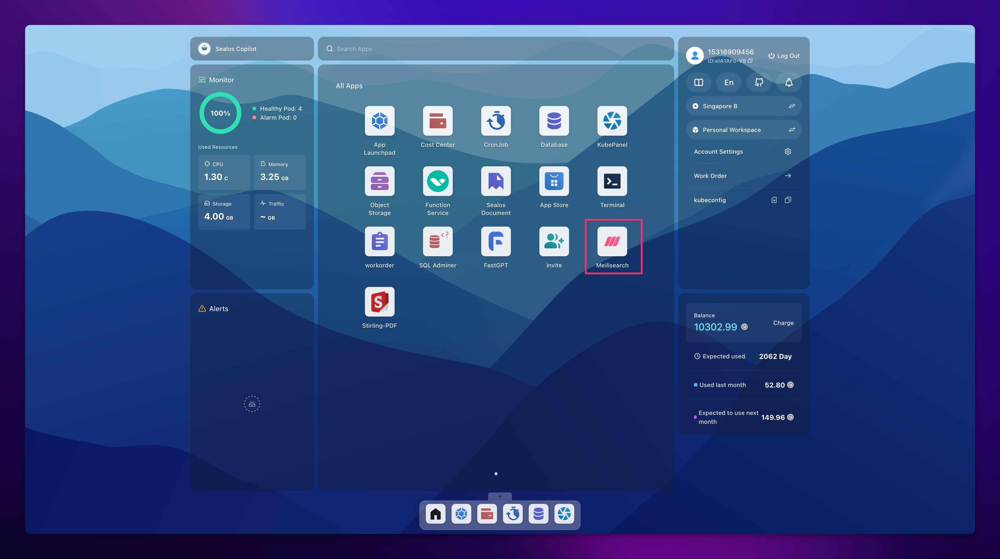
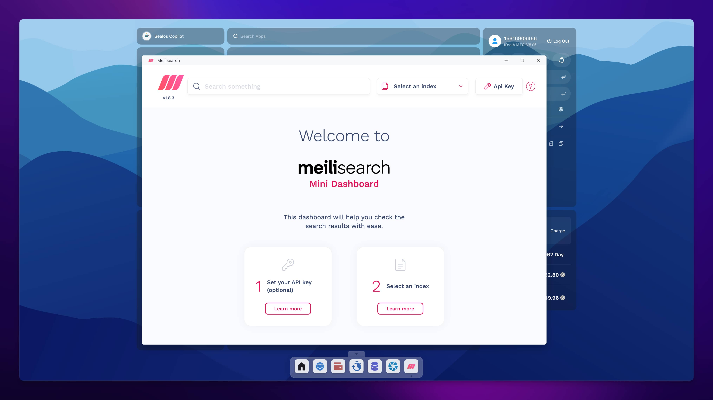
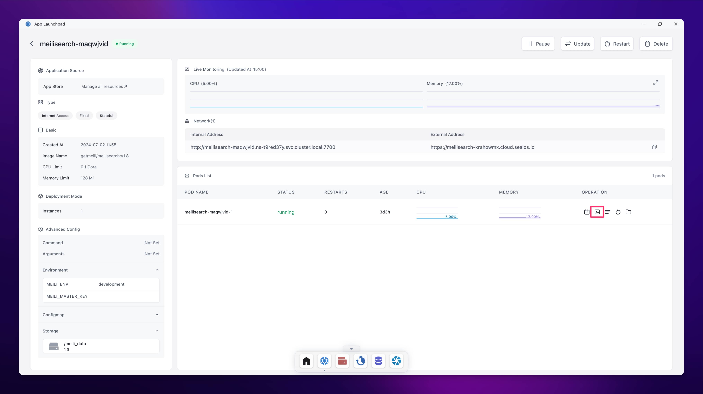
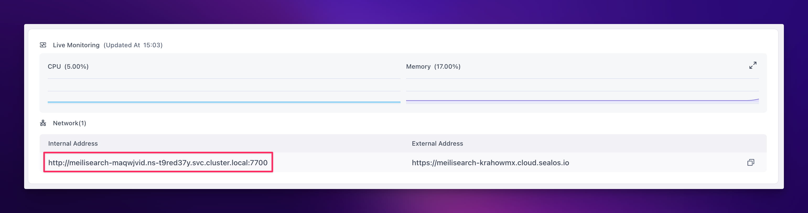

## Introduction

In today's digital world, search functionality is a real game-changer. It's the backbone of virtually every application, making our lives easier and more efficient. From e-commerce platforms to content management systems and corporate knowledge bases, users want to find information quickly and accurately. However, traditional search solutions often fall short, struggling with slow response times, irrelevant results, poor scalability, and lack of flexibility. These issues don't just frustrate users – they can drive them away, ultimately putting a dent in business growth.

We're so excited to introduce you to [Meilisearch](https://www.meilisearch.com/), an amazing open-source search engine that's here to shake things up! Meilisearch is a fresh newcomer to the search engine scene, and it's already making waves with its easy-to-use deployment, lightning-fast queries, and feature-rich toolkit. Just imagine this: with just one simple command, you can have a Meilisearch server up and running, ready to tackle queries. It's not just powerful; it's also super user-friendly! It's got all these amazing features like fuzzy matching and schema-less indexing, plus a sleek web interface for you to play around with.

<!--truncate-->

In this guide, we're going to take a deep dive into Meilisearch's world. Here's what we'll cover: 

+ the nitty-gritty of Meilisearch's standout features and why they matter.
+ setting up Meilisearch on your system step by step.
+ Meilisearch 101: Essential techniques to get you started.
+ Real-world application: Integrating Meilisearch into a Flarum forum (because theory is great, but practice makes perfect).
+ How Meilisearch stacks up against the competition in the search engine arena.

## Prerequisites

Before we get started, we just wanted to make sure you've got these bases covered:

- You're comfortable navigating the command line 
- You've got a grasp on RESTful API concepts 
- Bonus points: A [Sealos](https://sealos.io) account for lightning-fast Meilisearch deployment (optional, but handy) 
- Ready to revolutionize your search experience? Let's get started with Meilisearch!

## Introduction to Meilisearch

[Meilisearch](https://github.com/meilisearch/meilisearch) is a game-changing open-source search engine, it is powered by [Rust](https://www.rust-lang.org/) and offers lightning-fast full-text search capabilities while being incredibly user-friendly and easy to integrate. Meilisearch is built on four key principles that set it apart:

1. **Blazing Speed**: It delivers results in under 50 milliseconds, no matter how large your dataset is.
2. **Spot-On Relevance**: It uses smart algorithms to ensure the most relevant results always come first.
3. **Developer's Dream**: It features intuitive APIs and clear documentation, making integration a breeze.
4. **Tailor-Made Searches**: It offers a wide range of customization options to fine-tune your search experience.

Since its launch in 2018, Meilisearch has been on a roll! It's been a real rising star in the open-source community. Thanks to its user-friendly features and exceptional performance, it has already garnered an impressive 40,000+ stars on GitHub.


## ## Core Features of Meilisearch

Meilisearch offers a robust set of search capabilities, making it an ideal choice for projects ranging from personal websites to large-scale enterprise applications. Here's what sets it apart:

### Lightning-Fast Performance

- **Blazing Speed**: It delivers results in under 50 ms, no matter how much data you're working with.
- **Instant Feedback**: It even implements search-as-you-type for real-time responsiveness!
- **Typo-Tolerant**: It intelligently handles misspellings, ensuring relevant results despite query errors.

### Advanced Relevance Features

- **Custom Ranking**: Tailor result prioritization to your specific needs.
- **Faceted Search**: Enable intuitive filtering and navigation through multi-dimensional data.
- **Synonym Recognition**: Enhance search flexibility by setting up synonyms.

### Comprehensive Language Support

- **Global Readiness**: Optimized for a wide array of languages, including complex scripts like Chinese and Japanese.
- **Smart Filtering**: Customizable stop word lists to improve result quality across all supported languages.

### Powerful Advanced Features

- **Geo-aware Search**: Incorporate location-based searching and sorting.
- **Secure Multi-tenancy**: Implement robust data segregation with tenant tokens.
- **Result Highlighting**: Emphasize matching text in search outputs.
- **Flexible Document Management**: Easily add, update, or remove documents within your index.

### Developer-Friendly Ecosystem

- **Intuitive API**: Offers a RESTful interface for seamless integration.
- **Multilingual SDKs**: Official support across various programming languages.
- **Comprehensive Documentation**: Access detailed guides and practical examples.
- **Self-Hosting Option**: Deploy on your own infrastructure for complete control.

## Meilisearch vs. Other Search Solutions

Let's take a closer look at Meilisearch and see how it compares to other leading search solutions!

| Feature          | Meilisearch    | Elasticsearch                              | Algolia   |
| ---------------- | -------------- | ------------------------------------------ | --------- |
| Response time    | Lightning-fast (<50ms) | Varies, often >100ms               | Swift (<100ms) |
| Ease of use      | Highly intuitive | Moderate learning curve                  | User-friendly |
| Typo correction  | Built-in       | Configurable                               | Built-in  |
| Multilingual support | Excellent   | Proficient                                | Excellent |
| Geospatial search | Supported     | Supported                                  | Supported |
| Open-source      | Fully open     | Partially (some proprietary features)      | Proprietary |
| Pricing          | Free (self-hosted) | Free (self-hosted), paid cloud options | Paid SaaS |

While Elasticsearch has a ton of great features and a strong ecosystem, Algolia is all about cloud services and out-of-the-box functionality. But what really sets Meilisearch apart is its speed, simplicity, and open-source commitment. If you're a small to medium-sized project or team looking for the best of both worlds—performance and accessibility—Meilisearch is the perfect fit!

## Installation and Configuration of Meilisearch

Setting up Meilisearch is a piece of cake! With a smorgasbord of installation options to fit your needs like a glove, it couldn't be easier.

One of Meilisearch's standout features is its seamless integration with Docker, making deployment and scalability a breeze. The official Meilisearch Docker image allows you to get a Meilisearch instance up and running with just a single command:

```bash
$ docker run -p 7700:7700 getmeili/meilisearch:latest
```

This Docker-based approach ensures consistent environments across development, testing, and production, significantly simplifying the deployment process.

Not a tech wizard? No problem! The [Sealos app store](https://sealos.io/docs/guides/templates/) has got your back with one-click deployment templates. It's as easy as pie - just point, click, and you're off to the races!

**Do you Want to get Meilisearch up and running in a jiffy without getting lost in the weeds of complex setup?** Sealos might be your golden ticket.

First things first, head over to the [Meilisearch template page](https://template.cloud.sealos.io/deploy?templateName=meilisearch) and hit the "Deploy on sealos" button in the top right corner.

> New to the [Sealos](https://sealos.io/) scene? No biggie - just sign up for a Sealos cloud account, log in, and you'll be on your way to the deployment page in no time.

Now, listen up! There are just two settings you need to get right to keep your Meilisearch instance running like a well-oiled machine:

1. **MEILI_ENV**: This bad boy sets the mood for your instance - either **production** or **development**.

   Production mode:
   - Search preview? Nope, it's all business.

   Development mode:
   - Search preview's on tap - perfect for tinkering to your heart's content.

2. **MEILI_MASTER_KEY**: Think of this as your Meilisearch's VIP pass. It locks down everything except `GET /health`. Want in? You'll need to flash those API keys.

   Production mode:
   - A master key is non-negotiable. No ifs, ands, or buts.
   - Try to skimp on the key (less than 16 bytes), and Meilisearch will throw a tantrum and refuse to play ball.

   Development mode:
   - Master key? Take it or leave it.
   - No key? It's the Wild West - everything's up for grabs.

Here's the lowdown: If you don't bring your own key to the party or if it's not up to snuff, Meilisearch will try to hook you up with an auto-generated one.

Long story short: **In production, a master key is your ride-or-die. In development? It's dealer's choice.**

Whipping up a key is a walk in the park. Just punch this into your Linux or macOS terminal:

```bash
openssl rand -base64 48
```

Once you've done that, just hit the "Deploy Application" button and let the magic happen.

Once everything is all said and done, just head on over to the app details page and hang tight until you see "running." Then, just give that external address a click, and you'll be in Meilisearch search preview heaven in no time!

All you have to do is enter your master key, and you're all set!

Here's a little pro tip for you: just give your Sealos desktop (that's the [cloud.sealos.io](https://cloud.sealos.io) page) a quick refresh, and you'll see a shiny new icon! 



Just one click, and you'll be right there with the Meilisearch preview!



Does this feel a little familiar? It's got that Windows shortcut vibe going on, doesn't it? It just goes to show that Sealos can do all the same tricks as your trusty old desktop OS, but with its head in the clouds!

## Basic Usage of Meilisearch

Meilisearch offers a user-friendly RESTful API that seamlessly integrates with various programming languages and frameworks. Here's a quick guide to essential operations:

### 1. Creating an Index

Start by setting up a search index for your data:

```bash
$ curl \
  -X POST 'http://localhost:7700/indexes' \
  -H 'Content-Type: application/json' \
  -H 'Authorization: Bearer YOUR_API_KEY' \
  --data-binary '{
    "uid": "movies",
    "primaryKey": "id"
  }'
```

### 2. Adding Documents

Next, populate your index with some data:

```bash
$ curl \
  -X POST 'http://localhost:7700/indexes/movies/documents' \
  -H 'Content-Type: application/json' \
  -H 'Authorization: Bearer YOUR_API_KEY' \
  --data-binary '[
    {
      "id": 1,
      "title": "Carol",
      "genres": ["Romance", "Drama"]
    },
    {
      "id": 2,
      "title": "Wonder Woman",
      "genres": ["Action", "Adventure"]
    }
  ]'
```

### 3. Performing a Search

Finally, execute a search query on your indexed documents:

```bash
$ curl \
  -X POST 'http://localhost:7700/indexes/movies/search' \
  -H 'Content-Type: application/json' \
  -H 'Authorization: Bearer YOUR_API_KEY' \
  --data-binary '{
    "q": "wonder"
  }'
```

## Integrating Meilisearch into Flarum Forum

This guide walks you through integrating Meilisearch into your [Flarum](https://template.cloud.sealos.io/deploy?templateName=flarum) forum, giving your users a turbo-charged search experience.

### 1. Install Meilisearch SDK

Fire up the terminal from your Flarum app's details page and run. In the Flarum application details interface, click the terminal button in the bottom right corner:



Execute the following command in the opened terminal to install the Meilisearch SDK:

```bash
extension require meilisearch/meilisearch-php
```

### 2. Add Scout Search Extension

In the same terminal, execute:

```bash
extension require clarkwinkelmann/flarum-ext-scout
```

### 3. Set Up Scout Extension

Head over to your Flarum admin panel. Then, switch on Scout and choose Meilisearch as your search engine. Then, just plug in Meilisearch's URL and key

If you've got Meilisearch and Flarum in the same Sealos availability zone, you can just use Meilisearch's internal network address, go ahead and enter the Meilisearch application details page. Once you're there, just click on the internal network address to copy Meilisearch's internal network address. Then, paste it as the value of the Scout plugin's Meilisearch Host above.



### 4. Beef Up Meilisearch's Memory

Meilisearch needs a little more space to play nice with Flarum. Here's how to bump it from 128M to 1G:

1. Find your Meilisearch app details
2. Hit "Update"
3. Crank memory up to 1G
4. Save changes

### 5. Feed Meilisearch Your Data

Get your existing content into Meilisearch with:

```bash
php flarum scout:import-all
```

You'll see "Imported" messages for each data type when it's done.

And there you have it! Your Flarum forum now boasts turbocharged search capabilities, including slick Chinese text search! Let's give it a spin!

## Conclusion

Meilisearch is a real powerhouse for developers looking to supercharge their apps with lightning-fast, spot-on search capabilities. Our journey through this tutorial has unveiled Meilisearch's standout features, guided you through the setup process, and shown you how to weave it seamlessly into your projects.

But hey, don't stop here! We’d love for you to explore even more of the amazing features that Meilisearch has to offer! Have fun tinkering with custom ranking rules and playing around with synonym settings! You'll be amazed at how you can fine-tune your search experience.